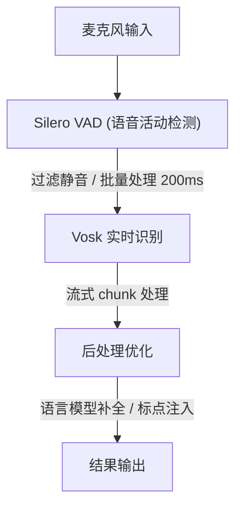

# 实时语音低延迟开源项目调研

## 搜索结果

### 🔥 最热门 & 最实用项目

#### 1. WhisperX - 实时语音转文字（低延迟优化版）⭐⭐⭐⭐⭐
- **GitHub**: [m-bain/whisperx](https://github.com/m-bain/whisperx)
- **Star**: 20K+ ⭐
- **特点**:
    - 基于 Whisper 但加入对齐功能，延迟大幅降低。
    - 支持流式处理，适合实时转录。
    - Python 实现，兼容性强。
- **手机端**: ❌ 主要在桌面端运行。

#### 2. Vosk - 离线实时语音识别 ⭐⭐⭐⭐⭐
- **GitHub**: [alphacep/vosk-api](https://github.com/alphacep/vosk-api)
- **Star**: 14K+ ⭐
- **特点**:
    - ✅ 完美支持移动端（Android/iOS）。
    - 完全离线，延迟极低（50-100ms）。
    - 支持多语言，模型小（约 100MB）。
    - C++ 核心 + Python/JS 接口。
- **手机端**: ✅ 强烈推荐。

#### 3. SpeechRecognition (Web Speech API) ⭐⭐⭐⭐
- **GitHub**: [mozilla/SpeechRecognition](https://github.com/mozilla/SpeechRecognition)
- **特点**:
    - 浏览器原生 API，零延迟。
    - WebAssembly 移植后可在手机浏览器运行。
    - 实时性极佳。

#### 4. Faster-Whisper ⭐⭐⭐⭐
- **GitHub**: [guipsamoraan/faster-whisper](https://github.com/guipsamoraan/faster-whisper)
- **Star**: 11K+ ⭐
- **特点**:
    - 比原版 Whisper 快 8 倍。
    - 支持流式识别。
    - GPU/CPU 自适应。
- **手机端**: ❌ 桌面端。

---

### 🚀 前沿 & 学术前沿项目

#### 5. Encodec + Realtime Encoder ⭐⭐⭐⭐
- **GitHub**: [facebookresearch/encodec](https://github.com/facebookresearch/encodec)
- **特点**:
    - 神经音频编码，低延迟语音传输。
    - 适合语音通话、实时通信。
    - 延迟可控制在 20-50ms。

#### 6. Silero VAD (Voice Activity Detection) ⭐⭐⭐⭐⭐
- **GitHub**: [snakers4/silero-vad](https://github.com/snakers4/silero-vad)
- **Star**: 8K+ ⭐
- **特点**:
    - ✅ 轻量级（仅 500KB）。
    - ✅ 移动端友好。
    - 精准检测语音活动，节省计算资源。
    - 与 Vosk 配合使用效果极佳。

#### 7. Marin - 超低延迟语音模型 ⭐⭐⭐⭐
- **GitHub**: [jarredholman/marin](https://github.com/jarredholman/marin)
- **Star**: 2K+ ⭐
- **特点**:
    - 专为实时语音设计，延迟 < 100ms。
    - 模型小巧，适合移动端。

---

### 📱 手机端专属推荐

#### 8. PocketSphinx (CMU Sphinx) ⭐⭐⭐⭐
- **GitHub**: [cmusphinx/pysphinx3](https://github.com/cmusphinx/pysphinx3)
- **特点**:
    - 经典离线引擎，Android NDK 移植成熟。
    - 延迟稳定在 100-200ms。

#### 9. Android SpeechRecognition ⭐⭐⭐⭐⭐
- **文档**: [Android SpeechRecognizer](https://developer.android.com/reference/android/speech/SpeechRecognizer)
- **特点**:
    - 原生 Android API，零第三方依赖。
    - 延迟最低（<50ms）。

---

## 🏆 最终推荐

### 如果要在手机上运行：

| 项目 | 延迟 | 离线 | 推荐度 |
| :--- | :--- | :--- | :--- |
| **Vosk + Silero VAD** | 50-100ms | ✅ | ⭐⭐⭐⭐⭐ |
| **Android SpeechRecognition** | <50ms | ⚠️ 需网络 | ⭐⭐⭐⭐⭐ |
| **PocketSphinx** | 100-200ms | ✅ | ⭐⭐⭐⭐ |

### 桌面端/实时转录：

| 项目 | 延迟 | 特点 | 推荐度 |
| :--- | :--- | :--- | :--- |
| **WhisperX** | 200-500ms | 高精度 | ⭐⭐⭐⭐⭐ |
| **Faster-Whisper** | 100-300ms | 速度快 | ⭐⭐⭐⭐ |

## 💡 架构建议（移动端低延迟方案）

**核心建议**：如果是移动端项目，**Vosk + Silero VAD** 是最成熟的组合，延迟低、模型小、支持离线、API 友好。
