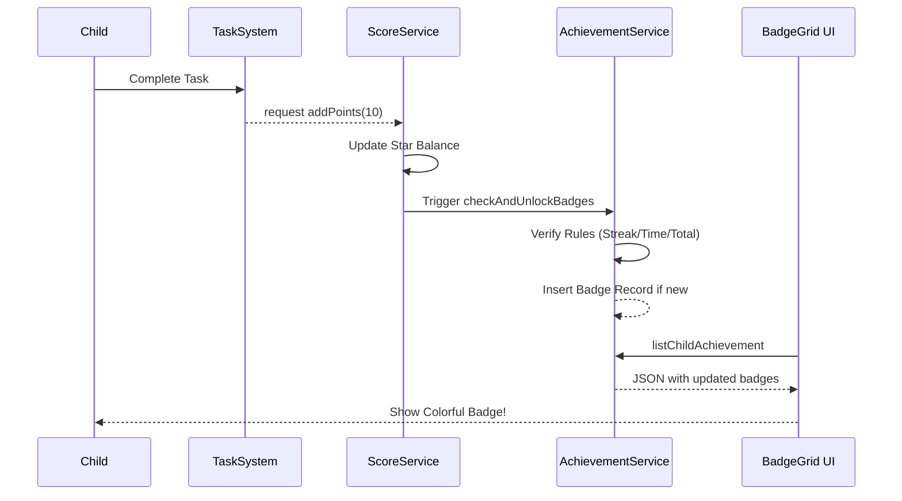

# 自动化勋章激励系统 (Automatized Achievement System)

## 核心愿景
通过 **即时满足感 (Instant Gratification)** 将枯燥的任务转化为冒险式的收集体验。重点在于“看见进步”，而非“惩罚失败”。

## 逻辑规则 (Rule Engine)
目前系统支持三类关键里程碑的自动触发，逻辑实现在 `ChildAchievementServiceImpl.checkAndUnlockBadges` 中：

| 勋章名称 | 触发条件 | 行为意义 |
| :--- | :--- | :--- |
| **早起鸟** | 当前时间 < 08:00 AM 且完成任务 | 养成早起习惯，建立第一步成功感 |
| **恒心大师** | 连续打卡天数 (Streak) >= 7 | 建立长期一致性 (Consistency) |
| **星光熠熠** | 累积获得星星总数 >= 100 | 量化长期努力的价值感 |

## 技术实现
1. **触发机制**: 
   - 监听 `ScoreServiceImpl.addPoints` 方法。
   - 每当 Points/Stars 变动时，同步触发 `checkAndUnlockBadges(childId)`。
2. **幂等保证**: 
   - 插入前校验 `ss_child_achievement` 数据库，确保同一勋章不会被重复解锁、重复记录。
3. **视觉表现层 (UI)**:
   - 全局置灰 (Grayscale Filter) 管理。
   - 动态合并静态配置 `ALL_BADGES` 与后端 `unlockedBadges`。

## 激励闭环示意

## 未来演进 (Future)
- **自定义勋章**: 家长可根据孩子的个性化进步点（如“今天没有发脾气”）手动授予特定勋章。
- **声光互动**: 达成重大成就时，硬件端 `smallsteps-esp32` 同步播放庆祝音效并闪烁彩虹灯光效果。
