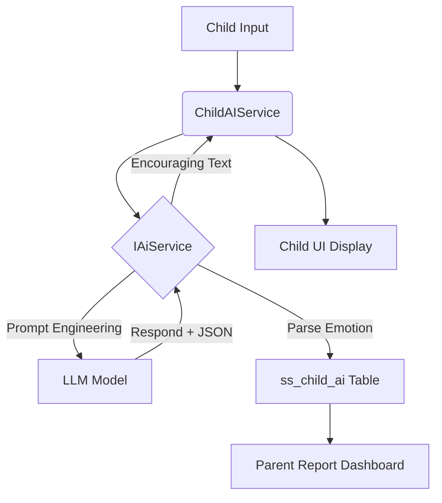

# AI 情绪分析与反馈闭环 (Emotion Feedback Loop)

## 核心目标
解决 ADHD 儿童情感表达难、正向回馈延迟的问题。通过 **“秘密树洞”** 建立一个高宽容度的傾诉接口，并将非结构化的文本转化为结构化的心理健康数据。

## 技术实现
系统采用 **“异步解析-即时反馈”** 模型：

1. **倾诉采集 (Acquisition)**:
   - 儿童端 App 提供“秘密树洞” UI。
   - 输入形式：文本或模拟语音输入。
   - 载体：[[treehole-chat/index.vue]]。

2. **AI 解析器 (LLM Parser)**:
   - 后端 `AiServiceImpl` 调用底层 LLM 模型。
   - **核心逻辑**: 在回复孩子的同时，要求模型返回一个包含核心情感类型的 JSON 结构。
   - **情感分类 (Emotion Types)**:
     - 1: 喜悦 (Joy)
     - 2: 悲伤 (Sadness)
     - 3: 愤怒 (Anger)
     - 4: 焦虑/恐惧 (Anxiety)
     - 5: 平静/其他 (Neutral)

3. **双重原子回馈 (Dual Feedback)**:
   - **软回馈 (Soft)**: AI 伙伴根据识别到的情感，给出具有共情能力的回复文字。
   - **硬回馈 (Hard)**: 将记录持久化至 `ss_child_ai` 数据库，作为家长端 [[Daily-Emotion-Report]] 的数据源。

## 架构示意

## 设计哲学：Cognitive Ease
根据 [[ADHD-Education-Psychology]]，该功能摒弃了传统的复杂问卷，改用沉浸式的聊天机器人形式，显著降低了孩子的倾诉压力（低心理建设门槛）。
