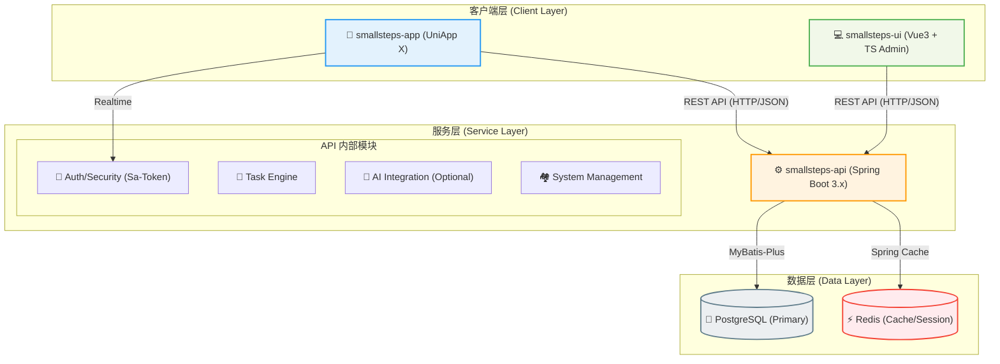

# Small Steps 项目架构图 (核心三项)

> [!IMPORTANT]
> 本架构图仅展示 **Small Steps** 系统中最核心的三个子项目及其交互关系。其他辅助项目（如硬件端、自动化脚本等）已在此视图中忽略。

## 1. 核心架构视图

---

## 2. 项目职责定义

### 🟢 [smallsteps-app](file:///d:/office/jushuang1/github/ss/smallsteps-app) (移动应用)
*   **定位**：面向 ADHD 儿童及其家长的跨端应用。
*   **核心功能**：
    *   **儿童端**：任务执行、能量收集、勋章墙。
    *   **家长端**：快速发布任务、查看今日概览、奖励审批。
*   **技术栈**：UniApp X + Vue 3 + Pinia + Tailwind CSS。

### 🔵 [smallsteps-ui](file:///d:/office/jushuang1/github/ss/smallsteps-ui) (管理后台)
*   **定位**：系统的“中枢大脑”，用于全局配置与运营。
*   **核心功能**：
    *   **配置管理**：管理系统的各种任务模板、难度分级、激励参数。
    *   **用户管理**：管理各家庭账户、医生/干预师账号权限。
    *   **数据看板**：全系统级别的 ADHD 干预效果大数据统计。
*   **技术栈**：Vue 3 + TypeScript + Vite + Element Plus + UnoCSS。

### 🟠 [smallsteps-api](file:///d:/office/jushuang1/github/ss/smallsteps-api) (后端 API)
*   **定位**：统一的数据底座与业务中枢。
*   **核心架构**：基于 RuoYi-Vue-Plus 的现代化 Spring Boot 3 架构。
*   **核心功能**：
    *   **权限中枢**：基于 Sa-Token 统一管理 App 与 UI 的认证。
    *   **业务逻辑**：处理任务流转、积分计算、统计报告生成。
    *   **接口聚合**：为前端提供标准的 RESTful 接口。
*   **技术栈**：Java 21 + Spring Boot 3.5 + MyBatis Plus + PostgreSQL + Redis。

---

## 3. 技术选型决策 (Decision Matrix)

| 维度 | smallsteps-app | smallsteps-ui | smallsteps-api |
| :--- | :--- | :--- | :--- |
| **框架** | UniApp X (Vue 3) | Vue 3 + Vite | Spring Boot 3.5.9 |
| **语言** | JavaScript / UTS | TypeScript | Java 21 |
| **样式** | Tailwind CSS | UnoCSS / Element+ | N/A |
| **状态** | Pinia | Pinia | Spring Context |
| **通信** | Axios / Request | Axios | MyBatis-Plus / Redis |

---

## 4. 后续演进路线
1.  **API 统一化**：确保 App 与 UI 共用同一套权限体系与核心模型。
2.  **数据隔离**：实现多租户隔离，确保各家庭数据的隐私与安全。
3.  **统计链路**：强化 API 端的数据预处理能力，为 UI 看板提供高效查询支撑。
