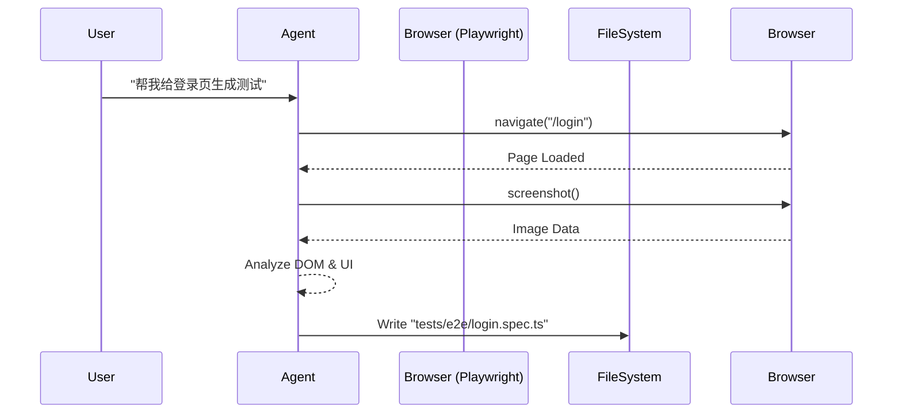

# Skill: UI Test Generation (Web 自动化测试生成)

## 🎯 目标 (Goal)
利用 **Browser Automation (Playwright)** 能力，通过观察现有的 Web 页面结构，自动生成高鲁棒性的 E2E 测试脚本。

## ⚙️ 依赖 (Dependencies)
- **MCP Server**: `playwright`
- **Tools**: `playwright_navigate`, `playwright_screenshot`
- **Output**: `tests/e2e/generated_test.spec.ts`

## 📝 提示词模板 (Prompt Template)

```markdown
请使用 Playwright MCP 为页面 [URL] 生成测试脚本。

**步骤 1: 观察 (Observe)**
- 使用 `playwright_navigate` 打开页面。
- 使用 `playwright_screenshot` 获取页面快照。
- 分析页面中的关键交互元素（按钮、输入框、验证文本），优先识别 `data-testid`。

**步骤 2: 思考 (Think)**
- 设计一个覆盖 "正常路径 (Happy Path)" 的测试用例。
- 确定需要断言 (Assert) 的关键状态。

**步骤 3: 编码 (Code)**
- 生成 Playwright (TypeScript) 测试代码。
- 确保代码包含详细的注释。
- 使用 `test.step` 分隔逻辑步骤。
```

## 🚀 执行流向 (Workflow)



## 💡 最佳实践

1.  **选择器策略**: 告诉 Agent "优先使用可访问性属性（Role, Label）或 data-testid，避免脆弱的 XPath"。
2.  **等待机制**: 生成的代码应包含自动等待 (`await expect(...)`)，避免硬编码 `sleep`。
3.  **视觉验证**: 对于复杂的 UI 组件，建议在测试中加入 Screenshot 对比步骤。
