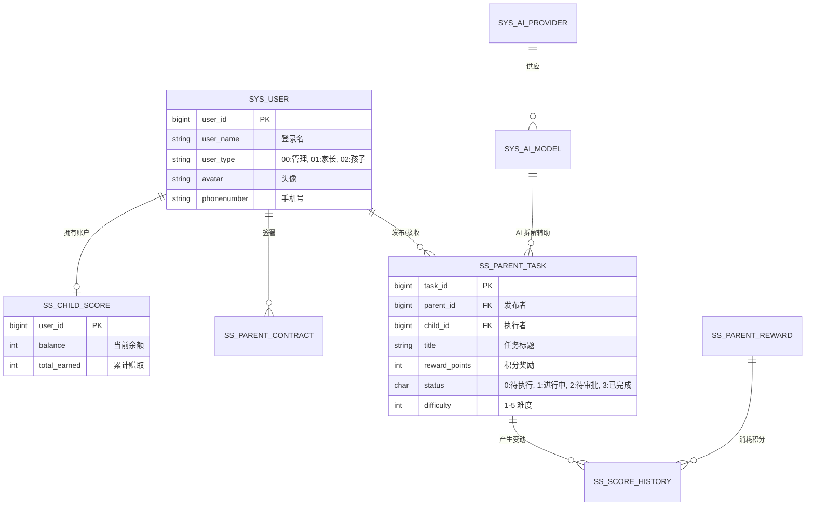

# Small Steps 核心数据库设计 (db.md) - 深度版

> [!IMPORTANT]
> 本文档是 **Small Steps (小步)** 系统的底层灵魂。它不仅定义了数据的存储结构，更通过 ER 关系界定了家长、孩子与 AI 助手之间的协作边界。

---

## 1. 数据库关系全景图 (Entity-Relationship)

---

## 2. 核心业务表详解

### 2.1 用户与生态基础表 (`sys_user`)
基于通用框架扩展，承载 ADHD 家庭系统的核心账号体系。

| 字段名 | 类型 | 说明 | 业务逻辑 |
| :--- | :--- | :--- | :--- |
| `user_id` | `bigint` | 主键 ID | 分布式雪花 ID |
| `user_type` | `char(2)` | 用户类型 | **01: 家长** (拥有管理权), **02: 孩子** (拥有执行权) |
| `dept_id` | `bigint` | 家庭 ID | 在系统中以“部门”概念模拟“家庭/机构”单位 |
| `avatar` | `varchar(200)` | 形象标识 | 孩子端支持个性化头像，增加归属感 |

### 2.2 家长任务引擎表 (`ss_parent_task`)
**核心特性**：支持任务的原子化拆解（Scaffolding）。

| 字段名 | 类型 | 约束 | 说明 |
| :--- | :--- | :--- | :--- |
| `task_id` | `bigint` | PK | - |
| `parent_id` | `bigint` | Index | 关联 `sys_user`，发布任务的家长 |
| `child_id` | `bigint` | Index | 关联 `sys_user`，接收任务的孩子 |
| `parent_task_id` | `bigint` | - | 用于**任务拆解**。指向父任务 ID，实现递归逻辑 |
| `is_atomic` | `char(1)` | Default '1' | 是否为原子任务。0:复合任务, 1:基础动作 |
| `prompt_level` | `int` | - | **辅助强度**。定义该任务提供的提示级别 |
| `reward_points` | `int` | > 0 | 成功完成后的积分收益 |

### 2.3 积分资产与流水系统
**ss_child_score (余额表) & ss_score_history (流水表)**

*   **设计原则**：余额表用于快速查询与显示，流水表用于防作弊审计与趋势分析。
*   **流水类型**：
    1.  `TASK_COMPLETED`: 任务奖励（入账）
    2.  `REWARD_EXCHANGED`: 兑换奖品（出账）
    3.  `MANUAL_ADJUST`: 家长手动干预（调账）

---

## 3. AI 中枢配置表

为了实现 **Mind Echo (情绪分析)** 和 **Task Crusher (任务拆解)**，引入了动态 AI 路由体系。

### 3.1 AI 供应商表 (`sys_ai_provider`)
| 字段名 | 说明 | 示例 |
| :--- | :--- | :--- |
| `type` | 驱动类型 | `deepseek`, `zhipuai`, `openai` |
| `api_key` | 密钥 | 存储加密后的 API Key |

### 3.2 AI 路由策略 (`sys_ai_route`)
根据业务场景（`scene_key`）动态决定使用哪个模型。
*   `TASK_SPLIT`: 侧重逻辑推理，使用大参数模型。
*   `EMOTION_ANALYSIS`: 侧重语义情感，使用专用微调模型。

---

## 4. 索引与性能优化建议

1.  **高频检索项**：对 `ss_parent_task` 的 `child_id + status` 建立复合索引，加速移动端“今日待办”加载。
2.  **安全性**：`ss_parent_contract` 的 `signature_img` 存储建议使用对象存储 (OSS) 的持久化链接。
3.  **统计加速**：积分变动表 `ss_score_history` 建议按 `user_id` 分区，便于进行月度、年度行为报告生产。
