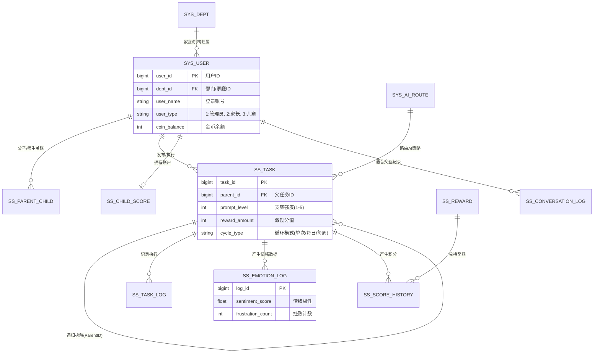

# Small Steps 核心数据库设计 (db.md) - 2.1 增强版

> [!IMPORTANT]
> 本文档定义了 **Small Steps (小步)** 系统的底层数据建模。2.1 版本强化了对 ADHD 执行功能障碍的底层支持，通过数据结构实现“支架式辅助”与“情绪反馈”的闭环，并集成了 XiaoZhi 语音交互能力。

---

## 1. 数据库关系全景图 (ER Diagram)

---

## 2. 系统基础表定义

### 2.1 系统用户表 (`sys_user`)
本表扩展自通用用户表，承载登录信息与代币余额。

| 字段名称 | 类型 | 长度 | 必填 | 说明 |
| :--- | :--- | :--- | :--- | :--- |
| `user_id` | BIGINT | 20 | 是 | 主键 (雪花算法) |
| `dept_id` | BIGINT | 20 | 否 | 所属家庭/机构 ID |
| `user_name` | VARCHAR | 64 | 是 | 登录账号/用户名 |
| `password` | VARCHAR | 128 | 是 | Bcrypt 加密 Hash |
| `user_type` | TINYINT | 4 | 是 | 1:管理员, 2:家长, 3:儿童 |
| `nickname` | VARCHAR | 64 | 否 | 显示简称或儿童名 |
| `coin_balance`| INT | 11 | 是 | 账户代币余额 (默认 0) |
| `status` | TINYINT | 4 | 是 | 0:正常, 1:停用 |

### 2.2 家庭/部门表 (`sys_dept`)
用于定义多租户隔离，通常一个家庭为一个 Dept。

| 字段名称 | 类型 | 说明 |
| :--- | :--- | :--- |
| `dept_id` | BIGINT | 部门 ID |
| `parent_id` | BIGINT | 父部门 ID |
| `dept_name` | VARCHAR | 家庭名称 (如: "Leo的家") |
| `leader` | VARCHAR | 家庭管理员 (家长) |

### 2.3 父子绑定关系表 (`ss_parent_child`)
支持多对多模型（例如：父母双方共同监管，或二胎家庭）。

| 字段名称 | 类型 | 说明 |
| :--- | :--- | :--- |
| `id` | BIGINT | 主键 |
| `parent_id` | BIGINT | 家长用户 ID (FK) |
| `child_id` | BIGINT | 儿童用户 ID (FK) |
| `bind_time` | DATETIME | 绑定时间 |

---

## 3. 核心业务表 (ADHD 支架系统)

### 3.1 任务定义表 (`ss_task`)
任务母版，包含 ADHD 辅助特有的 `prompt_level` 支架分级。

| 字段名称 | 类型 | 必填 | 说明 | 业务逻辑 |
| :--- | :--- | :--- | :--- | :--- |
| `task_id` | BIGINT | 是 | 主键 | - |
| `parent_id` | BIGINT | 否 | 父任务 ID | 用于无限级任务拆解 (Task Crusher) |
| `creator_id`| BIGINT | 是 | 创建者 ID | 指向 sys_user (家长/系统) |
| `title` | VARCHAR | 是 | 任务名称 | 如 "睡前阅读" |
| `content` | TEXT | 否 | 任务指导语 | 具体的动作拆解文本 |
| `prompt_level`| INT | 是 | 辅助强度 | 1:全视频/图文, 5:自主完成 |
| `reward_amount`| INT | 是 | 激励金币值 | 完成任务可得数额 |
| `cycle_type` | TINYINT | 是 | 循环类型 | 0:单次, 1:每日, 2:每周 |
| `status` | CHAR | 是 | 状态 | 0:草稿, 1:启用, 2:废弃 |

### 3.2 任务执行日志 (`ss_task_log`)
记录每日具体的执行流水，驱动统计趋势。

| 字段名称 | 类型 | 说明 |
| :--- | :--- | :--- |
| `log_id` | BIGINT | 主键 |
| `task_id` | BIGINT | 关联任务定义 |
| `child_id` | BIGINT | 执行儿童 ID |
| `target_date` | DATE | 预定执行日期 |
| `actual_duration`| INT | 实际专注时长 (秒) |
| `status` | TINYINT | 0:待办, 1:进行中, 2:已完成, 3:放弃 |
| `end_time` | DATETIME | 提交打卡的时间 |

### 3.3 情绪分析表 (`ss_emotion_log`)
承载 **Mind Echo** 模型的分析结果。

| 字段名称 | 类型 | 说明 | 业务应用 |
| :--- | :--- | :--- | :--- |
| `log_id` | BIGINT | 主键 | - |
| `task_id` | BIGINT | 关联的任务 | - |
| `sentiment_score`| FLOAT | 情绪极性 (-1 to 1) | 低于 -0.5 触发家长干预提醒 |
| `frustration_count`| INT | 挫败行为计数 | 识别反复操作、长时间停留等隐形异常 |
| `raw_voice_text`| TEXT | 语音转写原文 | 经加密存储，保护儿童隐私 |

---

## 4. 激励与资产系统

### 4.1 积分奖品表 (`ss_reward`)
定义“代币”可以兑换的实物或虚拟奖励。

| 字段名称 | 类型 | 说明 |
| :--- | :--- | :--- |
| `reward_id` | BIGINT | 主键 |
| `title` | VARCHAR | 奖品名称 (如: "额外看电视 30 分钟") |
| `cost_amount` | INT | 需要的金币数 |
| `inventory` | INT | 库存 (可选) |

### 4.2 积分变更流水 (`ss_score_history`)
每一笔金币变动必须可追溯。

| 字段名称 | 类型 | 说明 |
| :--- | :--- | :--- |
| `history_id` | BIGINT | 主键 |
| `user_id` | BIGINT | 儿童用户 ID |
| `change_type` | TINYINT | 1:任务奖励, 2:奖品兑换, 3:家长调整 |
| `amount` | INT | 变动值 (带符号) |
| `source_id` | BIGINT | 来源：相关任务 ID 或 奖品 ID |

---

## 5. 扩展与 AI 模块

### 5.1 语音交互日志 (`ss_conversation_log`)
记录 XiaoZhi 硬件与云端的对话记录。

| 字段名称 | 类型 | 说明 |
| :--- | :--- | :--- |
| `conv_id` | BIGINT | 主键 |
| `user_id` | BIGINT | 用户 ID |
| `query_text` | TEXT | 用户提问 (语音转文字) |
| `reply_text` | TEXT | AI 回复 |
| `timestamp` | DATETIME | 交互时间 |

### 5.2 AI 路由配置表 (`sys_ai_route`)
管理不同场景映射到不同的 LLM 策略。

| 场景 Key | 推荐模型 | Prompt 版本 | 说明 |
| :--- | :--- | :--- | :--- |
| `TASK_SPLIT` | GPT-4o / DeepSeek | v2.2 | 用于 Task Crusher 逻辑 |
| `EMOTION_ANALYZE`| Qwen-Audio | v1.5 | 用于音频语义/情绪综合判定 |

---

## 6. 索引优化与安全策略

1.  **分库分表建议**：`ss_task_log` 规模增长快，建议按 `dept_id` 哈希分区。
2.  **多租户隔离**：所有 SQL 拦截强制注入 `dept_id`。
3.  **加密存储**：`raw_voice_text` 字段采用 AES 加密。
4.  **脱敏展示**：前端展示儿童真实姓名时需根据设置脱敏。
