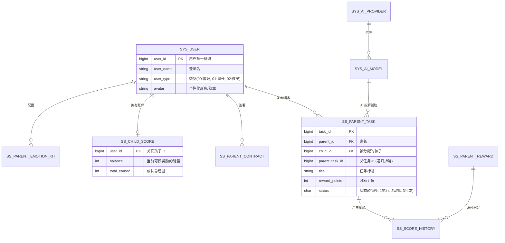

# Small Steps 核心数据库设计 (db.md) - 深度版

> [!IMPORTANT]
> 本文档是 **Small Steps (小步)** 系统的底层灵魂。它不仅定义了数据的存储结构，更通过 ER 关系界定了家长、孩子与 AI 助手之间的协作边界。

---

## 1. 数据库关系全景图 (Entity-Relationship)

---

## 2. 核心业务表详解

### 2.1 用户与生态基础表 (`sys_user`)
基于通用框架扩展，承载 ADHD 家庭系统的核心账号体系。

| 字段名 | 类型 | 说明 | 业务逻辑 |
| :--- | :--- | :--- | :--- |
| `user_id` | `bigint` | 主键 ID | 分布式雪花 ID |
| `user_type` | `char(2)` | 用户类型 | **01: 家长** (拥有管理权), **02: 孩子** (拥有执行权及成长权) |
| `dept_id` | `bigint` | 家庭/机构 ID | 在系统中以部门概念模拟“家庭单位”，实现数据可见性隔离。 |
| `avatar` | `varchar(200)` | 形象标识 | 孩子端支持由奖励系统解锁的“勋章头像”。 |

### 2.2 家长任务引擎表 (`ss_parent_task`)
**核心特性**：支持任务的原子化拆解（Task Crusher）。

| 字段名 | 类型 | 约束 | 说明 |
| :--- | :--- | :--- | :--- |
| `task_id` | `bigint` | PK | - |
| `parent_task_id` | `bigint` | Index | 用于**递归拆解**。指向父任务 ID。若为空则为顶层目标。 |
| `is_atomic` | `char(1)` | Default '1' | 是否为原子动作。0:复合任务(需拆解), 1:原子任务(可直接执行)。 |
| `reward_points` | `int` | > 0 | 完成后注入 `ss_child_score` 的分值。 |
| `prompt_level` | `int` | - | **辅助强度**。定义该任务提供的视觉/声音提醒频次。 |

### 2.3 情绪急救包配置 (`ss_parent_emotion_kit`)
用于家长预设针对某种特定情绪的即时干预文本或音效。

| 字段名 | 类型 | 说明 | 示例 |
| :--- | :--- | :--- | :--- |
| `kit_id` | `bigint` | PK | - |
| `child_id` | `bigint` | FK | 关联具体的目标儿童 |
| `emotion_type` | `int` | 触发情绪 | 1:开心, 2:难过, 3:愤怒, 4:焦虑 |
| `content` | `text` | 干预内容 | “深呼吸 3 次，抱抱你的小熊。” |
| `status` | `char(1)` | 启用状态 | 0:激活, 1:关闭 |

---

## 3. AI 中枢与路由配置

支撑系统中的 AI 辅导（Task Crusher）与情绪分析（Mind Echo）。

### 3.1 AI 供应商与模型配置 (`sys_ai_provider` / `sys_ai_model`)
| 字段名 | 说明 | 备注 |
| :--- | :--- | :--- |
| `provider.type` | 驱动类型 | 如 `deepseek`, `zhipuai`, `openai` |
| `model.cost_input` | 输入成本 | 用于管理运营费用，实现精细化成本控制。 |
| `model.is_free_tier`| 免费层级 | 用于区分提供给免费用户与付费专业用户的模型精度。 |

---

## 4. 设计原则与优化

1.  **数据的“支架”化**: `ss_parent_task` 的设计允许任务从复杂到简单的物理拆解，数据库支持多级树状结构。
2.  **安全性 (Family Isolation)**: 所有业务表均通过 `dept_id` 进行逻辑隔离。即使 API 被穿透，通过全局过滤器也能确保家长 A 无法查看孩子 B 的行为记录。
3.  **高频检索优化**: 对 `ss_score_history` 的 `user_id` 与 `create_time` 建立复合索引，支撑移动端“行为日报”的秒级渲染。
