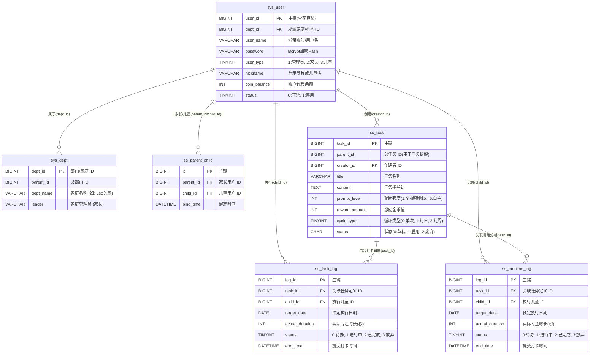

# ADHD行为习惯辅助系统 (小步) - 核心业务表 E-R 图

该 E-R 图基于论文中第三章的数据库设计（3.3.2 关键数据表结构设计）以及项目中实际的 PostgreSQL 表结构综合生成。

> **注：** 此 ER 图中的 `ss_emotion_log` 字段严格按照您论文中 **表 3.3.2.6** 的设计所绘制（其字段与任务执行日志一致）。但在实际项目工程的 PostgreSQL 脚本中（如 `ss_emotion_record` 表），通常会包含专门针对情绪评价的字段（如 `mood_level`, `mood_type`, `description` 等）。如果您需要在论文中修正此表的设计，建议将该表字段更新为针对情绪维度的度量。