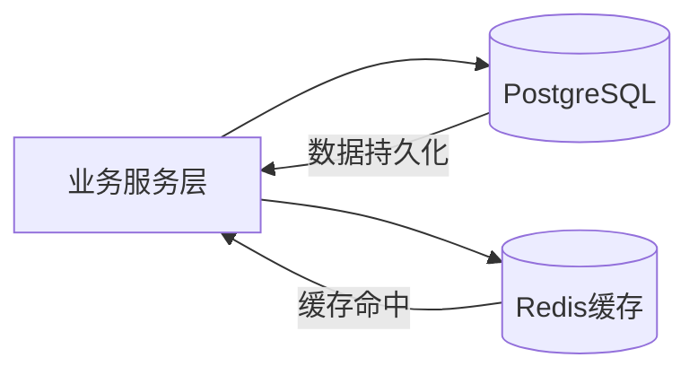
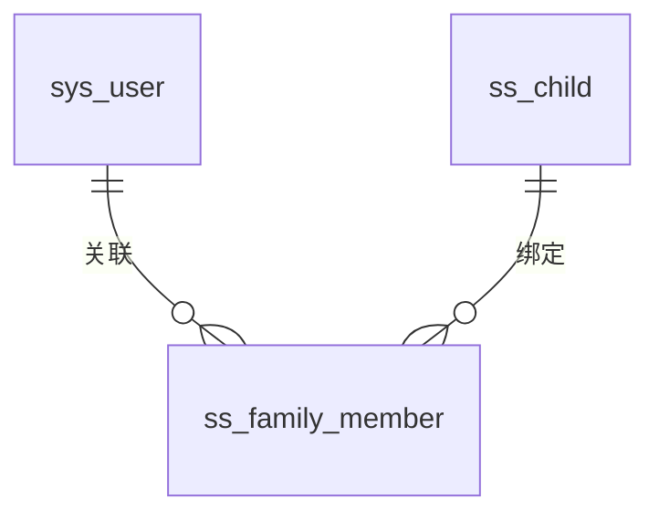
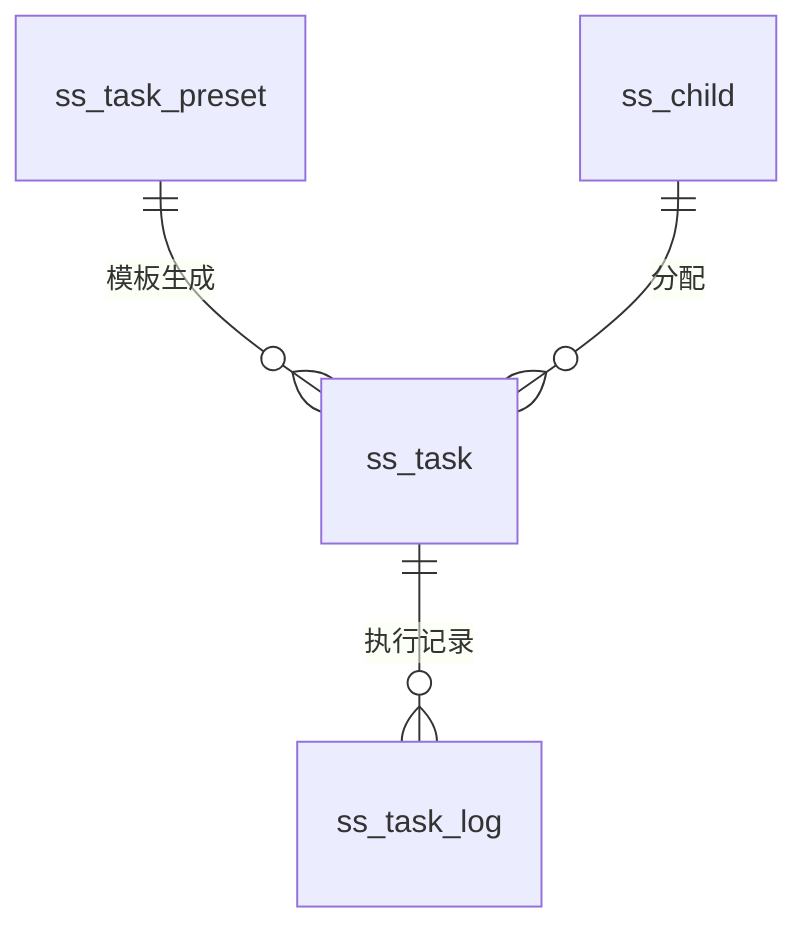
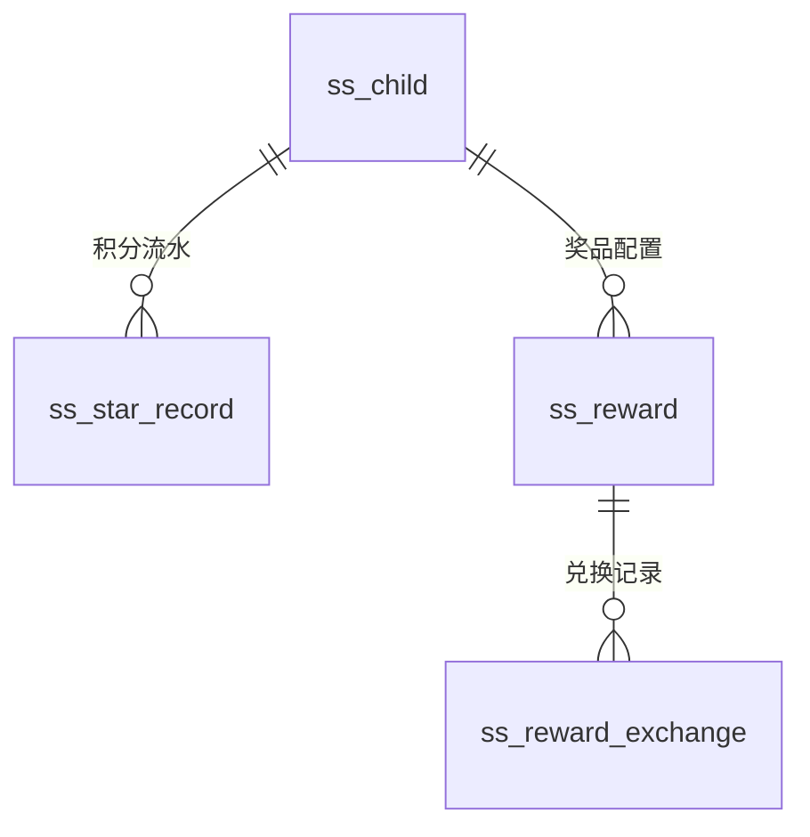
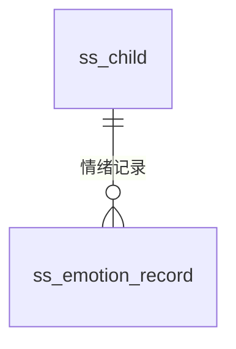

优化：

* 结构重构（从“列举表”→“设计说明”）
* ER 模型拆分（避免信息过载）
* 增加关键设计决策（评分核心）
* 强化工程表达（JSONB / 快照 / 缓存）
* 语言学术化（符合毕业设计要求）

---

# **3.3 数据库设计**

数据库是系统业务逻辑落地的核心载体，其设计直接决定系统的数据一致性、扩展性与运行性能。针对ADHD儿童行为干预场景的特殊性，本系统在数据库设计中不仅关注传统业务数据建模，同时引入游戏化激励、任务拆解以及情绪追踪等扩展维度，以支撑系统的长期行为引导能力。

---

## **3.3.1 设计原则与总体架构**

在数据库设计过程中，系统遵循以下核心原则：

（1）**高内聚与领域划分原则**
围绕系统核心业务，将数据划分为“用户与家庭”、“任务流转”、“激励体系”与“情绪追踪”四大领域，保证各模块职责清晰、边界明确。

（2）**读性能优先原则**
针对儿童端与家长端的高频读取场景，通过适度去范式化设计与缓存机制，减少多表关联查询带来的性能开销。

（3）**灵活扩展原则**
对于任务子步骤、用户偏好等非结构化数据，采用 PostgreSQL 的 JSONB 类型存储，以适应未来业务变化。

（4）**数据一致性保障原则**
通过快照字段与流水表设计，确保积分、奖励等关键数据具备可追溯性与审计能力。

系统整体采用“关系型数据库 + 缓存层”的双层架构，其结构如下：

该架构通过将高频访问数据前置至内存层，有效降低数据库压力，提高系统响应速度。

---

## **3.3.2 概念模型设计（E-R模型）**

基于系统功能需求分析，从业务中抽象出四类核心实体域，并分别构建其E-R关系模型。

---

### （1）用户与家庭域

该域用于描述系统用户（家长/管理员）与儿童之间的组织关系，支持多对多家庭结构。

---

### （2）任务流转域

该域描述任务从模板定义到实际执行的完整生命周期。

---

### （3）激励体系域

该域用于实现系统的游戏化激励机制，包括积分、奖励及兑换流程。

---

### （4）情绪追踪与行为分析域

该域为系统智能分析提供数据基础，是后续大语言模型介入的重要输入来源。

---

## **3.3.3 核心数据表设计**

在概念模型的基础上，系统设计了12张核心数据表以支撑业务运行。以下对关键表结构进行说明。

---

### （1）用户与家庭域

#### 系统用户表（sys_user）

用于存储家长及管理员账户信息。

| 字段        | 类型           | 说明   |
| --------- | ------------ | ---- |
| user_id   | BIGINT       | 主键   |
| user_name | VARCHAR(64)  | 登录账号 |
| password  | VARCHAR(128) | 加密密码 |
| user_type | TINYINT      | 用户类型 |
| status    | TINYINT      | 状态   |

---

#### 儿童档案表（ss_child）

将儿童独立建模，并引入游戏化属性。

| 字段            | 类型          | 说明    |
| ------------- | ----------- | ----- |
| id            | BIGINT      | 主键    |
| parent_id     | BIGINT      | 主家长ID |
| nickname      | VARCHAR(64) | 昵称    |
| star_balance  | INT         | 当前积分  |
| level         | INT         | 等级    |
| avatar_config | JSONB       | 个性化配置 |

---

#### 家庭成员表（ss_family_member）

实现多家长协同管理模式。

---

### （2）任务流转域

#### 任务定义表（ss_task）

核心业务表之一，用于描述任务执行标准。

| 字段            | 类型           | 说明    |
| ------------- | ------------ | ----- |
| id            | BIGINT       | 主键    |
| child_id      | BIGINT       | 所属儿童  |
| title         | VARCHAR(128) | 任务名称  |
| sub_tasks     | JSONB        | 子任务拆解 |
| star_reward   | INT          | 奖励    |
| schedule_conf | VARCHAR      | 调度配置  |

---

#### 任务执行记录表（ss_task_log）

记录任务执行过程及结果。

| 字段          | 类型        | 说明   |
| ----------- | --------- | ---- |
| id          | BIGINT    | 主键   |
| task_id     | BIGINT    | 任务ID |
| child_id    | BIGINT    | 儿童ID |
| status      | CHAR(1)   | 状态   |
| reward_snap | INT       | 奖励快照 |
| finish_time | TIMESTAMP | 完成时间 |

---

### （3）激励体系域

包含：

* 奖品表（ss_reward）
* 兑换记录表（ss_reward_exchange）
* 积分流水表（ss_star_record）
* 成就系统表（ss_achievement / ss_child_achievement）

该模块通过“积分 → 奖励 → 成就”形成多层激励结构。

---

### （4）情绪追踪域

#### 情绪记录表（ss_emotion_record）

用于记录儿童情绪状态，为AI分析提供数据支持。

---

## **3.3.4 关键设计说明**

为提升系统的稳定性与扩展性，数据库设计中引入以下关键机制：

---

### （1）JSONB半结构化存储设计

在任务子步骤（sub_tasks）与用户个性化配置中，采用JSONB格式进行存储。该设计避免了过度拆表带来的复杂查询问题，同时提高了系统对动态结构数据的适应能力。

---

### （2）任务奖励快照机制

在任务执行记录表中引入reward_snap字段，用于记录任务完成时的奖励值。该机制能够避免因任务规则变更导致历史数据不一致的问题，从而保证系统数据的可追溯性。

---

### （3）积分流水审计机制

通过独立的积分流水表（ss_star_record），记录所有积分变动来源，实现对积分系统的完整审计，防止数据异常。

---

### （4）适度去范式化设计

在部分高频查询场景中，系统冗余存储child_id等字段，以减少多表关联查询，提高查询效率。

---

## **3.3.5 缓存策略与性能优化**

为应对高并发访问场景，系统引入Redis作为缓存层，主要策略如下：

---

### （1）认证缓存

基于会话机制，将用户登录信息缓存于Redis中，减少重复认证开销。

---

### （2）任务防重机制

利用Redis的SETNX指令实现分布式锁，防止重复提交任务完成请求，从而避免积分重复发放。

---

### （3）数据看板缓存

针对家长端的统计数据，采用定时任务预计算并缓存，实现毫秒级响应。

---

