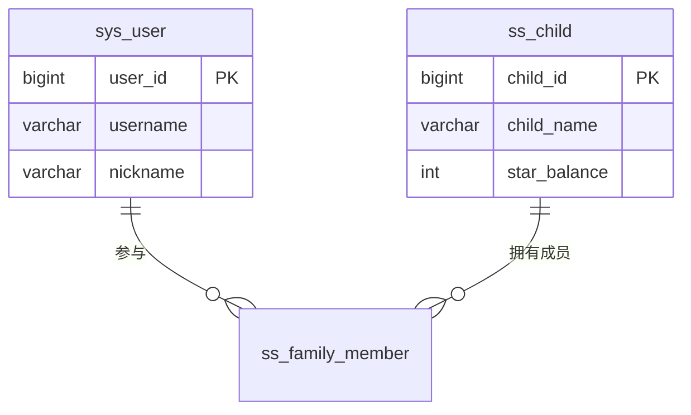
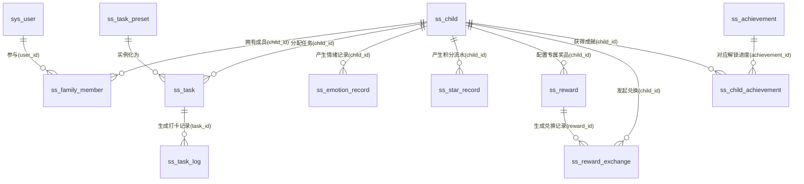
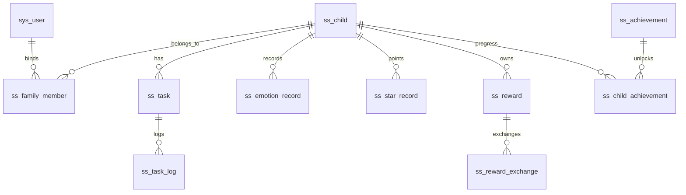

# 3.3 数据库设计（优化版）

数据库是系统业务逻辑落地的持久化基础。针对ADHD儿童特性，本系统在表结构上摒弃了传统效率软件的强控制逻辑，引入了游戏化激励、弹性任务拆解以及多维度情绪追踪的设计。本节梳理支撑系统核心业务运转的12张关键数据表。

## 3.3.1 概念模型与E-R图设计

通过从业务需求中提取实体与关联关系，系统的核心实体涵盖了“家庭与用户”、“任务流转”、“激励体系”与“情绪追踪”四大核心域：
（1）**家庭与用户域**：涵盖系统用户（家长/管理员）与儿童实体，并通过家庭成员表实现多角色的动态绑定。
（2）**任务流转域**：包含系统预设任务库、家长自定义任务定义，以及儿童实际执行的打卡日志。
（3）**激励体系域**：包含基础的星星代币流水、实物/心愿奖励兑换记录，以及长期的成就勋章解锁系统。
（4）**情绪追踪域**：专门记录患儿在干预过程中的情绪波动及家长的应对反馈。

## 3.3.2 关键数据表结构设计

基于上述E-R模型并结合PostgreSQL 15的特性（如对JSONB的良好支持），系统精选了12张核心物理表。在设计中严格遵循了最小化冗余与高查询性能的原则。

### 1. 家庭与用户域

#### 表 3.3.2.1 系统用户表 (sys_user)
存储家长和管理员等具备系统级操作权限的账户实体信息。
| 字段名称 | 类型 | 必填 | 说明 |
| --- | --- | --- | --- |
| user_id | BIGINT | 是 | 主键 (雪花算法) |
| user_name | VARCHAR(64) | 是 | 登录账号/手机号 |
| password | VARCHAR(128) | 是 | Bcrypt 加密 Hash |
| user_type | TINYINT | 是 | 1:管理员, 2:家长 |
| nickname | VARCHAR(64) | 否 | 显示简称 |
| status | TINYINT | 是 | 0:正常, 1:停用 |

#### 表 3.3.2.2 儿童档案表 (ss_child)
将儿童从系统用户表中抽离，单独增加游戏化属性（星星余额、等级），并引入 `JSONB` 格式处理可动态扩展的偏好设置。
| 字段名称 | 类型 | 必填 | 说明 |
| --- | --- | --- | --- |
| id | BIGINT | 是 | 主键 |
| parent_id | BIGINT | 是 | 主绑定的家长ID (关联sys_user) |
| nickname | VARCHAR(64) | 是 | 儿童昵称 |
| star_balance | INT | 是 | 当前拥有的星星代币余额 |
| level | INT | 是 | 当前游戏化等级 |
| avatar_config| JSONB | 否 | 虚拟形象穿搭的动态JSON配置 |

#### 表 3.3.2.3 家庭成员关联表 (ss_family_member)
支持“多对多”的家庭看护模式（如父母双方共同管理一个或多个孩子）。
| 字段名称 | 类型 | 必填 | 说明 |
| --- | --- | --- | --- |
| id | BIGINT | 是 | 主键 |
| child_id | BIGINT | 是 | 关联的儿童ID |
| user_id | BIGINT | 是 | 关联的家长/用户ID |
| role | VARCHAR(32) | 否 | 角色称呼（如：爸爸、妈妈） |
| permissions| JSONB | 否 | 权限细分配置（如是否允许审批兑换）|

### 2. 任务流转域

#### 表 3.3.2.4 任务预设模板表 (ss_task_preset)
平台内置的科学干预任务库，便于家长一键导入，降低家长的认知负荷与配置成本。
| 字段名称 | 类型 | 必填 | 说明 |
| --- | --- | --- | --- |
| id | BIGINT | 是 | 主键 |
| title | VARCHAR(128)| 是 | 预设任务名称 |
| sub_tasks | JSONB | 否 | 标准化的微步骤拆解列表 |
| difficulty | INT | 是 | 建议难度评级 |
| category | VARCHAR(32) | 否 | 任务分类（如：生活自理、学习习惯）|

#### 表 3.3.2.5 任务定义表 (ss_task)
记录分配给特定儿童的具体执行标准。利用 `JSONB` 格式存储 `sub_tasks` 以避免过度设计关联子表，降低多表联查的性能开销。
| 字段名称 | 类型 | 必填 | 说明 |
| --- | --- | --- | --- |
| id | BIGINT | 是 | 主键 |
| child_id | BIGINT | 是 | 所属儿童ID |
| title | VARCHAR(128)| 是 | 任务名称 |
| sub_tasks | JSONB | 否 | 家长自定义或AI生成的微步骤拆解 |
| star_reward| INT | 是 | 完成该任务可获得的星星激励 |
| schedule_conf| VARCHAR(64)| 否 | 循环执行配置 (如 Cron 表达式或枚举) |

#### 表 3.3.2.6 任务执行记录表 (ss_task_log)
记录每一次的打卡实例。设计了奖励快照（reward_snap）防止因后续任务定义修改而导致历史资产对账不平。
| 字段名称 | 类型 | 必填 | 说明 |
| --- | --- | --- | --- |
| id | BIGINT | 是 | 主键 |
| task_id | BIGINT | 是 | 关联的任务定义ID |
| child_id | BIGINT | 是 | 执行儿童ID |
| status | CHAR(1) | 是 | 0:待办, 1:进行中, 2:已完成, 3:放弃 |
| reward_snap| INT | 是 | 实际结算时发放的星星数量（快照）|
| finish_time| TIMESTAMP | 否 | 实际提交完成的时间 |

### 3. 情绪追踪域

#### 表 3.3.2.7 情绪反馈记录表 (ss_emotion_record)
针对ADHD的情绪易爆发现象，专门设计心理维度的情绪度量记录表，为后期LLM干预分析提供精准的数据喂料。
| 字段名称 | 类型 | 必填 | 说明 |
| --- | --- | --- | --- |
| id | BIGINT | 是 | 主键 |
| child_id | BIGINT | 是 | 记录对应的儿童ID |
| mood_level | INT | 是 | 情绪效价评分 (1:极差 - 5:极好) |
| mood_type | VARCHAR(32) | 否 | 具体情绪标签 (如: 开心, 暴躁) |
| description| VARCHAR(500)| 否 | 情绪事件的具体文字描述 |
| parent_feedback|VARCHAR(500)| 否 | 家长侧给出的应对反馈语 |

### 4. 游戏化激励体系域

#### 表 3.3.2.8 奖品配置表 (ss_reward)
由家长配置的短期心愿与实物奖励（如“周末去游乐园”、“玩平板30分钟”）。
| 字段名称 | 类型 | 必填 | 说明 |
| --- | --- | --- | --- |
| id | BIGINT | 是 | 主键 |
| child_id | BIGINT | 是 | 专属儿童ID |
| name | VARCHAR(128)| 是 | 奖品名称 |
| star_cost | INT | 是 | 兑换该奖品所需扣除的星星数 |
| stock | INT | 是 | 库存数量 (-1为不限量) |
| status | CHAR(1) | 是 | 0:正常可兑换, 1:已下架 |

#### 表 3.3.2.9 奖励兑换记录表 (ss_reward_exchange)
记录儿童发起兑换奖品的凭证及流转状态。
| 字段名称 | 类型 | 必填 | 说明 |
| --- | --- | --- | --- |
| id | BIGINT | 是 | 主键 |
| reward_id | BIGINT | 是 | 关联的奖品ID |
| child_id | BIGINT | 是 | 发起兑换的儿童ID |
| cost | INT | 是 | 实际扣除的星星数 |
| status | CHAR(1) | 是 | 0:待家长审批, 1:已兑现, 2:已拒绝 |
| exchange_time| TIMESTAMP | 否 | 发起兑换的时间 |

#### 表 3.3.2.10 星星代币流水表 (ss_star_record)
用于审计儿童代币的“发、扣、兑”全生命周期，保障代币经济体系的稳定。
| 字段名称 | 类型 | 必填 | 说明 |
| --- | --- | --- | --- |
| id | BIGINT | 是 | 主键 |
| child_id | BIGINT | 是 | 发生变动的儿童ID |
| amount | INT | 是 | 变动金额 (正数获取，负数扣除) |
| source_type| CHAR(1) | 是 | 来源 (1:任务获取 2:兑换扣除 3:系统补偿) |
| source_id | BIGINT | 否 | 关联的 Task_Log_ID 或 Exchange_ID |
| create_time| TIMESTAMP | 是 | 发生时间 |

#### 表 3.3.2.11 系统成就/勋章定义表 (ss_achievement)
提供脱离物资奖励的长期内在荣誉激励系统（如“连续早起30天勋章”）。
| 字段名称 | 类型 | 必填 | 说明 |
| --- | --- | --- | --- |
| id | BIGINT | 是 | 主键 |
| name | VARCHAR(64) | 是 | 勋章名称 |
| condition_type| VARCHAR(32) | 是 | 触发条件类型（如：TASK_COUNT）|
| threshold | INT | 是 | 达成该成就需满足的阈值 |
| reward_stars | INT | 是 | 额外奖励的星星数 |
| status | CHAR(1) | 是 | 0:启用, 1:停用 |

#### 表 3.3.2.12 儿童成就解锁进度表 (ss_child_achievement)
记录儿童针对各项长期成就的当前进度及解锁状态。
| 字段名称 | 类型 | 必填 | 说明 |
| --- | --- | --- | --- |
| id | BIGINT | 是 | 主键 |
| child_id | BIGINT | 是 | 关联儿童ID |
| achievement_id| BIGINT | 是 | 关联的成就ID |
| current_val | INT | 是 | 当前达成的数值进度 |
| status | CHAR(1) | 是 | 0:进行中, 1:已解锁可领取, 2:已领取 |
| unlock_time | TIMESTAMP | 否 | 达成/解锁时间 |

## 3.3.3 缓存策略与Redis结构设计

系统中的高频读写场景若直接落在关系型数据库上，容易引发性能瓶颈。为此，系统以Redis构建了全局缓存层，核心策略包括：

（1）**认证与会话缓存**：配合Sa-Token，为每个登录用户建立 `satoken:login:session:{userId}` 格式的Hash对象，存储权限集合与失效时间戳，消除权限比对过程的数据库查询开销。
（2）**任务操作防重机制**：利用Redis的短期Key自动过期机制（TTL）结合 `SETNX` 分布式互斥指令。当儿童端快速双击"任务完成"按钮时，利用 `ss:task:submit:{child_id}:{task_id}` 锁拦截重复提交请求，防止网络延迟导致的代币重复结算问题。
（3）**首页看板热点数据**：针对家长端首页需要聚合显示的"今日完成率"、"本周情绪曲线"等统计型数据，采取定时任务在凌晨计算后推入Redis，以 `ss:dashboard:{parent_id}:{date}` 的形式缓存，实现看板页面的毫秒级响应。