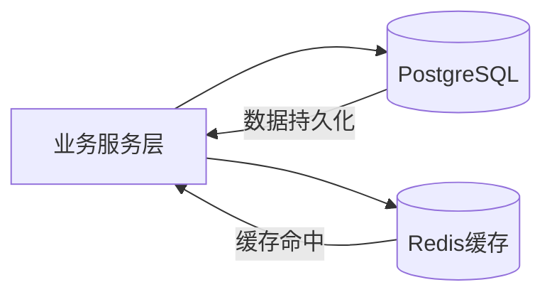
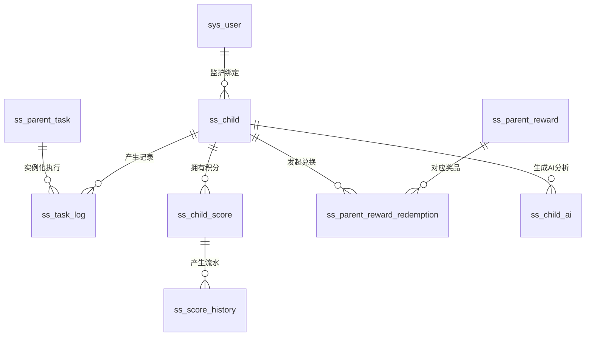

# 3.3 数据库设计

数据库是系统业务逻辑落地的核心载体，其设计直接决定系统的数据一致性、扩展性与运行性能。针对ADHD儿童行为干预场景的特殊性，本系统在数据库设计中不仅关注传统业务数据建模，同时引入游戏化激励、任务拆解以及情绪追踪等扩展维度，以支撑系统的长期行为引导能力。

## 3.3.1 设计原则与总体架构

在数据库设计过程中，系统遵循以下核心原则：

（1）**高内聚与领域划分原则**
围绕系统核心业务，将数据划分为“用户与档案”、“任务流转”、“激励体系”与“情绪与AI追踪”四大领域，保证各模块职责清晰、边界明确。

（2）**读性能优先原则**
针对儿童端与家长端的高频读取场景，通过适度去范式化设计与缓存机制，减少多表关联查询带来的性能开销。

（3）**灵活扩展原则**
对于任务子步骤、用户偏好等非结构化数据，采用 PostgreSQL 的 JSONB 类型存储，以适应未来业务变化。

（4）**数据一致性保障原则**
通过快照字段与流水表设计，确保积分、奖励等关键数据具备可追溯性与审计能力。

系统整体采用“关系型数据库 + 缓存层”的双层架构，其结构如下：

该架构通过将高频访问数据前置至内存层，有效降低数据库压力，提高系统响应速度。

## 3.3.2 概念模型设计（E-R模型）

基于系统功能需求分析，从业务中抽象出四类核心实体域。

## 3.3.3 核心数据表设计

在概念模型的基础上，结合工程中的实际 JPA/MyBatis-Plus 实体映射，系统设计了以下核心数据表以支撑业务运行。

### （1）用户与档案域

#### 系统用户表（sys_user）
用于存储家长及管理员账户信息，作为系统的基础鉴权实体。
| 字段名称 | 类型 | 说明 |
| --- | --- | --- |
| user_id | BIGINT | 主键 (雪花算法) |
| user_name | VARCHAR(64) | 登录账号 |
| password | VARCHAR(128) | Bcrypt 加密 Hash |
| user_type | TINYINT | 用户类型 (1:管理员, 2:家长) |

#### 儿童档案表（ss_child）
将儿童独立建模，并引入游戏化属性及个性化配置。
| 字段名称 | 类型 | 说明 |
| --- | --- | --- |
| id | BIGINT | 主键 |
| parent_id | BIGINT | 绑定的主家长ID |
| nickname | VARCHAR(64) | 儿童昵称 |
| level | INT | 当前游戏化等级 |
| daily_config | JSONB | 儿童每日习惯动态配置 |

### （2）任务流转域

#### 家长任务定义表（ss_parent_task）
核心业务表之一，用于描述家长配置的具体任务执行标准。
| 字段名称 | 类型 | 说明 |
| --- | --- | --- |
| task_id | BIGINT | 主键 |
| user_id | BIGINT | 创建任务的家长ID |
| title | VARCHAR(100)| 任务名称 |
| difficulty | INT | 任务难度评级 |
| reward_points| INT | 任务奖励积分值 |
| cycle_type | INT | 调度与循环配置 |

#### 儿童任务执行表（ss_task_log）
记录儿童在终端实际执行任务的过程及打卡结果。
| 字段名称 | 类型 | 说明 |
| --- | --- | --- |
| id | BIGINT | 主键 |
| task_id | BIGINT | 关联的父任务定义ID |
| child_id | BIGINT | 执行儿童ID |
| status | CHAR(1) | 状态 (如: 待办/进行中/已完成) |
| reward_snap | INT | 结算奖励快照（防止历史规则变更）|
| finish_time | TIMESTAMP | 实际打卡完成时间 |

### （3）激励体系域

#### 儿童积分余额表（ss_child_score）
维护儿童的虚拟资产总盘。
| 字段名称 | 类型 | 说明 |
| --- | --- | --- |
| user_id | BIGINT | 儿童ID（主键） |
| balance | INT | 当前可用积分余额 |
| total_earned | INT | 历史累计获得总积分 |

#### 积分流水历史表（ss_score_history）
记录每一次积分变动，确保经济体系的绝对审计安全。
| 字段名称 | 类型 | 说明 |
| --- | --- | --- |
| id | BIGINT | 主键 |
| user_id | BIGINT | 儿童ID |
| amount | INT | 变动数值 |
| type | CHAR(1) | 类型 (1:获取 2:消费) |
| source_id | BIGINT | 关联的任务ID或奖品ID |

#### 奖品与兑换表（ss_parent_reward & ss_parent_reward_redemption）
由 `ss_parent_reward` 定义家长可提供的实物/心愿池，由 `ss_parent_reward_redemption` 记录儿童发起的兑换审批流程。

### （4）情绪追踪与AI辅助域

#### 情绪安抚套件表（ss_parent_emotion_kit）
记录特定场景下的心理辅导策略与情绪应对方案。

#### 儿童AI生成建议表（ss_child_ai）
存储大语言模型针对该儿童历史行为生成的结构化建议与每日寄语，供家长参考和向儿童下发。
| 字段名称 | 类型 | 说明 |
| --- | --- | --- |
| id | BIGINT | 主键 |
| child_id | BIGINT | 目标儿童ID |
| ai_message | TEXT | AI 生成的寄语/建议文本 |
| generate_time| TIMESTAMP | 报告生成时间 |

## 3.3.4 关键设计说明

为提升系统的稳定性与扩展性，数据库设计中引入以下关键机制：

### （1）JSONB半结构化存储设计
在任务微步骤拆解与儿童个性化配置（如 `daily_config`）中，采用 PostgreSQL 原生的 JSONB 格式进行存储。该设计避免了过度拆表带来的复杂关联查询问题，同时极大提高了系统对非结构化、动态增减属性的适应能力。

### （2）任务奖励快照机制
在任务执行记录表（`ss_task_log`）中专门引入 `reward_snap` 字段。该机制用于在儿童点击“完成”的瞬间锁定当时应得的积分值，避免日后家长修改了源任务的积分规则从而导致历史数据对账不平，保证了系统审计的可追溯性。

### （3）积分流水审计闭环
通过“账户总盘表（`ss_child_score`）”与“流水历史明细表（`ss_score_history`）”的分离设计，任何积分的发放与扣除都必须先写流水再改余额，实现了对积分经济系统的完整财务级审计。

## 3.3.5 缓存策略与性能优化

为应对儿童晚间集中写作业、打卡等高并发访问场景，系统引入 Redis 作为内存缓存层，核心策略如下：

### （1）认证与鉴权缓存
基于 Sa-Token 框架机制，将用户的登录 Context 与权限列表缓存于 Redis 中（TTL 机制），将高频的权限比对开销从关系型数据库中彻底剥离。

### （2）任务防重与防连击锁
利用 Redis 的 `SETNX` (Set if Not eXists) 指令实现轻量级分布式互斥锁。当患儿在移动端因手抖快速双击“完成任务”或“兑换奖品”按钮时，利用类似 `lock:submit:task:{taskId}` 的原子键阻断并发冗余请求，彻底杜绝积分被重复核发的严重漏洞。