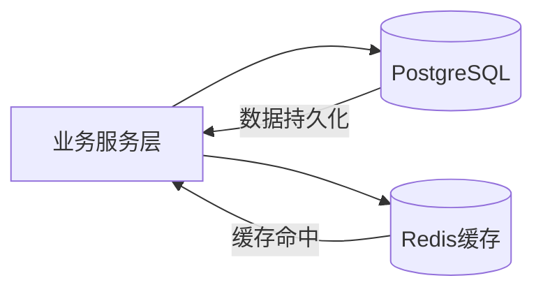
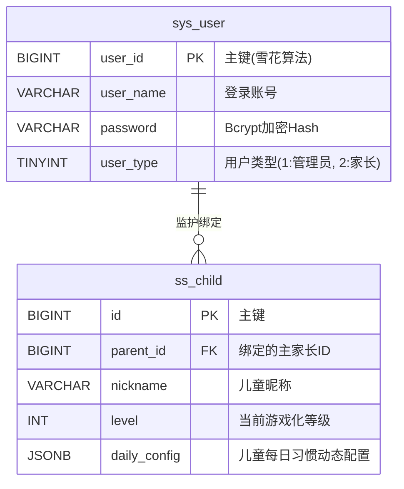
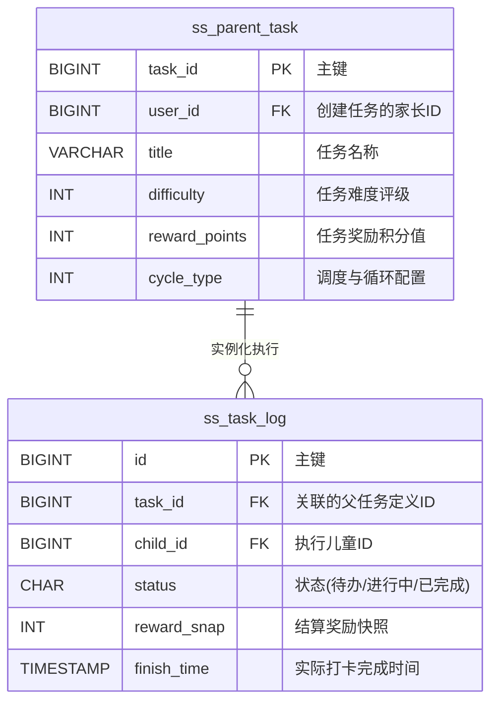
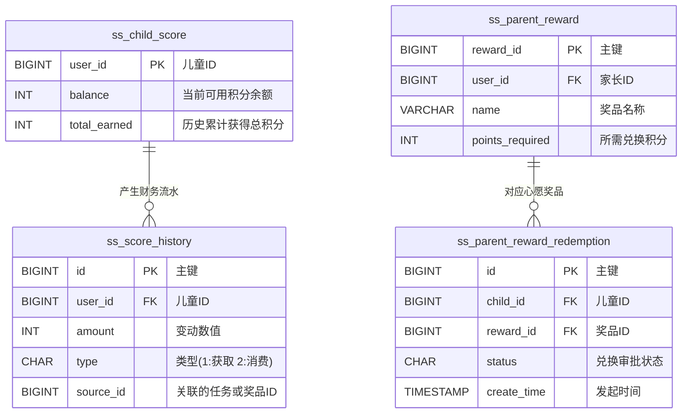
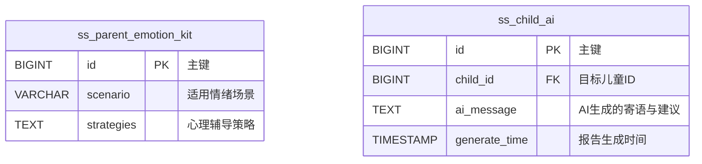

# 3.3 数据库设计

数据库是系统业务逻辑落地的核心载体，其设计直接决定系统的数据一致性、扩展性与运行性能。针对ADHD儿童行为干预场景的特殊性，本系统在数据库设计中不仅关注传统业务数据建模，同时引入游戏化激励、任务拆解以及情绪追踪等扩展维度，以支撑系统的长期行为引导能力。

## 3.3.1 设计原则与总体架构

在数据库设计过程中，系统遵循以下核心原则：

（1）**高内聚与领域划分原则**
围绕系统核心业务，将数据划分为“用户与档案”、“任务流转”、“激励体系”与“情绪与AI追踪”四大领域，保证各模块职责清晰、边界明确。

（2）**读性能优先原则**
针对儿童端与家长端的高频读取场景，通过适度去范式化设计与缓存机制，减少多表关联查询带来的性能开销。

（3）**灵活扩展原则**
对于任务子步骤、用户偏好等非结构化数据，采用 PostgreSQL 的 JSONB 类型存储，以适应未来业务变化。

（4）**数据一致性保障原则**
通过快照字段与流水表设计，确保积分、奖励等关键数据具备可追溯性与审计能力。

系统整体采用“关系型数据库 + 缓存层”的双层架构，其结构如下：

该架构通过将高频访问数据前置至内存层，有效降低数据库压力，提高系统响应速度。

## 3.3.2 概念模型设计 (E-R模型)

为了更直观地展现系统的底层架构，本节采用包含实体具体属性的 E-R 模型，将系统的核心库表划分为四大业务域进行展示。

### （1）用户与档案域
该域负责维护系统鉴权基础以及儿童的独立档案和游戏化属性。

### （2）任务流转域
该域为系统的业务中枢，实现了从家长任务下发到儿童实际打卡执行的全生命周期闭环。

### （3）激励体系域
负责系统内虚拟资产（积分）的发放、核算以及与心愿奖品的最终兑换流转。

### （4）情绪追踪与AI辅助域
专项支持 ADHD 治疗中所需的话术动态生成及情绪安抚应对机制。

> **注：** 考虑到版面布局，四大领域被拆分展示。在系统实际运行中，任务、激励与 AI 分析等领域的实体均通过 `child_id` 或 `user_id` 与顶层【用户与档案域】发生强关联。

## 3.3.3 物理数据表结构设计

结合工程中的实际 JPA/MyBatis-Plus 实体映射，本系统在 PostgreSQL 中建立了一系列核心物理表，下面列出关键表的字段设计（数据字典）：

### （1）用户与档案域数据表

**表 1 系统用户表 (sys_user)**

| 字段名称 | 类型 | 必填 | 说明 |
| :--- | :--- | :---: | :--- |
| user_id | BIGINT | 是 | 主键 (雪花算法生成) |
| user_name | VARCHAR(64) | 是 | 登录账号/手机号 |
| password | VARCHAR(128) | 是 | Bcrypt 加密的哈希值 |
| user_type | TINYINT | 是 | 用户类型 (1:管理员, 2:家长) |
| nickname | VARCHAR(64) | 否 | 显示简称 |
| status | TINYINT | 是 | 状态 (0:正常, 1:停用) |

**表 2 儿童档案表 (ss_child)**

| 字段名称 | 类型 | 必填 | 说明 |
| :--- | :--- | :---: | :--- |
| id | BIGINT | 是 | 主键 |
| parent_id | BIGINT | 是 | 绑定的主家长ID (关联 sys_user) |
| nickname | VARCHAR(64) | 是 | 儿童昵称 |
| level | INT | 是 | 当前游戏化等级 (默认1级) |
| daily_config | JSONB | 否 | 儿童每日习惯与偏好的动态 JSON 配置 |

### （2）任务流转域数据表

**表 3 家长任务定义表 (ss_parent_task)**

| 字段名称 | 类型 | 必填 | 说明 |
| :--- | :--- | :---: | :--- |
| task_id | BIGINT | 是 | 主键 |
| user_id | BIGINT | 是 | 创建该任务的家长ID |
| title | VARCHAR(100) | 是 | 任务名称（如：“睡前阅读20分钟”） |
| difficulty | INT | 是 | 任务难度评级 (1~5) |
| reward_points| INT | 是 | 任务基础奖励积分值 |
| cycle_type | INT | 是 | 调度与循环配置 (0:单次, 1:每日等) |

**表 4 儿童任务执行表 (ss_task_log)**

| 字段名称 | 类型 | 必填 | 说明 |
| :--- | :--- | :---: | :--- |
| id | BIGINT | 是 | 主键 |
| task_id | BIGINT | 是 | 关联的父任务定义ID |
| child_id | BIGINT | 是 | 执行该任务的儿童ID |
| status | CHAR(1) | 是 | 执行状态 (0:待办, 1:进行中, 2:已完成) |
| reward_snap | INT | 是 | 结算时应得奖励积分的快照 |
| finish_time | TIMESTAMP | 否 | 实际打卡完成的精确时间 |

### （3）激励体系与情绪辅助域数据表

**表 5 儿童积分余额表 (ss_child_score)**

| 字段名称 | 类型 | 必填 | 说明 |
| :--- | :--- | :---: | :--- |
| user_id | BIGINT | 是 | 关联儿童ID (作为主键) |
| balance | INT | 是 | 当前可用积分余额 (初始为0) |
| total_earned | INT | 是 | 历史累计获取的总积分 |

**表 6 积分流水历史表 (ss_score_history)**

| 字段名称 | 类型 | 必填 | 说明 |
| :--- | :--- | :---: | :--- |
| id | BIGINT | 是 | 主键 |
| user_id | BIGINT | 是 | 关联儿童ID |
| amount | INT | 是 | 积分变动数值 |
| type | CHAR(1) | 是 | 流水类型 (1:获取积分, 2:消费积分) |
| source_id | BIGINT | 否 | 积分变动关联源 (如 Task_Log_ID 或 兑换单ID) |

**表 7 儿童AI生成建议表 (ss_child_ai)**

| 字段名称 | 类型 | 必填 | 说明 |
| :--- | :--- | :---: | :--- |
| id | BIGINT | 是 | 主键 |
| child_id | BIGINT | 是 | 分析目标儿童ID |
| ai_message | TEXT | 是 | AI 大模型生成的针对性寄语与建议 |
| generate_time| TIMESTAMP | 是 | 报告的生成时间戳 |

## 3.3.4 关键设计说明

为提升系统的稳定性与扩展性，数据库设计中引入以下关键机制：

### （1）JSONB半结构化存储设计
在任务微步骤拆解与儿童个性化配置（如 `daily_config`）中，采用 PostgreSQL 原生的 JSONB 格式进行存储。该设计不仅去除了传统关系型数据库过度拆表带来的复杂关联查询，还极大提高了系统对非结构化、动态增减属性的适应能力。

### （2）任务奖励快照机制
在任务执行记录表（`ss_task_log`）中专门引入 `reward_snap` 字段。该机制用于在儿童点击“完成”的瞬间锁定当时应得的积分值，避免日后家长修改了源任务的积分规则从而导致历史数据对账不平，保证了系统审计的可追溯性。

### （3）积分流水审计闭环
通过“账户总盘表（`ss_child_score`）”与“流水历史明细表（`ss_score_history`）”的解耦分离设计，任何积分的发放与扣除操作都必须先写流水再改余额，实现了对积分经济系统的完整财务级审计与防篡改。

## 3.3.5 缓存策略与性能优化

为应对儿童晚间集中写作业、打卡等高并发访问场景，系统引入 Redis 作为内存缓存层，核心策略如下：

### （1）认证与鉴权缓存
基于 Sa-Token 框架机制，将用户的登录 Context 与权限列表缓存于 Redis 中（TTL 机制），将高频的权限鉴别开销从底层关系型数据库中彻底剥离。

### （2）任务防重与防连击锁
利用 Redis 的 `SETNX` (Set if Not eXists) 指令实现轻量级分布式互斥锁。当患儿在移动端因手抖快速双击“完成任务”或“兑换奖品”按钮时，利用类似 `lock:submit:task:{taskId}` 的原子键阻断并发冗余请求，彻底杜绝积分被重复核发（Double Spending）的严重漏洞。