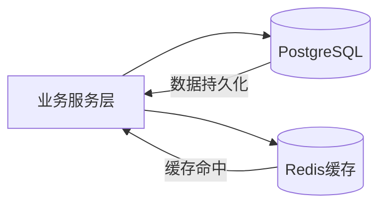
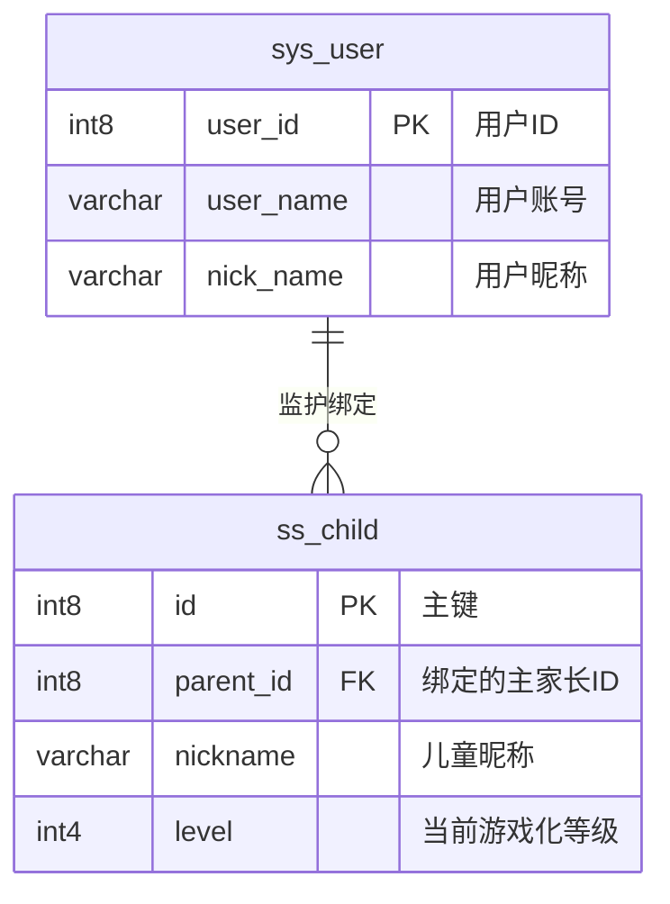
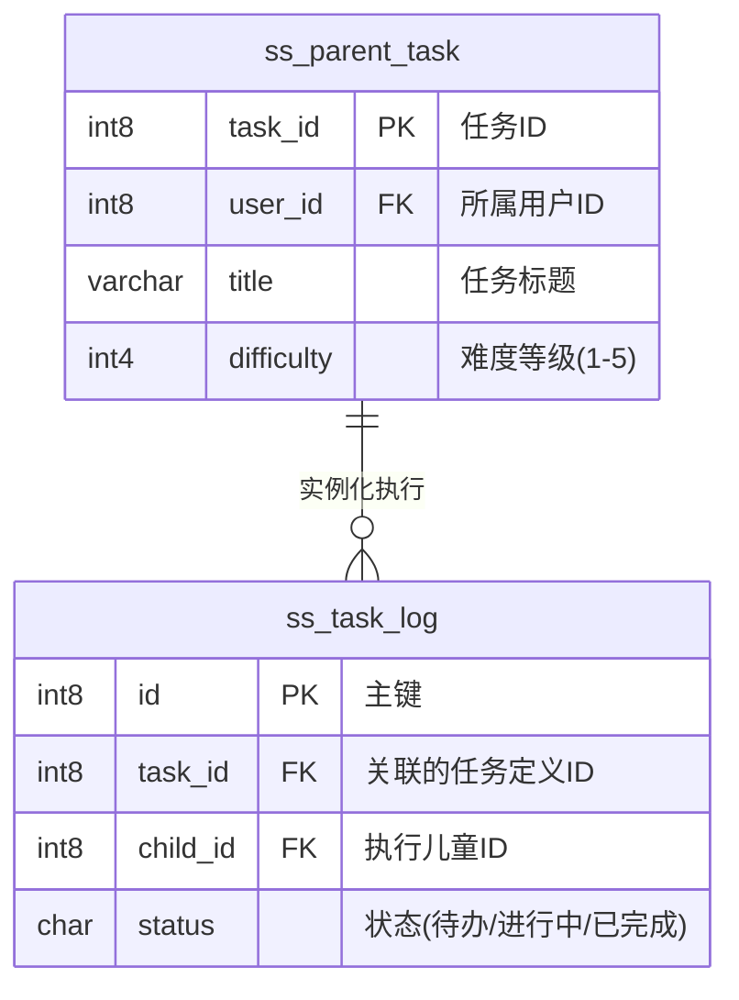
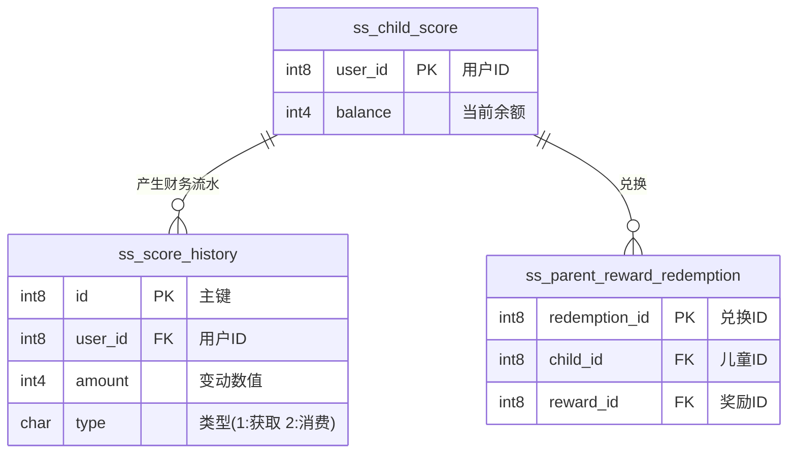

# 3.3 数据库设计

数据库是系统业务逻辑落地的核心载体，其设计直接决定系统的数据一致性、扩展性与运行性能。针对ADHD儿童行为干预场景的特殊性，本系统在数据库设计中不仅关注传统业务数据建模，同时引入游戏化激励、任务拆解以及情绪追踪等扩展维度，以支撑系统的长期行为引导能力。

## 3.3.1 设计原则与总体架构

在数据库设计过程中，系统遵循以下核心原则：

（1）**高内聚与领域划分原则**
围绕系统核心业务，将数据划分为“用户与档案”、“任务流转”、“激励体系”与“情绪追踪”四大领域，保证各模块职责清晰、边界明确。

（2）**读性能优先原则**
针对儿童端与家长端的高频读取场景，通过适度去范式化设计与缓存机制，减少多表关联查询带来的性能开销。

（3）**灵活扩展原则**
对于任务子步骤、用户偏好等非结构化数据，采用 PostgreSQL 的 JSONB 类型存储，以适应未来业务变化。

（4）**数据一致性保障原则**
通过快照字段与流水表设计，确保积分、奖励等关键数据具备可追溯性与审计能力。

系统整体采用“关系型数据库 + 缓存层”的双层架构，其结构如下：

## 3.3.2 概念模型设计 (E-R模型)

为了直观地展现系统的底层架构，本节通过 E-R 模型展示系统的核心库表以及关联结构。
*(注：通常在学位论文的 E-R 图中只展示能够体现业务关系的核心主外键及核心业务字段，完整字段请见下节 3.3.3 表结构设计)*

<table>
<tr>
<td valign="top" width="50%">

### （1）用户与档案域
该域负责维护系统鉴权基础以及儿童的独立档案和游戏化属性。

</td>
<td valign="top" width="50%">

### （2）任务流转域
该域为系统的业务中枢，实现了从家长任务下发到儿童实际打卡执行的全生命周期闭环。

</td>
</tr>
</table>

### （3）激励体系域
负责系统内虚拟资产（积分）的发放、核算以及与心愿奖品的最终兑换流转。

## 3.3.3 物理数据表结构设计

本节中的表结构严格对应工程环境的建表脚本，所有表及字段属性与实际项目完全一致，包含了完整的系统运行及审计字段（如 `create_time`、`del_flag`、`tenant_id` 等）。

### （1）用户与档案域数据表

**表 3.3.3.1 系统用户表 (sys_user)**
记录系统家长、管理员等主账号信息。

| 字段名称 | 类型 | 长度 | 必填 | 说明 |
| :--- | :--- | :--- | :---: | :--- |
| user_id | int8 | 20 | 是 | 用户ID |
| tenant_id | varchar | 20 | 否 | 租户编号 |
| dept_id | int8 | 20 | 否 | 部门ID |
| user_name | varchar | 30 | 是 | 用户账号 |
| nick_name | varchar | 30 | 是 | 用户昵称 |
| user_type | varchar | 10 | 否 | 用户类型（sys_user系统用户） |
| email | varchar | 50 | 否 | 用户邮箱 |
| phonenumber | varchar | 11 | 否 | 手机号码 |
| sex | char | 1 | 否 | 用户性别（0男 1女 2未知） |
| avatar | int8 | 20 | 否 | 头像地址 |
| password | varchar | 100 | 否 | 密码 |
| status | char | 1 | 否 | 帐号状态（0正常 1停用） |
| del_flag | char | 1 | 否 | 删除标志（0代表存在 1代表删除） |
| login_ip | varchar | 128 | 否 | 最后登陆IP |
| login_date | timestamp | 6 | 否 | 最后登陆时间 |
| create_dept | int8 | 20 | 否 | 创建部门 |
| create_by | int8 | 20 | 否 | 创建者 |
| create_time | timestamp | 6 | 否 | 创建时间 |
| update_by | int8 | 20 | 否 | 更新者 |
| update_time | timestamp | 6 | 否 | 更新时间 |
| remark | varchar | 500 | 否 | 备注 |

**表 3.3.3.2 儿童档案表 (ss_child)**
维护干预目标（ADHD患儿）的游戏化等级、余额、个性化配置等专有属性。

| 字段名称 | 类型 | 长度 | 必填 | 说明 |
| :--- | :--- | :--- | :---: | :--- |
| id | int8 | 20 | 是 | 主键ID |
| tenant_id | varchar | 20 | 否 | 租户编号 |
| parent_id | int8 | 20 | 是 | 绑定的家长ID |
| nickname | varchar | 64 | 是 | 儿童昵称 |
| avatar_url | varchar | 255 | 否 | 头像地址 |
| avatar_config | jsonb | - | 否 | 虚拟形象配置 |
| level | int4 | 11 | 否 | 当前等级 |
| daily_config | jsonb | - | 否 | 个性化每日限制配置 |
| gender | char | 1 | 否 | 性别 |
| birthday | timestamp | 6 | 否 | 生日 |
| star_balance | int4 | 11 | 否 | 星星余额 |
| total_stars | int4 | 11 | 否 | 累计星星 |
| challenges | jsonb | - | 否 | 挑战进度记录 |
| create_dept | int8 | 20 | 否 | 创建部门 |
| create_by | int8 | 20 | 否 | 创建者 |
| create_time | timestamp | 6 | 否 | 创建时间 |
| update_by | int8 | 20 | 否 | 更新者 |
| update_time | timestamp | 6 | 否 | 更新时间 |
| remark | varchar | 500 | 否 | 备注 |
| del_flag | char | 1 | 否 | 删除标志 |

### （2）任务流转域数据表

**表 3.3.3.3 家长任务发布表 (ss_parent_task)**
家长配置的日常习惯任务规则。

| 字段名称 | 类型 | 长度 | 必填 | 说明 |
| :--- | :--- | :--- | :---: | :--- |
| task_id | int8 | 20 | 是 | 任务ID |
| user_id | int8 | 20 | 否 | 所属用户ID |
| title | varchar | 100 | 否 | 任务标题 |
| description | varchar | 500 | 否 | 任务描述 |
| icon | varchar | 100 | 否 | 图标 |
| difficulty | int4 | 11 | 否 | 难度等级(1-5) |
| reward_points | int4 | 11 | 否 | 奖励积分 |
| status | char | 1 | 否 | 状态(0进行中 1已完成 2已过期) |
| create_by | int8 | 20 | 否 | 创建者 |
| create_time | timestamp | 6 | 否 | 创建时间 |
| update_by | int8 | 20 | 否 | 更新者 |
| update_time | timestamp | 6 | 否 | 更新时间 |
| del_flag | char | 1 | 否 | 删除标志(0代表存在 2代表删除) |
| dept_id | int8 | 20 | 否 | 家庭ID(部门ID) |
| parent_id | int8 | 20 | 否 | 父任务ID(用于任务拆解) |
| prompt_level | int4 | 11 | 否 | 支架强度/辅助强度(1-5) |
| cycle_type | int4 | 11 | 否 | 循环类型(0单次 1每日 2每周) |
| light_effect | varchar | 100 | 否 | 灯光效果代码 |
| audio_effect | varchar | 100 | 否 | 音频索引代码 |
| deadline | timestamp | 6 | 否 | 截止时间 |
| create_dept | int8 | 20 | 否 | 创建部门 |

**表 3.3.3.4 任务执行记录表 (ss_task_log)**
儿童实际打卡执行某次任务的过程快照记录。

| 字段名称 | 类型 | 长度 | 必填 | 说明 |
| :--- | :--- | :--- | :---: | :--- |
| id | int8 | 20 | 是 | 主键ID |
| tenant_id | varchar | 20 | 否 | 租户编号 |
| task_id | int8 | 20 | 是 | 关联的任务定义ID |
| child_id | int8 | 20 | 是 | 执行儿童ID |
| finish_time | timestamp | 6 | 否 | 实际打卡完成时间 |
| status | char | 1 | 否 | 状态(0:待办, 1:进行中, 2:已完成) |
| proof | varchar | 500 | 否 | 任务证明图片/资料 |
| reward_snap | int4 | 11 | 否 | 实际奖励星星快照 |
| title_snap | varchar | 128 | 否 | 任务标题快照 |
| create_time | timestamp | 6 | 否 | 创建时间 |
| dept_id | int8 | 20 | 否 | 家庭ID(部门ID) |
| target_date | date | - | 否 | 预定执行日期 |
| actual_duration| int4 | 11 | 否 | 实际专注时长(秒) |
| start_time | timestamp | 6 | 否 | 专注开始时间 |
| end_time | timestamp | 6 | 否 | 专注结束时间 |
| del_flag | char | 1 | 否 | 删除标志(0代表存在 2代表删除) |
| create_dept | int8 | 20 | 否 | 创建部门 |
| create_by | int8 | 20 | 否 | 创建者 |
| update_by | int8 | 20 | 否 | 更新者 |
| update_time | timestamp | 6 | 否 | 更新时间 |

### （3）激励体系域数据表

**表 3.3.3.5 儿童积分余额表 (ss_child_score)**
分离化记录儿童总体获得与剩余的积分盘。

| 字段名称 | 类型 | 长度 | 必填 | 说明 |
| :--- | :--- | :--- | :---: | :--- |
| user_id | int8 | 20 | 是 | 用户ID（儿童的对应系统登录ID） |
| balance | int4 | 11 | 否 | 当前余额 |
| total_earned | int4 | 11 | 否 | 累计获得 |
| update_time | timestamp | 6 | 否 | 更新时间 |

**表 3.3.3.6 积分流水记录表 (ss_score_history)**
所有积分增减行为的最终审计依据。

| 字段名称 | 类型 | 长度 | 必填 | 说明 |
| :--- | :--- | :--- | :---: | :--- |
| id | int8 | 20 | 是 | 流水ID |
| user_id | int8 | 20 | 是 | 关联儿童ID |
| amount | int4 | 11 | 是 | 变动数值 |
| type | char | 1 | 否 | 类型(1:获取 2:消费) |
| source_id | int8 | 20 | 否 | 关联源记录ID（如任务ID） |
| reason | varchar | 255 | 否 | 变动事由说明 |
| create_time | timestamp | 6 | 否 | 流水产生时间 |

**表 3.3.3.7 家长奖励配置表 (ss_parent_reward)**
家长为儿童设立的个性化心愿池奖品。

| 字段名称 | 类型 | 长度 | 必填 | 说明 |
| :--- | :--- | :--- | :---: | :--- |
| reward_id | int8 | 20 | 是 | 奖励ID |
| user_id | int8 | 20 | 否 | 所属家长用户ID |
| name | varchar | 100 | 否 | 奖励名称 |
| points_required| int4 | 11 | 否 | 所需兑换积分 |
| stock | int4 | 11 | 否 | 库存(-1无限) |
| icon | varchar | 100 | 否 | 奖励图标 |
| status | char | 1 | 否 | 状态(0上架 1下架) |
| create_by | int8 | 20 | 否 | 创建者 |
| create_time | timestamp | 6 | 否 | 创建时间 |
| update_by | int8 | 20 | 否 | 更新者 |
| update_time | timestamp | 6 | 否 | 更新时间 |
| del_flag | char | 1 | 否 | 删除标志(0代表存在 2代表删除) |
| create_dept | int8 | 20 | 否 | 创建部门 |

**表 3.3.3.8 奖励兑换记录表 (ss_parent_reward_redemption)**
记录儿童使用积分发起奖励兑换申请的流转与审批。

| 字段名称 | 类型 | 长度 | 必填 | 说明 |
| :--- | :--- | :--- | :---: | :--- |
| redemption_id | int8 | 20 | 是 | 兑换ID |
| reward_id | int8 | 20 | 是 | 奖励ID |
| user_id | int8 | 20 | 是 | 发起用户ID(儿童) |
| points_cost | int4 | 11 | 否 | 消耗积分 |
| status | char | 1 | 否 | 状态(0:待审批 1:已批准 2:已拒绝) |
| create_by | int8 | 20 | 否 | 创建者 |
| create_time | timestamp | 6 | 否 | 申请提交时间 |
| update_by | int8 | 20 | 否 | 更新/审批者 |
| update_time | timestamp | 6 | 否 | 更新/审批时间 |
| create_dept | int8 | 20 | 否 | 创建部门 |

### （4）情绪追踪辅助域数据表

**表 3.3.3.9 情绪记录表 (ss_emotion_record)**

| 字段名称 | 类型 | 长度 | 必填 | 说明 |
| :--- | :--- | :--- | :---: | :--- |
| id | int8 | 20 | 是 | 主键ID |
| tenant_id | varchar | 20 | 否 | 租户编号 |
| child_id | int8 | 20 | 是 | 关联儿童ID |
| mood_level | int4 | 11 | 否 | 情绪状态/能效评级 |
| mood_type | varchar | 32 | 否 | 情绪大类(如开心、愤怒等) |
| description | varchar | 500 | 否 | 具体表现文本描述 |
| voice_url | varchar | 255 | 否 | 声音分析录音URL |
| parent_feedback| varchar | 500 | 否 | 家长的应对方式反馈 |
| is_read | char | 1 | 否 | 状态(是否已查阅) |
| record_time | timestamp | 6 | 否 | 情绪记录时间 |
| create_time | timestamp | 6 | 否 | 入库时间 |

## 3.3.4 关键设计说明

为提升系统的稳定性与扩展性，数据库设计中引入以下关键机制：

### （1）JSONB半结构化存储设计
在系统核心业务的 `daily_config`（每日个人限时配置）中，采用了 PostgreSQL 原生的 JSONB 格式进行动态属性存储。此类设计不仅去除了过度拆解一对多从表带来的复杂关联查询，同时保证了当未来需新增儿童干预相关参数时，系统表结构依然能够无感自适应。

### （2）任务奖励快照及流水闭环机制
- **快照记录**：在 `ss_task_log` 执行记录表中专门引入 `reward_snap` 和 `title_snap` 快照字段。该机制用于在儿童点击打卡的瞬间锁定应得的积分值和当时的称呼。无论日后家长如何修改或删除源任务，历史执行数据绝不被篡改污染。
- **财务级审计**：任何虚拟积分的发放与扣除，都要求在 `ss_score_history` 流水表中写入增减值记录，实现了针对积分经济系统的不可篡改与完整对账闭环。

### （3）系统层与应用层的多租户与软删除策略
在所有实际的核心数据表中（如 `ss_child`, `ss_parent_task`），均完整包含了 `tenant_id` 租户字段以及 `del_flag` 标志。这符合企业级应用中 SaaS 多机构共用以及“软删除”（避免硬删除导致的数据不可恢复与外键抛错）的架构最佳实践规范。

## 3.3.5 缓存策略与性能优化

为应对儿童群体晚间集中写作业、大量高频请求接口产生的高并发打卡场景，系统引入 Redis 作为内存缓存层并设计了防刷机制：

### （1）认证与鉴权缓存去查库
基于 Sa-Token 框架机制，将用户的登录 Context 与基于 `role` 的权限集合预热并长时缓存于 Redis 中，将每次接口调用的最高频鉴别开销从 PostgreSQL 数据库中彻底剥离出来，大幅降低连接池消耗。

### （2）任务并发防抖防重锁
利用 Redis 原生支持的单线程 `SETNX` (Set if Not eXists) 指令实现了轻量级的高效分布式互斥锁。当出现儿童由于 ADHD 等症状急躁手抖，连续快速点击多次“完成任务”或者“兑换心愿奖品”按钮时，系统在后端通过形如 `lock:submit:task:{taskId}` 的原子键阻断了第二波甚至第三波冗余请求，彻底杜绝了并发情况下的积分重复核发（Double Spending）隐患。