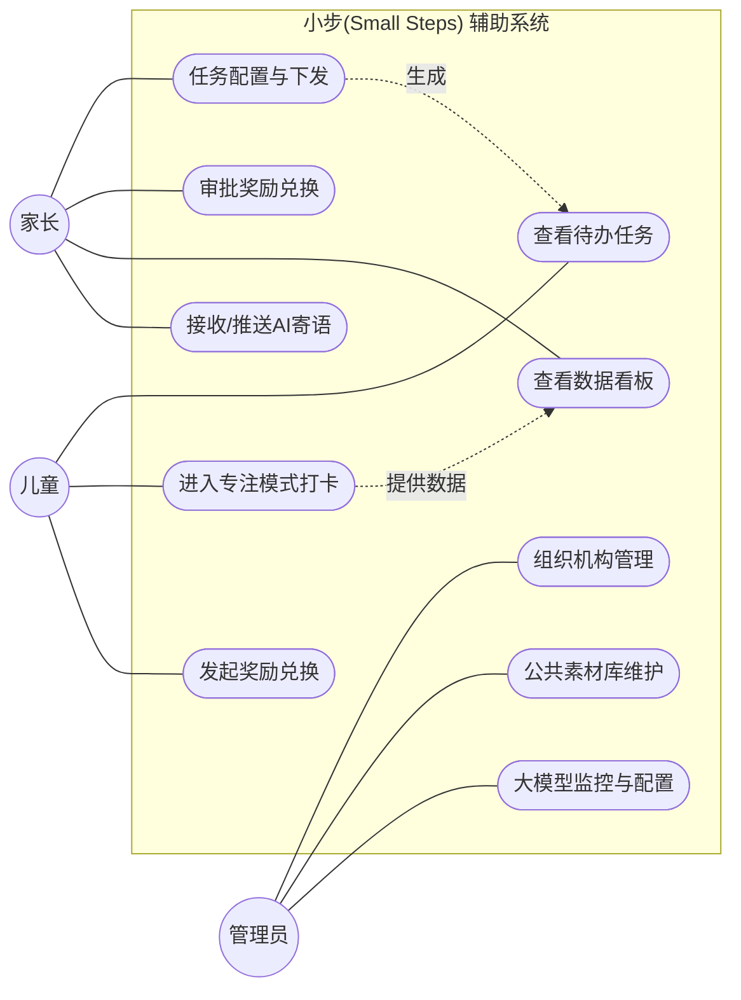
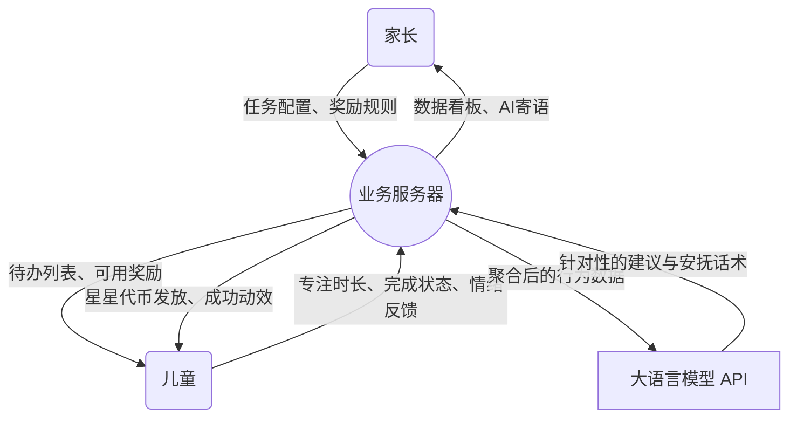

# 2.2.2 系统功能需求

依据多角色业务流向，系统在功能域上划分为三大相互耦合的模块：儿童移动端、家长移动端以及全局管理后台终端。本节将结合用例图和数据流图，对这三大模块的功能需求进行详细阐述。

### （1）核心业务模块划分与用例分析

总体而言，系统的核心业务流程围绕“任务”这一实体展开。其主要参与者（Actor）包括家长、儿童以及后台管理员。
*   **家长**负责统筹规划，包括下发任务、配置奖励以及查看儿童数据。
*   **儿童**负责执行任务，通过系统获得即时正向反馈与奖励。
*   **管理员**则负责系统层面的资源维护与安全监控。

为了直观展示各角色的功能边界，我们设计了以下系统全局用例图：

### （2）数据流图 (DFD)

为了进一步阐明系统内部数据的流动与转换过程，尤其是引入大语言模型（LLM）后的智能反馈闭环，我们构建了以下顶层数据流图：

### （3）儿童端功能需求描述 (专注模式、任务打卡)

儿童端作为数据产生的触发源头，核心功能极尽精简，主要围绕以下几点：
1.  **任务卡片极简展示**：系统需以大字体、高宽容度图片（Icon）的方式，依次单线程展示当下的待办任务，支持一键“开始进行”或“暂缓跳过”。避免列表式平铺带来的视觉压迫感。
2.  **沉浸式专注模式（动态番茄钟）**：提供基于番茄工作法变体的正计时与倒计时工具。在计时期间，屏幕需屏蔽外界干扰，以可视化的流水、沙漏或呼吸灯环等微小动效具象化“时间的流逝”，减轻时间流失焦虑。
3.  **随手正向打卡与代币系统**：任务完成后，系统需触发绚丽的全屏成功动画，并即时发放虚拟碎片/代币。代币需自动归入进度池，进度可视化（如“蓄水池”概念），兑换由家长设定的心愿礼物。

### （4）家长端功能需求描述 (任务分发、数据查看)

家长端旨在为家庭管理者提供“发号施令”与“观测结果”的控制台：
1.  **结构化任务创建与智能模版**：家长可以新建任务，设置周期（如每日/每周三）、奖励代币数额以及强制性的前置步骤打卡（支持图文附件）。系统应内置常见的“起床仪式”、“作业准备”等模版供一键引用。
2.  **实时数据与多维度数据看板**：需支持查看孩子每日的总体任务完成率、累计专注时长、各任务平均超时情况。数据需以柱状图、环形图等直观形式呈现。
3.  **AI 智能生成反馈**：接收由大语言模型（LLM）基于前日数据自动撰写的、旨在安抚儿童情绪与肯定微小进步的“每日寄语”，并支持一键下发给儿童端。

### （5）管理后台功能需求描述 (用户管理、系统监控)

管理后台主要供平台运营人员与超级管理员使用，核心保障系统的良性运作：
1.  **系统用户与组织机构管理**：实现对海量家长注册账号、儿童子账号状态的冻结、解封操作。监控平台日活与异常登录行为。
2.  **公共素材库与模版审核**：管理和维护全局任务库与系统内置的奖励图标、表扬音效素材，方便端侧应用拉取。
3.  **大模型配置与运营监控**：配置对接外部 LLM 的 API 密钥（如 DeepSeek/智谱等底层模型），监控生成 Token 的消耗量，并配置应对模型降级的兜底话术库。