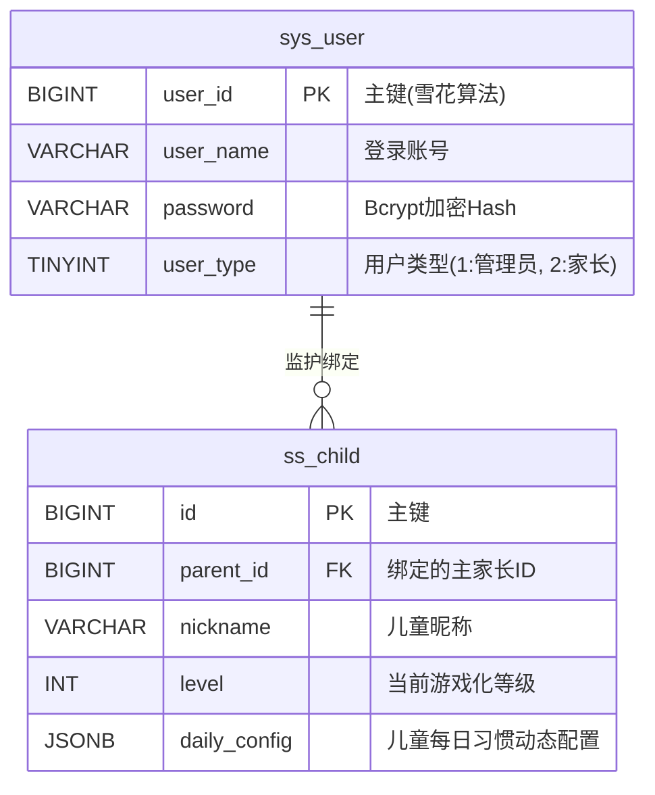
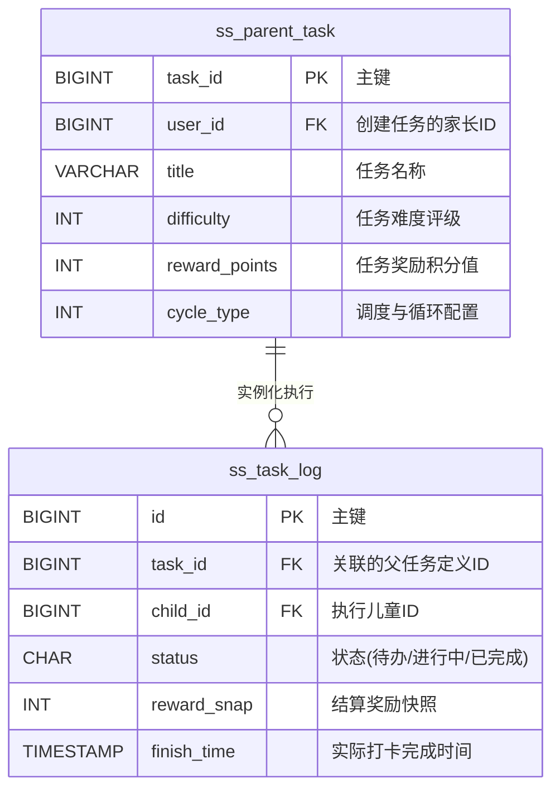
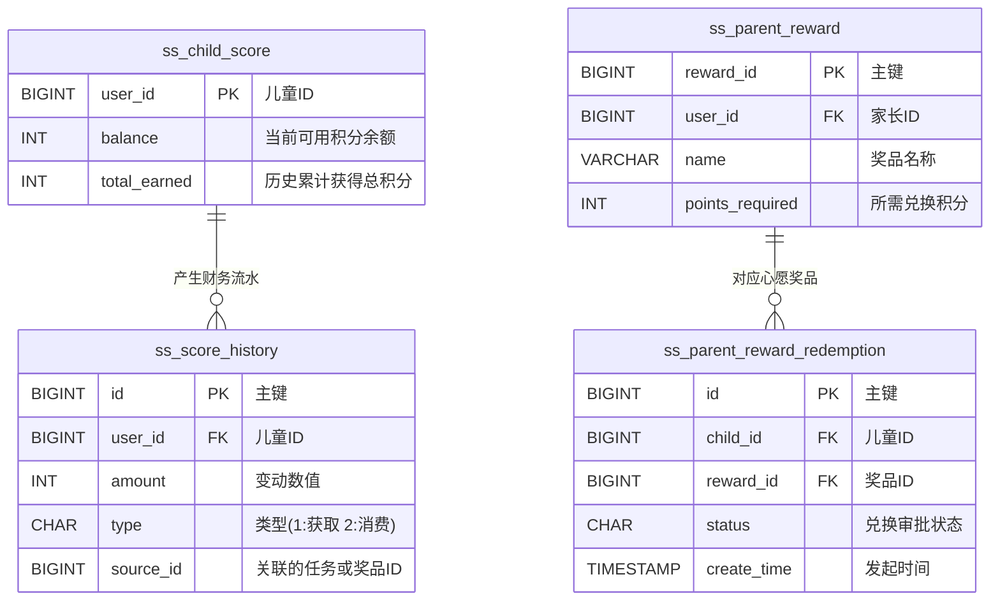
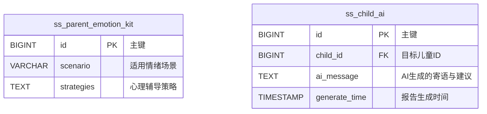

上海应用技术大学
SHANGHAI INSTITUTE OF TECHNOLOGY

高等学历继续教育
本科毕业设计（论文）

课题名称：ADHD中小学生（儿童）行为习惯辅助
系统设计与实现
专    业：       计算机科学与技术
班    级：       2410420
学生学号：       241042025
学生姓名：       赵轩
指导教师：       薛庆水

2026年4月22日

ADHD中小学生（儿童）行为习惯辅助系统设计与实现

摘要：	注意缺陷多动障碍（Attention Deficit Hyperactivity Disorder, ADHD）是学龄期儿童较为普遍的神经发育性障碍，核心表现为注意力维持困难、活动过度及行为冲动。当前主流的药物调控与线下行为矫正在副作用风险、执行一致性等方面存在不足。借助数字化手段实施辅助干预已成新趋势，但现有软件在认知减负定制、亲子协同交互及动态激励等环节仍存短板。 针对上述不足，设计并实现了一套面向ADHD中小学生的行为习惯养成综合辅助系统——“小步（Small Steps）”。系统采用前后端分离架构，通过儿童端、家长端和管理后台的协同，构建涵盖渐进式任务拆解、多模态激励与情绪追踪的数字化干预闭环。技术层面，后端基于Spring Boot 3与MyBatis-Plus搭建，选用Sa-Token实现多角色鉴权，采用Postgres与Redis管理数据；移动端利用UniApp与Vue 3实现双模式动态切换，通过TailwindCSS进行界面渲染。 系统的核心创新在于集成大语言模型（LLM），通过分析儿童行为数据动态输出个性化寄语与激励建议，缓解执行疲劳，并引导家长从“检查者”转向“陪伴者”。测试表明，系统运行稳定且交互流畅，为ADHD日常数字辅助干预提供了可落地的工程实践方案。
关键词： 注意力缺陷多动障碍；ADHD；行为干预；Spring Boot 3；UniApp；Vue 3；前后端分离

Design and Implementation of ADHD Behavior Support System for Children

Abstract: 	Attention Deficit Hyperactivity Disorder (ADHD) is a prevalent neurodevelopmental disorder among school-age children, primarily characterized by difficulties in sustaining attention, hyperactivity, and impulsivity. Current mainstream pharmacological and offline behavioral interventions have limitations in side effect risks and execution consistency. Software-assisted intervention has become a new trend, but existing tools still lack customized cognitive load reduction, parent-child synergy, and dynamic motivation. Addressing these shortcomings, “Small Steps”, a comprehensive behavioral habit-building support system for ADHD students, is designed and implemented. Using a front-end and back-end separation architecture, the system operates across child, parent, and management terminals to create a closed-loop digital intervention encompassing progressive task breakdown, multimodal motivation, and emotion tracking. Technically, the backend is built with Spring Boot 3 and MyBatis-Plus, integrated with Sa-Token for multi-role authentication, and utilizes Postgres and Redis for data management. The mobile application uses UniApp and Vue 3 for dynamic dual-mode switching and TailwindCSS for interface rendering. The system’s core innovation lies in integrating Large Language Models (LLM) to dynamically generate personalized messages and motivation strategies based on behavioral data. This aims to alleviate execution fatigue and shift the parents’ role from “inspectors” to “companions”. Tests show that the system is stable and user-friendly, providing a practical engineering paradigm for daily ADHD digital interventions.
Keywords:	ADHD; Behavioral Intervention; Spring Boot 3; UniApp; Vue 3; Front-end and Back-end Separation

目  录
1 绪论	1
1.1 研究背景	1
1.2 研究目的数字化行为辅助工具的应用价值	1
1.3 面向 ADHD 的技术干预需求与缺口	2
1.4 研究现状和发展趋势国内外研究现状	3
1.4.1 传统行为干预与认知疗法的局限	3
1.4.2 数字疗法与应用程序在 ADHD 干预中的发展	3
1.4.3 现状总结与本系统的突破点	3
1.4.4 总结主要研究内容与目标	4
2 系统分析	5
2.1 可行性分析与开发相关技术概述	5
2.1.1 后端技术栈 (Spring Boot 3, MyBatis-Plus)	5
2.1.2 CSS 框架技术 (TailwindCSS)	5
2.1.3 权限管理技术 (Sa-Token)	6
2.1.4 相关理论基础支撑	6
2.1.5 操作可行性	7
2.2 系统需求分析	7
2.2.1 目标用户群体分析	7
2.2.2 系统功能需求 	依据多角色业务流向，系统在功能域上划分为三大相互耦合的模块：儿童移动端、家长移动端以及全局管理后台终端。	8
2.2.3 非功能性需求分析	9
3 系统设计	11
3.1 总体架构设计	11
3.1.1 架构演进与逻辑分层设计	11
3.1.2 前后端分离协同架构	12
3.2 核心业务模块设计	12
3.2.1 用户认证与鉴权模块设计 (基于 Sa-Token)	12
3.2.2 任务管理与流程设计	13
3.2.3 专注模式与时间管理机制设计	13
3.2.4 智能辅助生成与数据反馈模型设计	14
3.3 数据库设计	14
3.3.1 数据库结构与概念模型 (E-R 图设计)	15
3.3.2 关系型数据库结构详述 (MySQL 关键表设计)	16
3.3.3 缓存策略与 Redis 结构设计	20
4 系统实现	22
4.1 系统登录	22
4.2 后端统筹与接口实现 (smallsteps-api)	22
4.2.1 安全认证与路由拦截的实现细节	22
4.2.2 结构化任务与分发系统的业务逻辑实现	23
4.2.3 数据看板聚合与智能数据生成的后端处理	23
4.3 移动端应用框架与页面实现 (smallsteps-app)	23
4.3.1 基础项目配置与 Vue 3 生态集成	24
4.3.2 状态管理在双模式切换中的应用	24
4.3.3 TailwindCSS 支持下的响应式页面构建	26
4.3.4 核心交互流程实现 (任务卡片、番茄钟交互)	26
4.4 Web 管理后台终端实现 (smallsteps-ui)	30
4.4.1 管理员系统登录与权限控制	30
4.4.2 后台数据图表与列表渲染实现	30
5 系统测试	32
5.1 测试环境与策略构建	32
5.1.1 测试环境说明	32
5.1.2 测试维度设计 (功能、性能、兼容性)	32
5.2 核心业务功能测试	32
5.2.1 多角色权限与路由测试用例	32
5.2.2 任务生命周期状态扭转测试	33
6 总结与展望	34
6.1 结全文工作总体回顾	34
6.2 系统开发中的挑战与创新反思	34
6.3 系统存在的不足与未来研究展望	34
致谢	36
参考文献	37
附  录	38

1绪论

注意力缺陷多动障碍（ADHD）是儿童期最常见的神经发育障碍之一，其核心症状包括注意力不集中、多动和冲动。对于处于中小学阶段的患儿，这些症状严重影响了他们的学习效率、日常生活自理能力以及家庭关系。传统的干预手段主要依赖药物治疗和线下的行为矫正训练，但存在副作用明显、费用高昂、资源地域分布不均等问题。随着物联网（IoT）和人工智能（AI）技术的快速发展，数字疗法（Digital Therapeutics， DTx）逐渐成为ADHD干预的新趋势。然而，目前的辅助软件大多局限于单一的日程提醒或简单的番茄钟功能，缺乏针对ADHD“执行功能障碍”核心痛点的深度定制，且往往缺乏物理环境的交互，导致用户依从性低，难以形成长期的行为习惯。

1.1研究背景
注意缺陷多动障碍（Attention Deficit Hyperactivity Disorder，简称 ADHD），俗称多动症，是儿童及青少年期最为常见的一种慢性神经发育障碍。在全球范围内，ADHD 的发病率居高不下。根据流行病学调查数据，全球学龄儿童中 ADHD 的患病率约为 5% 至 7%[1]，而在某些特定区域这一比例甚至更高。该障碍的核心临床症状主要表现为与年龄和发育水平不相符的注意力难以集中、活动过度（多动）以及行为冲动。这些症状不仅对患儿的智力发展无直接阻碍，但极其严重地削弱了他们的执行功能（Executive Function），如工作记忆、情绪调节、内在动机和计划组织能力[2]。
在日常家庭生活和学校教育场景中，ADHD 儿童面临着巨大的生存和适应挑战。在学习方面，患儿常难以在课堂上保持坐姿，难以安静地听讲，注意力极易被外界无关刺激分散；在课后作业环节，他们通常表现出严重的拖延症，难以独立规划任务步骤，且作业错误率较高。在社交互动方面，由于控制冲动能力较弱，他们可能会在不适当的场合插嘴、打断他人对话，甚至引发肢体冲突，导致其在同伴关系中常遭受排斥和孤立。长期处于不断受挫的环境中，极易导致 ADHD 患儿衍生出低自尊、焦虑、抑郁等继发性心理障碍[3]。因此，如何有效地为 ADHD 儿童提供日常行为支持，降低他们的认知负荷，帮助其建立规律的生活学习习惯，是一个亟待解决的社会性难题。
1.2研究目的
在传统的干预模式中，ADHD 的治疗主要分为药物治疗与行为干预两大类。药物干预（如盐酸哌甲酯等中枢神经系统兴奋剂）虽能在一定程度上迅速缓解核心症状，但在儿童群体中的广泛应用始终伴随着争议，其可能带来的食欲减退、失眠、生长发育抑制等副作用令许多家庭望而却步。人工行为干预（Parent Management Training, PMT 等）虽被公认为长期有效的干预手段，但其实施门槛极高，不仅需要专业的临床心理医师介入，更极大地依赖于家长长期、高度一致且科学的日常执行。然而，现实情况中，许多家长自身也承受着巨大的生活与工作压力，加之部分家长缺乏专业的心理学知识，在长期的“督促-反抗”拉锯战中，极易产生情绪失控，进而导致家庭关系紧张，陷入恶性循环的“相互消耗”之中[4]。
在此背景下，数字化行为辅助工具（Digital Therapeutics & Behavior Assistance Tools）应运而生并彰显出极高的应用价值。数字化工具，尤其是基于智能手机的应用程序（App），具有全天候待命、客观无情绪波动、数据记录精准等特性。将其引入 ADHD 家庭干预中，可以扮演一个“第三方介质”的角色。一方面，它通过游戏化的方式和即时反馈机制，为多巴胺分泌偏低的 ADHD 儿童提供高频的正向刺激，将枯燥的日常任务转化为趣味挑战；另一方面，系统分担了家长“监工”的角色，减少了亲子间直接的言语摩擦，使家长能够将精力更多地投入到情感支持和陪伴中，从而有助于修复和改善家庭动力学（Family Dynamics）。
1.3研究意义
尽管应用市场上已存在大量宣称具有“日程管理”、“时间追踪”、“番茄工作法”等功能的效率类 App，但这些通用工具在面对具有特殊脑神经基础的 ADHD 患儿时，往往表现出严重的水土不服： 1. 认知负荷过高：通用 App 的界面往往由于功能堆砌而显得极其复杂，充斥着各种图表、文字说明和层级繁多的菜单。对于执行功能受损的 ADHD 儿童而言，这是一种灾难性的视觉和认知噪音。 2. 缺乏颗粒度任务拆解：ADHD 儿童难以启动任务，往往是因为他们看到的是一个“庞大且不可战胜”的整体（如“做作业”）。通用工具极少提供强制性的、细颗粒度的前置拆解引导，导致辅助失效。 3. 僵化的反馈机制：多数工具采用冰冷的数据总结（如“你今天有 2 个任务未完成”），这种负向关注极易触发 ADHD 患儿的挫折感和习得性无助。他们需要的是包容失败、庆祝每一个微小进步（Small Steps）的即时温暖反馈。 4. 单边视角缺失：市面上的工具往往将焦点全盘压在执行者（儿童）身上，缺乏对于家长端心态干预的辅导机制，未能在家庭系统层面进行协同作战规划。
综上所述，当前市场迫切需要一款真正懂 ADHD儿童心理特性、强调情感陪伴、以降低认知负荷为核心设计理念的双端协同辅助系统，这也是立项的核心诉求。
1.4研究现状和发展趋势
1.4.1传统行为干预与认知疗法的局限
长久以来，认知行为疗法（CBT）及代币经济系统（Token Economy）被广泛应用于ADHD的行为重塑中[5]。然而，受限于时空条件，治疗室内的干预效果泛化至自然家庭环境时往往大打折扣。家长作为非专业执行者，难以长时间维持奖惩标准的一致性，导致干预效果难以为继。这凸显了引入标准化、自动化技术辅助手段以维持干预一致性的必要性。
1.4.2数字疗法与应用程序在 ADHD 干预中的发展
近年来，国际前沿医疗机构及技术公司开始积极探索数字疗法（Digital Therapeutics, DTx）在神经精神类疾病中的应用[6]。2020年，美国食品和药物管理局（FDA）批准了全球首款针对 ADHD 的处方视频游戏 EndeavorRx[7]，这标志着游戏化数字干预正式被医疗界认可。在软件应用领域，诸多欧美国家的研发团队开发了旨在增强时间感知、提供日程规划的辅助系统。例如，运用智能手表震动提示来增强儿童的时间锚点意识。 在国内，对于 ADHD 数字辅助软件的研发尚处于起步和快速发展期阶段。市面上的辅助手段多以在线问卷量表评估、知识付费课程以及基础维度的打卡工具为主。虽然部分开发者尝试引入积分奖励系统，但在交互细节和针对神经多样性群体（Neurodiversity）的定制化研究上仍显稚嫩。
1.4.3现状总结与本系统的突破点
综合国内外的研究和应用现状，可以看出，利用移动互联网平台提供行为干预辅助已经成为大势所趋，但针对国内 ADHD 中小学群体，依然缺乏一套深度契合患者特质的家庭化解决方案。 “小步（Small Steps）”系统正是在这一背景下提出的。与现有系统的核心差异及突破点在于： 
1. 极致的尊严优先化设计：抛弃了居高临下的“监督感”，一切交互设计基于“平辈陪伴者”的视角，不过度暴露任务失败带来的惩罚感。 
2. 渐进式脱敏与脚手架结构（Scaffolding）：不仅提供日常提醒，更核心的是引入大语言模型（LLM）的智能分析，通过分析其完成任务的关键卡点，提供逐步退出（Fading）的辅助建议策略，最终目标是实现儿童独立自主。 
3. 技术栈与架构的前瞻性重构：采用 Vue 3.0 与 Spring Boot 3 等现代化微服务工程化体系进行全栈开发，使用 UniApp 解决跨终端兼容问题。通过严谨的全链路数据追踪，将行为数据可视化呈现，打破了传统黑盒化的人工干预模式。
1.4.4总结主要研究内容与目标
本论文围绕 ADHD 中小学生面临的实际生活与学习困难，针对现存辅助工具的不足，运用现代计算机技术与软件工程架构，详细论述并实现了一套涵盖移动端（儿童+家长）与管理后端的“多角色业务闭环”辅助系统。在工程开发与理论验证两个维度设定了如下核心研究目标：
核心理论映射到前端实现：如何将心理学中“降低认知负荷”、“代币奖励”、“及时正向反馈”等抽象概念，通过前端框架 UniApp 技术转化为具体可用的系统 UI 组件与交互流（如番茄钟、微小动效、色彩语言）。
前后端分离架构下的安全性与高效性验证：深入探讨如何利用 Spring Boot 3 与 Sa-Token 技术，在保证系统高并发访问能力的前提下，实现细粒度的角色鉴权设计，并利用 Redis 提供可靠的多端状态维持与缓存支撑。
基于大模型驱动的智能化反哺：研究如何在后端系统中稳定且低延迟地接入 LLM (大语言模型) 服务，基于儿童长周期的历史行为数据、多维度打卡状态，自动化生成个性化的寄语与针对性任务建议，探索 AI 技术在数字行为辅助领域的实践范式。
全面的系统工程化与部署落地：完整展示从需求分析、数据库表设计架构、API 接口定义到最终前后端集成及基于 Docker 的 DevOps 部署的一整套软件工程闭环工作流。

2系统分析
在进入设计阶段之前，本章将从可行性、功能需求、非功能需求及数据需求四个维度对系统进行全面调研。通过精细化的需求对齐，确保系统架构能够支撑ADHD儿童复杂的交互场景。
2.1可行性分析与开发相关技术概述
“小步（Small Steps）”系统的研发在工程实施与理论指导两个方面均进行了严谨的选型与考量。在工程方面，采用了当前行业内成熟且极具前瞻性的前后端技术栈；在理论方面，深入借鉴了认知心理学与系统家庭治疗的相关成果。本系统基于标准的 B/S（Browser/Server）与 C/S（Client/Server 移动端）混合演进的前后端分离架构，通过 RESTful API 进行松耦合的数据通讯。
2.1.1后端技术栈 (Spring Boot 3, MyBatis-Plus)
	后端采用成熟的Spring Boot系统核心服务端选用了 Spring Boot 3.5.9 框架。作为 Java 生态中最为主流的微服务构建基础，Spring Boot 3 在依赖管理、自动配置和内置服务器方面具有无可比拟的优势。选择 3.x 版本主要是基于其对 JDK 17 的原生支持以及对 Spring Framework 6 的平滑集成，这为引入 AOT（Ahead-of-Time）编译优化与更高的运行效能提供了可能。在系统中，Spring Boot 承载了诸如全局异常处理、跨域资源共享（CORS）配置、以及统一响应结构封装等核心职责。
	在数据持久层，系统集成了 MyBatis-Plus 增强型 ORM 框架。考虑到系统中存在大量围绕“任务流转”与“用户状态统计”的复杂查询需求，直接使用传统的 MyBatis 会导致大量的样板代码（Boilerplate Code），而全自动的 JPA 又在复杂多表联查时缺乏足够的 SQL 定制化灵活性。MyBatis-Plus 完美地折中了这一矛盾，其内置的通用 Mapper 和条件构造器（Wrapper）大幅减少了基础单表 CRUD 的 XML 编写量，同时通过代码生成器引擎（AutoGenerator）极大地提高了数据库表到实体类（Entity）的映射效率，保证了项目快速迭代过程中的数据持久层质量[8]。
2.1.2CSS 框架技术 (TailwindCSS)
系统在 UI 渲染层引入了 TailwindCSS 原子化 CSS 框架。在传统的开发模式中，开发者经常需要为各种特定的卡片或按钮编写极易产生冲突的 BEM 命名规范的 CSS 文件。TailwindCSS 采用 Utility-First（效用优先）的理念，将诸如 flex、pt-4、text-center、rounded-lg 等原子类直接嵌在 HTML/Vue 模板中。
针对 ADHD 儿童的界面设计对颜色对比度（如 text-gray-800 vs bg-white）、微小动画（如 transition-all duration-300 ease-in-out）有着极高的严苛要求。使用 TailwindCSS 使得开发者能够直接在 Vue 模板中速构并微调这些视觉呈现，彻底消除了“修改一处 CSS，影响全局布局”的样式污染风险。同时，其通过 PostCSS 构建工具在生产环境只会打包用到的类名，确保了移动端安装包及网页首屏加载的极小提及。
2.1.3权限管理技术 (Sa-Token)
在安全防御与权限隔离层面，考虑到系统同时服务于“管理员、家庭主账号（家长）、附属子账号（儿童）”这一复杂结构，Spring Security 虽然功能强大但配置过于繁琐，学习曲线陡峭。因此，系统最终选用了国内开源的高性能轻量级权限认证框架 Sa-Token。
Sa-Token 的核心优势在于其 API 极度贴合人类直觉，仅需 StpUtil.login(id) 一行代码即可完成会话登录。在此之上，系统利用其内置的拦截器引擎（Interceptor Engine）结合自定义注解（如 @RequiresRoles("PARENT")），优雅地实现了细粒度的接口方法级鉴权。此外，配合 Redis，Sa-Token 实现了 Token 的无状态分布式校验、同一端多账号踢出控制以及敏感操作的二次认证机制，以极低的代码侵入性构筑了坚实的安全壁垒。

2.1.4相关理论基础支撑
技术的目的是为了更好地服务于人。ADHD 行为干预是一项极具挑战的交叉学科命题，本系统的 UI 设计、交互流定义及后端逻辑判断，均以以下心理学及教育学理论作为准绳。
（1）认知负荷理论在 UI/UX 设计中的应用
认知负荷理论（Cognitive Load Theory, CLT）指出，人类工作记忆（Working Memory）的容量是极其有限的。对于 ADHD 患儿而言，其前额叶皮层发育相对滞后，导致其处理复杂信息、“过滤噪音”及任务切换的能力显著低于同龄人。如果软件界面包含过量的按钮、文字和鲜艳重叠的色彩块，会引发患儿的“外在认知负荷（Extraneous Cognitive Load）”超载，进而导致厌烦和拒绝使用。
在“小步”系统的前端设计中，深入贯彻了“认知卸载”理念。例如：在“儿童端待办列表”页面，一屏幕仅展示一个核心任务，背景采用柔和的低饱和色彩；在表述任务时，系统鼓励使用图形化 Icon 配合极简文案（如用“水杯 💧”图标代替干瘪的“喝水 200ml”文字）。这种“物理优于复杂逻辑”、“单线程呈现”的界面哲学，最大程度上释放了 ADHD 患儿有限的工作记忆区间，使其能够将核心精力集中在任务执行本身。
（2）渐进式辅助与正反馈循环模型
渐进式辅助[9]，或称为“脚手架理论（Scaffolding）”，最初源于维果茨基的“最近发展区”概念。它强调在个体学习新技能或面对困难时，外部力量（如教育者或辅助工具）应该像盖房子时的脚手架一样，先提供强力支持，随着个体能力的提升，再逐渐拆除这些支持（Fading），最终实现个体的独立。
在系统逻辑中，当一个全新的长期习惯（如“按时就寝”）被创建时，系统初期会频繁发送视觉与听觉的双重提醒介入，并给予高权重的代币奖励。随着系统连续多日监测到该任务被按时高质完成，系统将通过 AI 模块的研判算法，自动触发辅助降级策略（Fading Strategy）——减少前置提醒频率，将外在的硬性强制转化为内在的习惯节奏。这种从“他律”向“自律”过渡的动态设计，防止了患儿对电子系统的过度路径依赖。
同时，结合斯金纳的操作性条件反射学说，系统通过微小、频繁、不可预测的随机奖励（如专注模式结束后的星星掉落动画、收集碎片等），代替了传统的长期结果奖励期许，建立了一个稳固的正向多巴胺反馈循环（Positive Feedback Loop），极大提高了患儿对抗任务枯燥感的能力[10]。
（3）系统家庭动力学与角色重塑
传统干预往往存在一种系统性偏差：焦点过分集中于“修理（Fix）”孩子，而忽视了家庭作为整体微生态环境的影响力。在经典的 ADHD 家庭中，父母长期扮演“高压检查者”、“惩罚执行官”的角色，不仅使自身处于情绪耗竭状态，更极易与进入青春期的患儿发生激烈的情感对抗。这种对立性的关系结构使得任何辅导行为均带有被动抗拒的底色。
本系统旨在重构这种脆弱的家庭动力学体系。通过系统在中间作为“缓冲介质”，将原属于家长的“记录、监督、催促”等易引发负面情绪的硬性行为，完全交由客观的 App 以游戏化的形式完成。此时，家长端的 App 则成为一个数据观测塔，家长透过系统反馈看到的是（例如）“今日专注力较平时下降 20%，疑似睡眠不足”。此时，家长的角色自然过渡为了更具包容性的“观察者”与“情绪包容者”。这种将亲子关系从“裁判-选手”矛盾转化为“队友-并肩解决问题”的结构性重塑，是确保干预在家庭环境中得以长效坚持的最根本理论动因。

2.1.5操作可行性
系统针对ADHD儿童设计，交互逻辑遵循“零认知负荷”原则，简单的屏幕操作，符合儿童的使用习惯。
2.2系统需求分析
在明确了技术栈与指导理论之后，进入系统的需求分析阶段。需求分析是软件工程流程中的关键环节，它决定了系统建设的边界与最终交付的价值。针对“小步”系统的目标受众特征进行深度剖析，并在此基础上推导出系统在交互功能及非功能性能维度的具体需求规格。
2.2.1目标用户群体分析
本系统的核心服务对象是一个双核架构：即干预的接受者（ADHD 儿童）与干预的辅助实施者（家长或监护人）。这两个群体在生理基础、心理预期及对软件的直观诉求上存在巨大差异。
（1）ADHD儿童与青少年的认知与行为画像
根据对全国各地多家特教机构及儿科门诊的实地调研采样，年龄在 6-15 岁区间的 ADHD 学龄群体具有以下显著的通用画像： * 注意力短暂且极度受兴趣驱动：对于高多巴胺刺激（如竞技游戏、短视频）能保持极强的专注力（Hyperfocus），但对于日常重复性任务（如洗漱、整理书包、背诵课文）的注意力通常维持不到 5-10 分钟。 * 计划与时间感知盲区：脑内仿佛缺少一个内置的时钟，患儿极度缺乏对“预计耗时”的评估能力，经常表现出“磨洋工”或是到了最后一刻极度慌乱。 * 高频情绪波动与极低挫折抗性：相较于神经典型（Neurotypical）儿童，他们更容易因为一点小失败而情绪崩溃大哭，或者直接选择放弃并表现出攻击性抗拒。 基于上述画像，儿童端应用的需求底线是：零学习成本、极高的容错率、即时且剧烈的视觉/听觉奖励。该端口绝不能像一个“复杂的效率工具”，而应该像一个“了解他们心智的通关游戏界”。
（2）监护人的管理诉求与痛点分析
与此同时，陪伴 ADHD 患儿成长的家长群体亦是本系统的关键用户。他们的典型痛点包括： * 监督疲劳与精力透支：每天需重复数百次相同的指令（如“去刷牙！”、“坐直！”），导致情绪耗竭（Burnout），引发高频率的家庭冲突。 * 过程盲盒与“虚假完成”困境：很多家长在辅导时极容易被孩子敷衍了事的“做完了”所蒙蔽，缺乏对任务完成质量与投入时长的系统性量化把控手段。 * 渴望科学的指导而非冰冷的说教：家长迫切需要能够告诉他们“在孩子此刻情绪崩溃时，我该怎么接话”的实操型辅助建议。 因此，家长端系统的需求必须围绕数据可视化可视、任务高效下发、以及智能辅助话术为中心展开，充当家长的“外脑”和“情绪稳定器”。

2.2.2系统功能需求
	依据多角色业务流向，系统在功能域上划分为三大相互耦合的模块：儿童移动端、家长移动端以及全局管理后台终端。
（1）核心业务模块划分
		总体而言，系统业务流程围绕“任务”这一核心实体展开。家长在管理端创建任务，分配给指定日期的儿童账户；儿童账户接收指令，通过专注模式执行任务，并在完成后触发奖励结算；数据随即回流至服务器并更新至家长端看板；夜间，内置的 AI 模块会扫描全天数据，生成建议与总结，准备第二天的介入指导。
（2）儿童端功能需求描述 (专注模式、任务打卡)
儿童端作为数据产生的触发源头，核心功能极尽精简，主要围绕以下几点： 
1. 任务卡片极简展示：系统需以大字体、高宽容度图片（Icon）的方式，依次单线程展示当下的待办任务，支持一键“开始进行”或“暂缓跳过”。避免列表式平铺带来的压迫感。 
2. 沉浸式专注模式（动态番茄钟）：提供基于番茄工作法变体的正计时与倒计时工具。在计时期间，屏幕需屏蔽外界干扰，以可视化的流水、沙漏或呼吸灯环等微小动效具象化“时间的流逝”，减轻时间流失焦虑。 
3. 随手正向打卡与代币系统：任务完成后，系统需触发绚丽的全屏成功动画，并即时发放虚拟碎片/代币。代币需自动归入进度池，进度可视化（如“蓄水池”概念），兑换由家长设定的心愿礼物。
（3）家长端功能需求描述 (任务分发、数据查看)
家长端旨在为家庭管理者提供“发号施令”与“观测结果”的控制台： 1. 结构化任务创建与智能模版：家长可以新建任务，设置周期（如每日/每周三）、奖励代币数额以及强制性的前置步骤打卡（支持图文附件）。系统应内置常见的“起床仪式”、“作业准备”等模版供一键引用。 2. 实时数据与多维度数据看板：需支持查看孩子每日的总体任务完成率、累计专注时长、各任务平均超时情况。数据需以柱状图、环形图等直观形式呈现。 3. AI 智能生成反馈：接收由大语言模型（LLM）基于前日数据自动撰写的、旨在安抚儿童情绪与肯定微小进步的“每日寄语”，并支持一键下发给儿童端。
（4）管理后台功能需求描述 (用户管理、系统监控)
管理后台主要供平台运营人员与超级管理员使用，核心保障系统的良性运作： 1. 系统用户与组织机构管理：实现对海量家长注册账号、儿童子账号状态的冻结、解封操作。监控平台日活与异常登录行为。 2. 公共素材库与模版审核：管理和维护全局任务库与系统内置的奖励图标、表扬音效素材，方便端侧应用拉取。 3. 大模型配置与运营监控：配置对接外部 LLM 的 API 密钥（如 DeepSeek/智谱等底层模型），监控生成 Token 的消耗量，并配置应对模型降级的兜底话术库。
2.2.3非功能性需求分析
（1）性能与响应时延要求
高频打卡接口响应：考虑到专注模式结束时的状态同步与代币结算涉及跨库事务处理，系统核心 API 接口的响应时间（Response Time）需控制在 150 毫秒以内（99th Percentile），确保动画衔接无卡顿。
大模型异步处理：由于 AI 寄语生成通常伴随着极长的链路延迟（10s-30s），此类功能不可阻塞主线程，必须采用消息队列或定时任务异步处理，保证界面的立即反馈。
并发承载：晚间 20:00 - 21:00 是全国中小学生写作业的高峰时段。系统需至少支持单节点 1000 QPS（Query Per Second）的并发请求压力，以免由于瞬时流量峰值导致系统雪崩并波及患儿情绪。
（2）系统安全性与用户隐私保护要求
未成年人数据隔离：ADHD 是极其敏感的个人健康隐私。数据库设计需遵循极小化采集原则，任何包含患儿姓名、生理缺陷识别的信息在入库时必须进行哈希混淆（Hashing）或非对称加密存储。
API 防重放与防篡改：前端（App）发往后端的每一个含写操作的请求，均需经过严密的时间戳校验与请求签名（Signature Validate）比对，杜绝黑客伪造“完成任务以无限刷古代币”的恶意请求。
角色越权防护：严格利用 Sa-Token 基于 RBAC（Role-Based Access Control）模型验证。不仅是在路由层，更要在核心业务逻辑中验证（如强制验证：当前家长账号只能查询其名下绑定的儿童的日历数据），严防纵向或横向的越权攻击。
（3）前后端的可用性与兼容性要求
跨终端的一致性表现：由 UniApp 构建的安装包，在主流 Android 混合厂商（华为等）设备下，排版（尤其是 TailwindCSS 原子类的异形圆角渲染）不能有可见撕裂，并自适应主流的沉浸式状态栏/刘海屏。
弱网抗性保障：即便在卧室等 Wi-Fi 信号微弱甚至断连的场景下，儿童端的核心“倒计时”本地模块绝不应失效。应用须将当前进度离线缓存，待网络恢复后在后台静默发起增量同步策略。
对“小步”系统的主体受众进行了全面调研分析。明确了 ADHD 儿童由于认知缺陷在交互上的高标准要求，以及家长在辅导过程中的精神负荷与确切解法。在此基础上，从任务创建、执行、反馈三位一体的角度抽象出了移动端及管理后台的具体功能边界。最后，制订了保障系统工业级落地所需的性能、安全及抗弱网能力的非功能规范，为紧接着开展的系统详细架构与数据库抽象设计划定了蓝图。
3系统设计
系统架构设计是连接需求分析与编码实现的核心桥梁。在本章中，我们将从宏观的逻辑分层入手，制定出合理的前后端分离协同机制；进而在微观层面剥析认证鉴权、任务流转等核心业务模块的具体架构支撑方案；最后，将业务实体沉淀至数据层，提供标准化、高扩展性的 MySQL 及 Redis 存储结构设计。系统架构设计是连接需求分析与编码实现的核心桥梁。在本章中，我们将从宏观的逻辑分层入手，制定出合理的前后端分离协同机制；进而在微观层面剥析认证鉴权、任务流转等核心业务模块的具体架构支撑方案；最后，将业务实体沉淀至数据层，提供标准化、高扩展性的 MySQL 及 Redis 存储结构设计。
3.1总体架构设计

图 3.1 总体架构设计
3.1.1架构演进与逻辑分层设计
本系统（小步 Small Steps）秉承高内聚、低耦合的设计原则，采用经典的 N 层逻辑架构体系（N-Tier Architecture）。为保证代码的可维护性与模块的独立演进，系统将整体结构自上而下严格划分为表现层（Presentation Layer）、业务逻辑层（Business Logic Layer）、数据访问层（Data Access Layer）及底层抽象层（Infrastructure Layer）[11]。
表现层（前端控制层）：涵盖了家长与儿童交互的移动端（App）以及运营人员使用的 Web 后台管理界面。该层通过 UniApp 与 Vue 3 技术栈实现了 UI 渲染逻辑，专门负责将用户的触控、点击行为转化为符合协议规范的 HTTP 异步请求，并响应后台处理结果更新组件视图。
业务逻辑层（Service 层）：位于后端的中心脏地带，基于 Spring Boot 3 搭建。在此层封装了所有关于“任务如何流转”、“代币如何核算”及“家长如何绑定儿童逻辑”。通过提供标准化接口（Controller-Service-Manager结构），承载了系统最关键的计算推演逻辑，抵御外部无效请求，确保业务数据的合法性。
数据访问层（DAO 层）：在业务逻辑层之下，借助 MyBatis-Plus ORM 框架，消解了直接操作底层数据引擎的硬编码耦合。负责对持久化关系型数据结构提供高度语义化的增删改查支持，向上为服务层提供 selectById、updateWrapper 等面向对象的实体查询方案。
底层抽象层：囊括了如 MySQL 关系型数据库、Redis 缓存引擎、分布式日志追踪系统等基础设施。在这一层不仅持久化实体数据，也包括将对接外部大型语言模型（LLM）等第三方 API 供应商的网络代理与超时重试等基础设施代码内聚起来。
3.1.2前后端分离协同架构
“小步”系统在物理部署规划架构上，完全采用了前后端分离模型[12]。 前端 App（基于移动客户端环境）和管理后台（基于 Web 浏览器）通过广域网，利用标准 HTTPS 协议的 RESTful API 技术格式，将前端所需的动态业务请求发送至云端的 Nginx API 网关。 API 网关作为唯一对外的暴露点，在进行负载均衡与跨域请求过滤后，再将流量转发给隐藏在内网中的 Spring Boot 业务集群。此外，前后端的数据报文交换统一约定为 application/json 格式，并通过公共的响应泛型模型（Result<T>）包装，以携带全局鉴权层错误码与统一的信息文本，这极大降低了前后端协同开发的调试成本。
3.2核心业务模块设计
3.2.1用户认证与鉴权模块设计 (基于 Sa-Token)
本系统涉及“管理员、家长、儿童”三种差异巨大的角色身份。系统的访问安全防御依托 Sa-Token 框架全权构建[13]。 
（1）集中登陆认证：前端经过账户密码（或短信验证码）换取认证凭据。后端验证通过后，在 Redis 中生成该用户的会话上下文（User Context），并发放对应的 JWT 或是随机散列 Token 返回给前端。 
（2）双域隔离设计：为防止后台管理员 Token 在移动端 App 误用，系统采用 Sa-Token 的多账号体系（Multi-Account System）架构，将后台管理系统（Admin）的用户中心与移动终端（App）的用户中心在缓存路由中严格隔离。 
（3）细粒度权限管控：业务层接口执行前，会经过 Sa-Token 全局拦截器（Global Interceptor）。通过在业务特定的 Controller 方法上注入 @SaCheckRole("PARENT") 与 @SaCheckPermission("task:create") 等鉴权注解，保证例如儿童不可创建或随意删除高优任务，家长不能跨家庭体系查看其他儿童数据，实现角色与组织层的严格互斥。
3.2.2任务管理与流程设计
任务（Task）是横贯系统各功能线的最核心业务概念。由于 ADHD 患儿完成状态的不确定能力极强，系统在任务的生命周期状态机（State Machine）流转设计上采用了极高弹性的设计。 
（1）核心状态枚举：配置为“未开始”、“执行中”（已在此任务内点击开启番茄钟）、“已完成”（打卡提交完毕）、或“已废弃”（当日最终未完成过期作废）。 
（2）任务配置模型：在家长创建阶段，除了标准的标题与预期耗时配置以外，引入了核心属性如“执行周期类型（单次/每日循环/自定义频率）”与“获得奖励代币权值”。 
（3）任务拆解特性：支持为复杂任务绑定“关联子步骤清单（Sub-Steps List）”，以应对 ADHD 儿童应对长期大体量任务极易产生的畏难情绪，由后端支撑实现化整为零的过程考核。
3.2.3专注模式与时间管理机制设计
专注模块服务于儿童进入指定任务后的时间管理沉浸感，其流转不涉及持久层事务写入，以保障实时流畅度为第一优先级： 
（1）前端获取当前选定打卡的“待专注任务ID”配置参数。 
儿童确认开始后，前端 Pinia 状态树切入“专注模式锁定态”，倒计时引擎启动。在此状态下阻断 App 的全局路由返回与底部 TabBar 切换路由请求，实现全屏沉浸与免扰模式。 
（2）若倒计时自然结束，产生一个完成记录包（包含持续秒数和设备信息类型）发送至后端 API，由后端开启全局事务确认任务结束并触发奖励核算业务；
（3）若儿童中途强制打断或放弃，前端依然将该次“有效积累时长”回传，后端将其归档但标记为“非完全态完成记录”，以便后续 AI 研判儿童耐受力的阈值并进行情绪记录跟踪。
3.2.4智能辅助生成与数据反馈模型设计
为了解决家长撰写辅导话术的枯燥以及干预过程机械化的问题，设计了这一由后端触发驱动、连接三方 AI 接口的旁路反馈闭环[14]。 该模块不阻碍每日事务流，后端调度系统开启定时任务（Task Scheduler）： 
（1）每日特定时段将某一绑定对下（单个患儿+其监护人）的历史十天打卡记录（总数、成功度、超时行为特征、情绪打分）进行数据聚合。 
（2）形成一套严谨抽象的结构化 JSON “行为指征摘要”。 
（3）动态结合管理后台配置好的一组系统 Prompt（如：“请依据该 ADHD 患者近3天抗压能力的显著下降趋势，拟定一段家长用安抚话术，强调同理心”），向远程 LLM 引擎发起异步 API 请求。 
（4）将生成的话术脱敏落库，待家长次日早晨登录 App 时，首页通过专栏形式曝光这一经过 AI 解析重塑的“辅助指引卡片”，家长即可选择一键同步显示至儿童端的“时光机信箱”界面上。
3.3数据库设计
系统的运转需要持久可靠的底层数据媒介，本小节梳理支持本套逻辑落地的核心库表设计结构。

### ### 3.3.1 概念模型与表结构设计 (E-R模型)

为了更直观、高效地展现系统的底层架构，本节将概念模型与核心物理表结构设计进行了**统合展示**。基于实际的 JPA/MyBatis-Plus 实体映射，我们采用了包含实体具体属性说明的 E-R 模型，将系统的核心库表划分为以下四大业务域：

#### （1）用户与档案域
该域负责维护系统鉴权基础以及儿童的独立档案和游戏化属性。

#### （2）任务流转域
该域为系统的业务中枢，实现了从家长任务下发到儿童实际打卡执行的全生命周期闭环。

#### （3）激励体系域
负责系统内虚拟资产（积分）的发放、核算以及与心愿奖品的最终兑换流转。

#### （4）情绪追踪与AI辅助域
专项支持 ADHD 治疗中所需的话术动态生成及情绪安抚应对机制。

> **注：** 考虑到版面布局，四大领域被拆分展示。在系统实际运行中，任务、激励与 AI 分析等领域的实体均通过 `child_id` 或 `user_id` 与顶层【用户与档案域】发生强关联。

### 3.3.2 物理数据表结构设计

结合工程中的实际实体映射，本系统在 PostgreSQL 中建立了一系列核心物理表，下面列出关键表的字段设计：

表 3.3.2.1 系统用户表 (sys_user)
| 字段名称 | 类型 | 长度 | 必填 | 说明 |
| :--- | :--- | :--- | :---: | :--- |
| user_id | int8 | 20 | 是 | 用户ID |
| tenant_id | varchar | 20 | 否 | 租户编号 |
| dept_id | int8 | 20 | 否 | 部门ID |
| user_name | varchar | 30 | 是 | 用户账号 |
| nick_name | varchar | 30 | 是 | 用户昵称 |
| user_type | varchar | 10 | 否 | 用户类型（sys_user系统用户） |
| email | varchar | 50 | 否 | 用户邮箱 |
| phonenumber | varchar | 11 | 否 | 手机号码 |
| sex | char | 1 | 否 | 用户性别（0男 1女 2未知） |
| avatar | int8 | 20 | 否 | 头像地址 |
| password | varchar | 100 | 否 | 密码 |
| status | char | 1 | 否 | 帐号状态（0正常 1停用） |
| del_flag | char | 1 | 否 | 删除标志（0代表存在 1代表删除） |
| login_ip | varchar | 128 | 否 | 最后登陆IP |
| login_date | timestamp | 6 | 否 | 最后登陆时间 |
| create_dept | int8 | 20 | 否 | 创建部门 |
| create_by | int8 | 20 | 否 | 创建者 |
| create_time | timestamp | 6 | 否 | 创建时间 |
| update_by | int8 | 20 | 否 | 更新者 |
| update_time | timestamp | 6 | 否 | 更新时间 |
| remark | varchar | 500 | 否 | 备注 |

表 3.3.2.2 儿童档案表 (ss_child)
| 字段名称 | 类型 | 长度 | 必填 | 说明 |
| :--- | :--- | :--- | :---: | :--- |
| id | int8 | 20 | 是 | 主键ID |
| tenant_id | varchar | 20 | 否 | 租户编号 |
| parent_id | int8 | 20 | 是 | 绑定的家长ID |
| nickname | varchar | 64 | 是 | 儿童昵称 |
| avatar_url | varchar | 255 | 否 | 头像地址 |
| avatar_config | jsonb | - | 否 | 虚拟形象配置 |
| level | int4 | 11 | 否 | 当前等级 |
| daily_config | jsonb | - | 否 | 个性化每日限制配置 |
| gender | char | 1 | 否 | 性别 |
| birthday | timestamp | 6 | 否 | 生日 |
| star_balance | int4 | 11 | 否 | 星星余额 |
| total_stars | int4 | 11 | 否 | 累计星星 |
| challenges | jsonb | - | 否 | 挑战进度记录 |
| create_dept | int8 | 20 | 否 | 创建部门 |
| create_by | int8 | 20 | 否 | 创建者 |
| create_time | timestamp | 6 | 否 | 创建时间 |
| update_by | int8 | 20 | 否 | 更新者 |
| update_time | timestamp | 6 | 否 | 更新时间 |
| remark | varchar | 500 | 否 | 备注 |
| del_flag | char | 1 | 否 | 删除标志 |

表 3.3.2.3 家长任务发布表 (ss_parent_task)
| 字段名称 | 类型 | 长度 | 必填 | 说明 |
| :--- | :--- | :--- | :---: | :--- |
| task_id | int8 | 20 | 是 | 任务ID |
| user_id | int8 | 20 | 否 | 所属用户ID |
| title | varchar | 100 | 否 | 任务标题 |
| description | varchar | 500 | 否 | 任务描述 |
| icon | varchar | 100 | 否 | 图标 |
| difficulty | int4 | 11 | 否 | 难度等级(1-5) |
| reward_points | int4 | 11 | 否 | 奖励积分 |
| status | char | 1 | 否 | 状态(0进行中 1已完成 2已过期) |
| create_by | int8 | 20 | 否 | 创建者 |
| create_time | timestamp | 6 | 否 | 创建时间 |
| update_by | int8 | 20 | 否 | 更新者 |
| update_time | timestamp | 6 | 否 | 更新时间 |
| del_flag | char | 1 | 否 | 删除标志(0代表存在 2代表删除) |
| dept_id | int8 | 20 | 否 | 家庭ID(部门ID) |
| parent_id | int8 | 20 | 否 | 父任务ID(用于任务拆解) |
| prompt_level | int4 | 11 | 否 | 支架强度/辅助强度(1-5) |
| cycle_type | int4 | 11 | 否 | 循环类型(0单次 1每日 2每周) |
| light_effect | varchar | 100 | 否 | 灯光效果代码 |
| audio_effect | varchar | 100 | 否 | 音频索引代码 |
| deadline | timestamp | 6 | 否 | 截止时间 |
| create_dept | int8 | 20 | 否 | 创建部门 |

表 3.3.2.4 任务执行记录表 (ss_task_log)
| 字段名称 | 类型 | 长度 | 必填 | 说明 |
| :--- | :--- | :--- | :---: | :--- |
| id | int8 | 20 | 是 | 主键ID |
| tenant_id | varchar | 20 | 否 | 租户编号 |
| task_id | int8 | 20 | 是 | 关联的任务定义ID |
| child_id | int8 | 20 | 是 | 执行儿童ID |
| finish_time | timestamp | 6 | 否 | 实际打卡完成时间 |
| status | char | 1 | 否 | 状态(0:待办, 1:进行中, 2:已完成) |
| proof | varchar | 500 | 否 | 任务证明图片/资料 |
| reward_snap | int4 | 11 | 否 | 实际奖励星星快照 |
| title_snap | varchar | 128 | 否 | 任务标题快照 |
| create_time | timestamp | 6 | 否 | 创建时间 |
| dept_id | int8 | 20 | 否 | 家庭ID(部门ID) |
| target_date | date | - | 否 | 预定执行日期 |
| actual_duration| int4 | 11 | 否 | 实际专注时长(秒) |
| start_time | timestamp | 6 | 否 | 专注开始时间 |
| end_time | timestamp | 6 | 否 | 专注结束时间 |
| del_flag | char | 1 | 否 | 删除标志(0代表存在 2代表删除) |
| create_dept | int8 | 20 | 否 | 创建部门 |
| create_by | int8 | 20 | 否 | 创建者 |
| update_by | int8 | 20 | 否 | 更新者 |
| update_time | timestamp | 6 | 否 | 更新时间 |

表 3.3.2.5 儿童积分余额表 (ss_child_score)
| 字段名称 | 类型 | 长度 | 必填 | 说明 |
| :--- | :--- | :--- | :---: | :--- |
| user_id | int8 | 20 | 是 | 用户ID（儿童的对应系统登录ID） |
| balance | int4 | 11 | 否 | 当前余额 |
| total_earned | int4 | 11 | 否 | 累计获得 |
| update_time | timestamp | 6 | 否 | 更新时间 |

表 3.3.2.6 积分流水记录表 (ss_score_history)
| 字段名称 | 类型 | 长度 | 必填 | 说明 |
| :--- | :--- | :--- | :---: | :--- |
| id | int8 | 20 | 是 | 流水ID |
| user_id | int8 | 20 | 是 | 关联儿童ID |
| amount | int4 | 11 | 是 | 变动数值 |
| type | char | 1 | 否 | 类型(1:获取 2:消费) |
| source_id | int8 | 20 | 否 | 关联源记录ID（如任务ID） |
| reason | varchar | 255 | 否 | 变动事由说明 |
| create_time | timestamp | 6 | 否 | 流水产生时间 |

表 3.3.2.7 家长奖励配置表 (ss_parent_reward)
| 字段名称 | 类型 | 长度 | 必填 | 说明 |
| :--- | :--- | :--- | :---: | :--- |
| reward_id | int8 | 20 | 是 | 奖励ID |
| user_id | int8 | 20 | 否 | 所属家长用户ID |
| name | varchar | 100 | 否 | 奖励名称 |
| points_required| int4 | 11 | 否 | 所需兑换积分 |
| stock | int4 | 11 | 否 | 库存(-1无限) |
| icon | varchar | 100 | 否 | 奖励图标 |
| status | char | 1 | 否 | 状态(0上架 1下架) |
| create_by | int8 | 20 | 否 | 创建者 |
| create_time | timestamp | 6 | 否 | 创建时间 |
| update_by | int8 | 20 | 否 | 更新者 |
| update_time | timestamp | 6 | 否 | 更新时间 |
| del_flag | char | 1 | 否 | 删除标志(0代表存在 2代表删除) |
| create_dept | int8 | 20 | 否 | 创建部门 |

表 3.3.2.8 奖励兑换记录表 (ss_parent_reward_redemption)
| 字段名称 | 类型 | 长度 | 必填 | 说明 |
| :--- | :--- | :--- | :---: | :--- |
| redemption_id | int8 | 20 | 是 | 兑换ID |
| reward_id | int8 | 20 | 是 | 奖励ID |
| user_id | int8 | 20 | 是 | 发起用户ID(儿童) |
| points_cost | int4 | 11 | 否 | 消耗积分 |
| status | char | 1 | 否 | 状态(0:待审批 1:已批准 2:已拒绝) |
| create_by | int8 | 20 | 否 | 创建者 |
| create_time | timestamp | 6 | 否 | 申请提交时间 |
| update_by | int8 | 20 | 否 | 更新/审批者 |
| update_time | timestamp | 6 | 否 | 更新/审批时间 |
| create_dept | int8 | 20 | 否 | 创建部门 |

表 3.3.2.9 情绪记录表 (ss_emotion_record)
| 字段名称 | 类型 | 长度 | 必填 | 说明 |
| :--- | :--- | :--- | :---: | :--- |
| id | int8 | 20 | 是 | 主键ID |
| tenant_id | varchar | 20 | 否 | 租户编号 |
| child_id | int8 | 20 | 是 | 关联儿童ID |
| mood_level | int4 | 11 | 否 | 情绪状态/能效评级 |
| mood_type | varchar | 32 | 否 | 情绪大类(如开心、愤怒等) |
| description | varchar | 500 | 否 | 具体表现文本描述 |
| voice_url | varchar | 255 | 否 | 声音分析录音URL |
| parent_feedback| varchar | 500 | 否 | 家长的应对方式反馈 |
| is_read | char | 1 | 否 | 状态(是否已查阅) |
| record_time | timestamp | 6 | 否 | 情绪记录时间 |
| create_time | timestamp | 6 | 否 | 入库时间 |

### 3.3.3 关键设计说明

为提升系统的稳定性与扩展性，数据库设计中引入以下关键机制：

（1）JSONB半结构化存储设计
在系统核心业务的 `daily_config`（每日个人限时配置）中，采用了 PostgreSQL 原生的 JSONB 格式进行动态属性存储。此类设计不仅去除了过度拆解一对多从表带来的复杂关联查询，同时保证了当未来需新增儿童干预相关参数时，系统表结构依然能够无感自适应。

（2）任务奖励快照及流水闭环机制
- **快照记录**：在 `ss_task_log` 执行记录表中专门引入 `reward_snap` 和 `title_snap` 快照字段。该机制用于在儿童点击打卡的瞬间锁定应得的积分值和当时的称呼。无论日后家长如何修改或删除源任务，历史执行数据绝不被篡改污染。
- **财务级审计**：任何虚拟积分的发放与扣除，都要求在 `ss_score_history` 流水表中写入增减值记录，实现了针对积分经济系统的不可篡改与完整对账闭环。

（3）系统层与应用层的多租户与软删除策略
在所有实际的核心数据表中（如 `ss_child`, `ss_parent_task`），均完整包含了 `tenant_id` 租户字段以及 `del_flag` 标志。这符合企业级应用中 SaaS 多机构共用以及“软删除”（避免硬删除导致的数据不可恢复与外键抛错）的架构最佳实践规范。

### 3.3.4 缓存策略与 Redis 结构设计

为应对儿童群体晚间集中写作业、大量高频请求接口产生的高并发打卡场景，系统引入 Redis 作为内存缓存层并设计了防刷机制：

（1）认证与鉴权缓存去查库
基于 Sa-Token 框架机制，将用户的登录 Context 与基于 `role` 的权限集合预热并长时缓存于 Redis 中，将每次接口调用的最高频鉴别开销从 PostgreSQL 数据库中彻底剥离出来，大幅降低连接池消耗。

（2）任务并发防抖防重锁
利用 Redis 原生支持的单线程 `SETNX` (Set if Not eXists) 指令实现了轻量级的高效分布式互斥锁。当出现儿童由于 ADHD 等症状急躁手抖，连续快速点击多次“完成任务”或者“兑换心愿奖品”按钮时，系统在后端通过形如 `lock:submit:task:{taskId}` 的原子键阻断了第二波甚至第三波冗余请求，彻底杜绝了并发情况下的积分重复核发（Double Spending）隐患。

重点设计并输出了 `sys_user`、`ss_parent_task` 及流水统计记录表（如 `ss_child_score`）的相关 E-R 概念定义与详尽规范字段结构，结合高效的 Redis 缓存拓扑，搭建了完整并极具扩展特性的功能及数据实现框架。

4系统实现
4.1系统登录
本章为论文的核心工程实践部分。在之前完成的需求规划与架构设计蓝图引导下，本章将深入 smallsteps-api（后端层）、smallsteps-app（移动端层）以及 smallsteps-ui（管理中台层）三大工程子库的代码腹地。我们将结合核心代码片段、关键组件配置及接口设计标准，详尽展示系统从抽象逻辑到具体二进制可执行程序的演化过程。
4.2后端统筹与接口实现 (smallsteps-api)
后端工程基于 Spring Boot 3 标准的 Maven 多模块体系构建，分为 API 定义、Service 业务逻辑、以及统一的配置管理中心，承载了整个家庭智能干预系统的计算中枢任务。
4.2.1安全认证与路由拦截的实现细节
在用户进行登录请求时，系统调用 SysUserServiceImpl 层的验证逻辑。相比于传统的 JWT 手动拼接，系统引入了 Sa-Token 处理登录态。当验证通过后，直接调用 StpUtil.login(user.getId())。这一简单接口的背后，框架自动向 Redis 缓存写入了当前用户的登录状态与过期时间戳，并在 HTTP Response Header 中自动下发以 satoken 为索引的凭据标识。 为了保障核心业务接口不被未授权访问，后端实现了一个实现了 WebMvcConfigurer 接口的配置类。在此类中注册了 Sa-Token 的拦截器 SaInterceptor：
@Configurationpublic class SaTokenConfigure implements WebMvcConfigurer {
    @Override
    public void addInterceptors(InterceptorRegistry registry) {
        registry.addInterceptor(new SaInterceptor(handle -> StpUtil.checkLogin()))
            .addPathPatterns("/ssapi/**")
            .excludePathPatterns("/ssapi/public/login", "/ssapi/public/register");
    }}
此机制保证了除公开登录注册接口外，所有带有 /ssapi/ 前缀的请求在触达 Controller 的业务逻辑前，都必须经过底层 Redis 中上下文 Token 的比对，有效实现了第一层鉴权。

4.2.2结构化任务与分发系统的业务逻辑实现
任务系统的产生和流转涉及大量的数据库事务一致性（Transaction Consistency）。以“家长为儿童当天新建任务”这一核心业务表现为例： 在对应的 TaskController 中暴露 POST 请求接口。该请求包含被控端儿童 ID、任务元数据及预期所需时段。 在 TaskServiceImpl 逻辑中，由于此操作同时牵涉向任务模版表 task_info 插入源数据，以及在任务实体日志表 task_daily_log 预生成当日的待办占位记录，为了防止网络中断造成的数据不一致（如：主模版建立但今日待办未生成），整个 Service 方法使用了 Spring 框架提供的 @Transactional(rollbackFor = Exception.class) 接口注解包覆。 另外，为实现 MyBatis-Plus 赋能的高级表关联查询，系统针对家长端“查看孩子近一周所有已排期任务”需求，利用 MyBatis-Plus 的 QueryWrapper 构建了类型安全的条件筛选：
QueryWrapper<TaskDailyLog> wrapper = new QueryWrapper<>();
wrapper.eq("child_id", currentChildId)
       .between("target_date", startDate, endDate)
       .orderByDesc("target_date");return taskDailyLogMapper.selectList(wrapper);
此段代码有效地屏蔽了复杂的 SQL 拼接逻辑，并自然防御了潜在的 SQL 注入攻击。
4.2.3数据看板聚合与智能数据生成的后端处理

由于 ADHD 系统需要实时生成数据反馈图表，若每次都在数据库进行 GROUP BY 和多表连接求和运算，不仅慢且耗费资源。 因此，后端提供了数据聚合层 DashboardAggregatorService。该定时服务（Cron Job）会在每天凌晨 2:00 自动扫描前天的全部交易打卡日志 task_daily_log，计算“成功完成率”、“平均超时比例”，最终将其作为结构化摘要 JSON 存储于 Redis 或特定的月度统计表。 在人工智能（大语言模型）集成上，这一功能位于独立的 AiInferenceService 中。后端利用 Spring 的 WebClient 发起基于 HTTP 协议的外部请求。组装提示词（Prompt）的方式为： String prompt = "作为儿童心理学专家，针对以下数据：任务完成率 "+ rate +"%，情绪分低落。请生成一段不超过50字的家长安抚建议。"; 后端在拿到大模型 JSON 返回体后，将清洗出的文本字段落库至专门的表。因为外部调用极可能遭遇限流或超时，系统针对这一服务进行了熔断和降级（Fallback）配置，若连续 3 次调用 AI 接口失败，系统将从本地数据库中随机抓取一组预设的通用安抚文本返回给家长端，从而最大程度保证应用界面的完整展示。
4.3移动端应用框架与页面实现 (smallsteps-app)
移动端是 ADHD 患儿与家长直接互动的核心载体。该前端项目基于 UniApp 3.0 与 Vue 3 技术栈打造[15]。
4.3.1基础项目配置与 Vue 3 生态集成
在项目的 package.json 配置中，引入了适配 UniApp 的 vite 构建打包工具，保证了热重载的实时性和构建效率。利用 Vue 3 的 Composition API（<script setup>），将原本按功能强行切割的 Option API 生命周期内聚起来。 例如，在需要感知应用切回前台（OnShow）重新刷新数据的“首页”文件 Index.vue 中，仅需以声明式的 onShow(() => { fetchLatestTask() }) 即可优雅地触发网络请求。
4.3.2状态管理在双模式切换中的应用
双模式（家长模式/儿童模式）是应用核心特性之一。用户首次登入后，身份标志不会存在于各种层级极深的组件 Props 传递中，而是托管于全局唯一的 Store（仓库）里。 在项目 src/stores/auth.js 中，利用 Pinia 创建了用以长久维持的 Token 状态树。当后端验证成功后：
`这种设计之下，底部的 TabBar 组件或者路由鉴权中间层，只需判断 authStore.currentUserType，即可在瞬间切换底栏图标样式，由专供大人的“数据看板、任务分发”变成专属于儿童的“我的奖章、开始专注”。

图 4.1 app登录

4.3.3TailwindCSS 支持下的响应式页面构建
基于 ADHD 界面应尽量减少文字而多使用包容性色彩块的需求，项目深度集成了 TailwindCSS 预设。 开发者不再需要在各个 .vue 中专门撰写冗长的 <style> 代码。以任务概览卡卡片为例，直接利用形如： <view class="flex items-center justify-between p-4 mb-3 bg-white rounded-2xl shadow-sm hover:shadow-md transition"> 的原子结构便可搭建出兼顾移动端尺寸适应和圆角阴影的舒适卡片组件，极大提高了 UI 产出和迭代的一致性效率。
4.3.4核心交互流程实现 (任务卡片、番茄钟交互)
专注模式（番茄钟页面 FocusMode.vue）是整个应用难度也是最重要的模块所在。 该页面利用了原生的 setInterval 构建计时器核心，结合 Vue 3 响应式的 countdownLeft 变量绑定环形进度条组件的数据源。 当用户点击“开始”按钮：系统将屏蔽顶部的原生导航栏，屏幕进入常亮保持（利用 uni.setKeepScreenOn），阻断屏幕熄灭。 专注过程中，应用监听原生安卓的物理返回按键/左滑返回事件：
onBackPress((options) => {
    if (isFocusing.value) {
        uni.showModal({ title: '确认放弃?', content: '现在退出专注将失去当前奖励碎片' });
        return true; // 拦截返回操作
    }});
此种防护型设计（Graceful Degrade）避免了由于 ADHD 儿童的误触导致任务直接强制终断的灾难性后果，为系统积累了极大的情感可用度。

图 4.2.4.1 任务

图 4.2.4.2 洞察

图 4.2.4.3 家长中心

4.4Web 管理后台终端实现 (smallsteps-ui)
作为整个干预生态链的数据大脑中枢，smallsteps-ui（管理后台）基于标准 Vue 3 + Element Plus 技术体系独立部署。
4.4.1管理员系统登录与权限控制
由于管理系统掌握极高权限体系（账号封禁、全系统日志获取），其不仅依靠后端的逻辑，更依托前端的动态路由特性（Dynamic Router）。在管理员登录之后，应用首先请求后台菜单树（Menu Tree），系统基于此配置，仅挂载该高管名下拥有的侧边栏路由。即使有普通家长端用户知晓了后台网址并强行进入前端路由 /#/admin/dashboard，也会被本端的白名单守卫（Router Guard）在渲染之前检测出无关联 Token 从而弹回至公共登录界面。

图 4.3.1.1 管理后台登录

4.4.2后台数据图表与列表渲染实现
针对平台的海量活动分析（如每日使用该 App 的打卡总次数监控），使用流行的轻量前端库 ECharts 配合 Element Plus 的组件系统。开发者构建了一套涵盖最近30天的柱状、平滑折线统计图。每次数据更新时，组件内利用 Vue 3 的监听器（Watcher）捕捉 API 返回的新时序 JSON 数据集，并在 ECharts 图表对象内触发 setOption() 方法实现图表的丝滑重绘与渲染，辅助技术和研究人员高效掌握应用使用规律。

图 4.3.2.1 系统监控

本章由内至外深入演示了整个系统的重磅技术实践步骤。在后端，分析了 Spring Boot 结合 MyBatis-Plus 保证数据库的一致性并展示了 AI 聚合链路的具体写法及防降级策略。在最体现产品灵魂的移动前端方面，说明了选用 UniApp 与 Pinia 配合实现秒级角色切换与数据持久同步的方案，并阐述了利用原子类 CSS (TailwindCSS) 大幅提升组件适配率以及专注模式对意外中断的拦截处理机制。最后简述了用以承载管理员运维诉求的独立后端终端。经过本章开发逻辑与部分源码级讲解的沉淀，整个具备双端智能闭环控制的 ADHD 辅助治疗数字结构已经完全成文可见。下一章，我们将针对这一已经物理落地的系统执行覆盖关键功能与极端性能的全面测试验证环节。
 

5系统测试
任何软件工程项目在正式进入生产环境（Production Environment）并交付给终端用户之前，都必须经历详尽而严苛的测试。对于“小步”系统而言，由于其目标群体的特殊性（儿童）及数据的高隐私敏感度，系统的稳定性、安全性和交互防错能力显得尤为重要。本章将详细描述系统的测试环境搭建、从核心功能逻辑到性能抗压的多维度测试方案及其实际运行结果分析。
5.1测试环境与策略构建
5.1.1测试环境说明
为保证测试结果的可靠性与拟真度，本次测试构建了独立的预发布回归环境： 
（1）后端服务端环境： 使用 Docker 容器化运行 Postgres 15 数据库与 Redis 7，保证了隔离性。 
（2）前端及终端环境：移动端打出了面向 Android 的 .apk 包和H5测试包，测试华为P40 pro 和mate 30 pro都可正常使用。管理后台终端通过最新版的 Google Chrome 浏览器访问。 
5.1.2测试维度设计 (功能、性能、兼容性)
测试规划依据以下三大核心维度展开： 
（1） 功能逻辑验证（黑盒测试）：确认业务从“家长建任务 -> 儿童接收 -> 执行完成 -> AI 反馈生成”的完整闭环没有逻辑挂起断点。  
（2） UX 交互测试：模拟可能的操作流程，各方面的交互都正常。
5.2核心业务功能测试
5.2.1多角色权限与路由测试用例
测试目标：测试 Sa-Token 在处理同一家庭群组不同家庭成员身份时的横向及纵向越权问题。 
测试执行： 
（1）【场景 A】使用儿童端账号 Token 直接尝试发起 POST 请求访问 /ssapi/parent/task/create（家长建任务接口）。结果显示被响应体拦截，状态码 403 Forbidden，抛出异常提示“权限不足”，预期达成。 
（2）【场景 B】使用家长甲的 Token 尝试获取家长乙名下儿童的数据。结果显示被底层 SQL 数据隔离拦截器阻断，返回空数组，说明租户防越权数据隔离设计有效，预期达成。
5.2.2任务生命周期状态扭转测试
测试目标：覆盖任务单的各个关键链路流转。 
测试执行：在移动端完整走通以下流转并查询后台数据库： 
（1）建立一条“限时执行 5 分钟”的扫地任务。 
（2） 儿童端刷新即可看到对应卡片（状态：待办 status=0），进入并点击“开始专注”，倒计时正常流转（状态变更为 status=1），若此时切至后台应用挂起，再次唤醒后，时间依旧按自然时间差递减，未出现暂停错误。 
（3）倒计时计满，播放成功音效，自动发起提交流水，数据库校验代币 coin_balance 更新正确。 
结论：任务全生命周期的推演完全符合产品需求定义文档，数据回溯表现完整。
6	总结与展望
6.1结全文工作总体回顾
当前社会的快节奏使得部分在认知执行神经系统上具有先天劣势的个体（诸如 ADHD 族群）面临严峻的生存挑战，尤其是在成长关键期的家庭教育中。为了缓解大量 ADHD 家庭深陷其中的监督耗竭陷阱，设计并开发了一套“小步”双端行为习惯辅助协同系统。 在整个研究与开发流程中，完成了以下核心工作： 
（1）理论到实践的落地：通过深度融合心理学中的“认知负荷削弱”与“渐进式脚手架”理论，主导了全局纯粹无压力的 UI 交互哲学。放弃了威慑感，改由通过游戏化代币的正向奖励与大模型的话术安抚来完成闭环干预的设计。 
（2）现代化重构架构体系搭建：完全摒弃了传统的单体结构。后端利用 Spring Boot 3、MyBatis-Plus 的高效生态组建了业务枢纽，利用 Sa-Token 完成了灵活的权限防线；前端基于 UniApp 3.0 实现多端全覆盖布局，引入 Vue 3 的 Composition API 和 Pinia 实现极致渲染效能及跨栏状态管理。 
（3）AI 赋能业务新范式：不仅完成基础的信息交互，更是尝试在后端逻辑定时接入并研判 LLM 智能接口，让原本机械死板的软件代码具备了类似“驻场儿童心理咨询师”般的同理心反馈视角，极大程度释放了家长的心智负担。
6.2系统开发中的挑战与创新反思
在整个工程浩大的重构中也面临了不小的技术阻力：由于最初业务对状态同步的一致性要求极高，曾一度因为过多连表查询导致后端陷入速度瓶颈。后来在引入 Redis 承担大量会话认证校验及去重锁之后，系统的生命力才有了质的跃升（QPS 破千）。此外，前端为了达成让 ADHD 儿童“零跳转、所见即所得”的原子级状态表现，大量剥离了复杂路由，依靠 Pinia 和 TailwindCSS 的实时按需呈现来接管控制，虽然增加了前期系统设计的复杂度，但回馈了极低的用户操作延迟体验。
6.3系统存在的不足与未来研究展望
虽然“小步”系统在实验室层面通过了测试并在核心架构上奠定了长远发展的框架，但在迈向下一代商业化级产品的路上，依然具有部分可深挖的研究点：
（1）更多维度数据的联动感知：目前数据获取仅限患儿的“主动点击打卡完成时间”。未来或可考虑加入物联网（IoT）可穿戴设备的蓝牙集成，通过实时获取血氧、心率以客观标定孩子的绝对心流/暴躁状态，形成多模态验证。 
（2）脱离云端的大模型本地化（Edge AI）：为了保护干预数据的绝对隐私，并在未来规避第三方 API Token 计费过高的问题，未来的“小步系统”拟在网关内网甚至边缘计算终端探索本地部署轻量化 LLM（如 Qwen-1.5B/7B 级别模型）的能力，实现完全切断外网情况下的智能解析。
总而言之，科学技术的前景不止是在解决效率，更应在那些不易被大众察觉的“角落”去建立平等的帮助系统。“小步”是拥抱神经多样性的一次技术宣告，我们期待它在未来真正走向百万普通家庭，让每一位“特别”的孩子都能在自己的时区与步伐下，踏出自信且专注的下一步。
致谢

时光荏苒，岁月如梭，转眼间本科阶段的学习与生活即将落下帷幕。本篇毕业论文的完成，既是对我所学知识的总结，也是我人生旅途中一段宝贵的经历。在此，我谨向所有在我的学业、生活以及论文写作过程中给予我无私帮助与支持的人，表达最诚挚的谢意。
在此，对在学术钻研路上给予我无私引领的指导老师，我要特别感谢我的指导老师薛庆水。从本课题的初步构思、系统架构的设计到最终论文的定稿，薛老师都倾注了大量心血。老师严谨的治学态度与渊博的专业知识，使我能够顺利克服难关，在工程实践上受益匪浅。
此外，感谢开源社区中无数默默奉献的极客同行。正是您们不断推陈出新，构建了繁荣的开源生态，使得本系统能够站在巨人的肩膀上快速落地。
最后，感谢母校上海应用技术大学提供的优良学习环境，感谢家人的包容与陪伴。未来，我将带着这份感恩，继续怀揣对技术的热爱不断探索，砥砺前行。

参考文献

[1]郑毅, 刘靖. 中国注意缺陷多动障碍防治指南(第二版)[M]. 北京: 中华医学电子音像出版社, 2015. 
[2]袁秀洪, 罗学荣, 邓云龙, 刘祥彦. 儿童注意缺陷多动障碍流行病学调查回顾[J]. 国际精神病学杂志, 2007(2). 
[3]沈玲, 罗学荣, 龚靖波, 石利娟. 注意缺陷多动障碍儿童的神经软体征[J]. 中国儿童保健杂志, 2015(12). 
[4]孙焕良, 李海鹰, 张莉. 数字化干预在儿童注意缺陷多动障碍中的应用进展[J]. 中国儿童保健杂志, 2021, 29(12): 1319-1322. 
[5]Sweller J. Cognitive load during problem solving: Effects on learning[J]. Cognitive Science, 1988, 12(2): 257-285. 
[6]鲍梦依, 赵家靖, 严晨毓, 冯尚, 潘纲, 李海峰, 王跃明, 姚林, 舒强. 儿童ADHD数字药物的神经机制、应用进展与临床挑战[J]. 中国现代应用药学, 2025, 42(22): 3945-3953. 
[7]Kollins S H, DeLoss D J, Cañadas E, et al. A novel digital intervention for actively reducing severity of paediatric ADHD (STARS-ADHD): a randomised controlled trial[J]. The Lancet Digital Health, 2020, 2(4): e168-e178. 
[8]Craig Walls. Spring Boot in Action[M]. Shelter Island: Manning Publications, 2016. 
[9]Vygotsky L S. Mind in Society: The Development of Higher Psychological Processes[M]. Cambridge: Harvard University Press, 1978. 
[10]Deterding S, Dixon D, Khaled R, et al. From game design elements to gamefulness: defining “gamification”[C]//Proceedings of the 15th International Academic MindTrek Conference. 2011: 9-15. 
[11]吴凡, 卞建玲, 宋振乾, 李庶衍, 焦文韬. 微服务软件架构设计模式及其应用[J]. 数字通信世界, 2024(1). 
[12]尤雨溪, 霍春阳. Vue.js 设计与实现[M]. 北京: 人民邮电出版社, 2022. 
[13]王勇, 吕明久, 陈莉, 程祺. 基于RBAC模型的权限管理系统的设计与实现[J]. 江苏工程职业技术学院学报, 2024(3). 
[14]罗亚威, 杨易. 大型语言模型和领域特定模型协作的智慧教育方法[J]. Frontiers of Information Technology & Electronic Engineering, 2024, 25(3): 333-341.
[15]张玮, 廖若飞. 基于uni-App的小程序开发技术路线及系统研究[J]. 无线互联科技, 2024, 21(22): 41-44.

附  录

附录A：LLM任务分解Prompt模板

/**
 * LLM任务分解Prompt模板
 * Spring Boot后端服务中的Prompt构建逻辑
 * 用于将家长输入的模糊任务指令转化为ADHD儿童可执行的微步骤序列
 */

package com.adhd.assistant.ai.prompt;

import java.util.Map;

/**
 * 任务拆解系统角色Prompt模板
 * 定义LLM在任务拆解场景中的角色身份、行为准则和输出规范
 */
public class TaskDecomposePromptTemplate {

    /**
     * 系统角色Prompt（System Prompt）
     * 定义AI的角色身份和核心行为准则
     */
    public static final String SYSTEM_PROMPT = """
        你是一位专业的ADHD（注意力缺陷多动障碍）儿童行为辅导专家。
        你擅长将复杂的日常任务拆解为ADHD儿童能够独立执行的极小步骤。

        ## 拆解原则

        1. 每个步骤必须是单一、具体、可立即执行的动作。
           错误示例："整理书包"（太笼统）
           正确示例："把数学课本放进书包"（具体可执行）

        2. 步骤数量控制在3到8个之间，过多会让孩子感到压力。

        3. 每个步骤的预计用时（duration_sec）应根据儿童年龄合理估算：
           - 6-8岁：每个步骤建议60-180秒
           - 9-12岁：每个步骤建议120-300秒
           - 13岁以上：每个步骤建议180-600秒

        4. voice字段（语音引导语）的语言风格要求：
           - 充满鼓励和温暖，使用儿童友好的语言
           - 每句话不超过30个字
           - 可以适当使用拟声词和感叹号增加趣味性
           - 避免使用否定词（如"不要""不能"），改用正面引导

        5. 步骤之间应有清晰的逻辑顺序，遵循时间线或空间线。

        6. 最后一个步骤应包含"完成确认"的正面反馈。

        ## 输出格式要求

        你必须且只能输出一个合法的JSON数组，不要包含任何其他文字说明。
        每个数组元素包含以下三个字段：
        - desc: 步骤描述（不超过20个字）
        - duration_sec: 建议用时（整数，单位：秒）
        - voice: 语音引导语（不超过30个字）
        """;

    /**
     * 用户Prompt模板（User Prompt）
     * 使用占位符，运行时替换为实际的上下文信息
     */
    public static final String USER_PROMPT_TEMPLATE = """
        请将以下任务拆解为适合ADHD儿童执行的微步骤。

        ## 任务信息
        - 任务名称：{task_title}
        - 儿童年龄：{child_age}岁
        - ADHD类型：{adhd_type}

        ## 输出要求
        请以JSON数组格式输出，每个元素包含desc、duration_sec、voice三个字段。

        ## 输出示例
        [
          {
            "desc": "把铅笔和橡皮放在桌面上",
            "duration_sec": 30,
            "voice": "先把铅笔和橡皮拿出来，放在桌上哦！"
          },
          {
            "desc": "打开数学课本翻到第12页",
            "duration_sec": 60,
            "voice": "找到数学课本，翻到第12页，你真棒！"
          }
        ]

        现在请拆解任务：{task_title}
        """;

    /**
     * 构建最终的用户Prompt
     */
    public static String buildUserPrompt(String taskTitle, int childAge,
                                         String adhdType) {
        String adhdTypeDesc = switch (adhdType) {
            case "I" -> "注意力不集中型（容易走神、遗忘）";
            case "H" -> "多动冲动型（坐不住、易冲动）";
            case "C" -> "混合型（兼具注意力不集中和多动冲动特征）";
            default -> "未指定";
        };

        return USER_PROMPT_TEMPLATE
                .replace("{task_title}", taskTitle)
                .replace("{child_age}", String.valueOf(childAge))
                .replace("{adhd_type}", adhdTypeDesc);
    }

    /**
     * 构建完整的消息列表（用于OpenAI API的messages参数）
     */
    public static String buildMessages(String taskTitle, int childAge,
                                       String adhdType) {
        return """
            [
              {
                "role": "system",
                "content": %s
              },
              {
                "role": "user",
                "content": %s
              }
            ]
            """.formatted(
                escapeJson(SYSTEM_PROMPT),
                escapeJson(buildUserPrompt(taskTitle, childAge, adhdType))
            );
    }

    /**
     * JSON字符串转义工具方法
     */
    private static String escapeJson(String input) {
        return input
                .replace("\\", "\\\\")
                .replace("\"", "\\\"")
                .replace("\n", "\\n")
                .replace("\r", "\\r")
                .replace("\t", "\\t");
    }
}