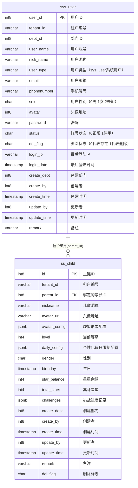
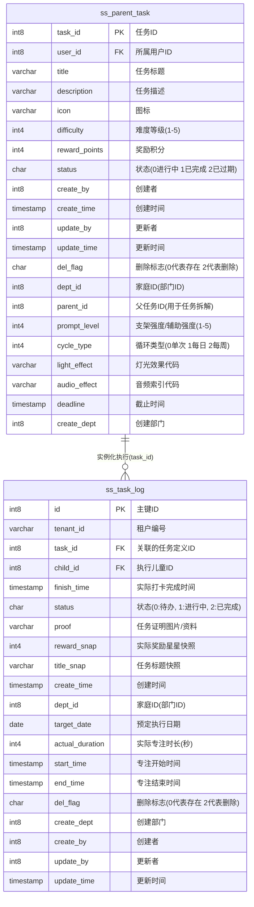
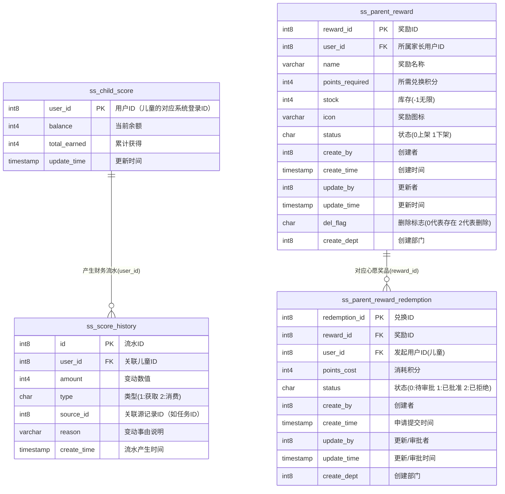
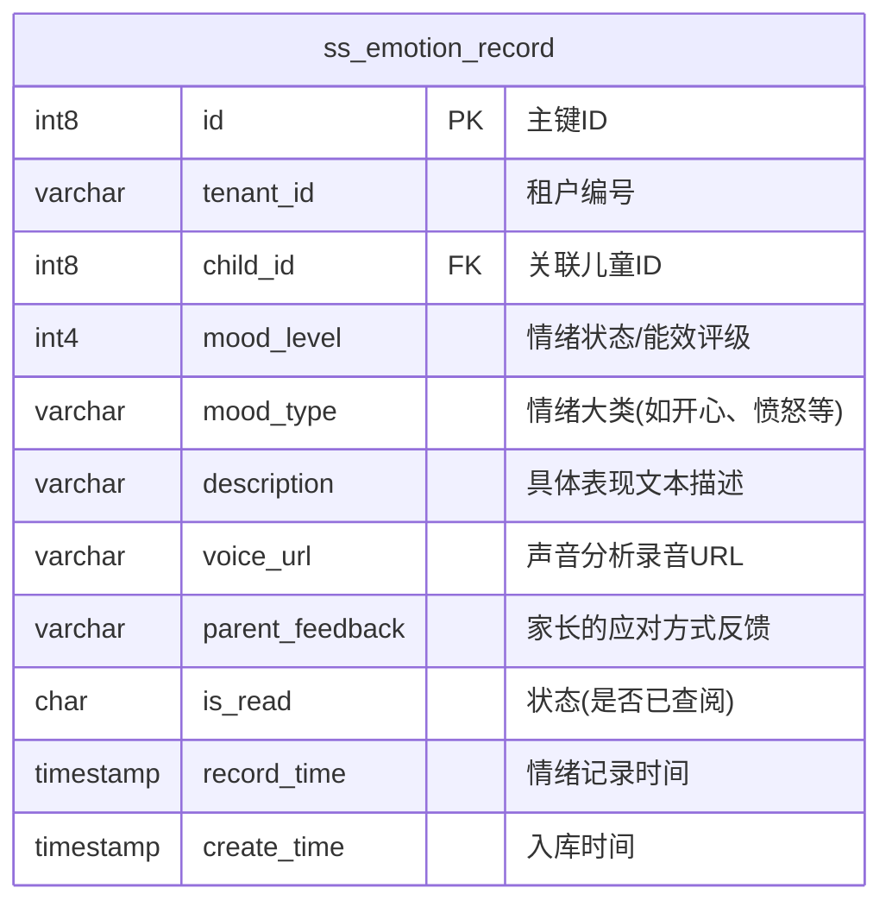

# 最新生成的全字段 E-R 模型图

根据您提供的 9 张核心表（包含所有系统字段及审计字段）的详尽数据字典，以下是重新生成的完整 Mermaid E-R 模型图。为了便于在 Markdown 中直观查阅，前两大核心业务域仍采用左右并排的横向显示布局。

<table>
<tr>
<td valign="top" width="50%">

### （1）用户与档案域
该域负责维护系统鉴权基础以及儿童的独立档案和游戏化属性。

</td>
<td valign="top" width="50%">

### （2）任务流转域
该域为系统的业务中枢，实现了从家长任务下发到儿童实际打卡执行的全生命周期闭环。

</td>
</tr>
</table>

### （3）激励体系域
负责系统内虚拟资产（积分）的发放、核算以及与心愿奖品的最终兑换流转。

### （4）情绪追踪辅助域
专项支持 ADHD 治疗中所需的话术动态生成及情绪安抚应对机制。

