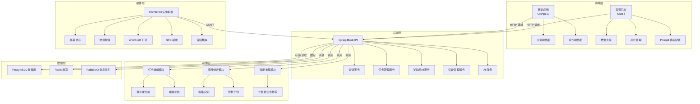

# 架构设计文档

## 1. 架构概述

### 1.1 系统架构
Small Steps 系统采用分层架构设计，包含以下核心层次：

- **前端层**：包含移动应用（UniApp X）和管理后台（Nuxt 3）
- **后端层**：Java Spring Boot 应用，提供 API 服务
- **硬件层**：ESP32-S3 驱动的实体玩偶，通过 MQTT 与后端通信
- **AI 中台**：基于 Barkley/Greene 理论的垂类模型，提供任务拆解和情绪分析服务
- **数据层**：PostgreSQL 数据库，Redis 缓存，RabbitMQ 消息队列

### 1.2 架构图

## 2. 模块设计

### 2.1 前端模块

#### 2.1.1 移动应用模块
- **儿童端**：游戏化界面，任务执行，奖励系统，成就展示
- **家长端**：任务配置，数据分析，情绪管理，设备管理

#### 2.1.2 管理后台模块
- **数据大盘**：系统运行状态，用户数据统计，任务完成情况
- **用户管理**：用户注册、登录、权限管理
- **Prompt 模板配置**：AI 提示词模板管理，个性化配置

### 2.2 后端模块

#### 2.2.1 认证服务
- **用户认证**：JWT 令牌生成与验证
- **权限管理**：基于角色的权限控制
- **设备认证**：硬件设备的身份验证

#### 2.2.2 任务管理服务
- **任务创建**：家长创建任务，AI 拆解为微步骤
- **任务执行**：儿童执行任务，进度跟踪
- **任务分析**：任务完成情况分析，优化建议

#### 2.2.3 奖励系统服务
- **奖励配置**：家长配置奖励规则
- **奖励发放**：任务完成后自动发放奖励
- **奖励兑换**：儿童使用奖励兑换物品

#### 2.2.4 设备管理服务
- **设备注册**：新设备注册与绑定
- **设备状态**：设备在线状态监控
- **设备配置**：设备参数配置与更新

#### 2.2.5 AI 服务
- **任务拆解**：将复杂任务拆解为微步骤
- **情绪分析**：分析儿童情绪状态，提供干预建议
- **智能推荐**：基于用户行为推荐个性化任务

### 2.3 硬件模块

#### 2.3.1 核心功能
- **专注模式**：通过光语/声语帮助儿童保持专注
- **任务提醒**：定时提醒儿童执行任务
- **NFC 互动**：通过 NFC 标签触发特定场景

#### 2.3.2 硬件组件
- **ESP32-S3**：主控制器
- **ST7735 屏幕**：1.8寸，128x160分辨率
- **物理按键**：4个，用于用户交互
- **WS2812B 灯环**：用于视觉反馈
- **NFC 模块**：用于场景触发
- **DFPlayer**：用于音频播放

## 3. 技术选型

### 3.1 前端技术
- **移动应用**：UniApp X (Vue3 + UTS)
- **管理后台**：Nuxt 3
- **UI 框架**：Element Plus（管理后台）、自定义组件库（移动应用）
- **样式方案**：Tailwind CSS

### 3.2 后端技术
- **框架**：Java Spring Boot（基于 RuoYi-Vue-Plus）
- **数据库**：PostgreSQL
- **缓存**：Redis
- **消息队列**：RabbitMQ
- **认证**：JWT

### 3.3 硬件技术
- **平台**：ESP32-S3
- **语言**：MicroPython
- **通信**：MQTT / WebSocket
- **显示**：ST7735 屏幕
- **交互**：物理按键，WS2812B 灯环，NFC

### 3.4 AI 技术
- **模型**：基于 Barkley/Greene 理论的垂类模型
- **部署**：云端部署，通过 API 调用

## 4. 关键设计

### 4.1 数据流设计

#### 4.1.1 任务数据流
1. 家长在移动应用创建任务
2. 后端将任务发送给 AI 中台进行拆解
3. AI 中台将任务拆解为微步骤，返回给后端
4. 后端将微步骤存储到数据库
5. 后端通过 MQTT 将任务发送给硬件设备
6. 儿童通过硬件设备执行任务
7. 硬件设备通过 MQTT 将任务执行情况发送给后端
8. 后端更新任务状态，计算奖励
9. 后端将任务完成情况同步到移动应用

#### 4.1.2 情绪数据流
1. 硬件设备通过麦克风采集儿童声音
2. 硬件设备将音频数据发送给后端
3. 后端将音频数据发送给 AI 中台进行情绪分析
4. AI 中台分析情绪状态，返回分析结果和干预建议
5. 后端将情绪分析结果存储到数据库
6. 后端将情绪分析结果同步到移动应用
7. 家长通过移动应用查看儿童情绪状态，获取干预建议

### 4.2 通信设计

#### 4.2.1 MQTT 通信
- **主题结构**：`smallsteps/{device_id}/{topic}`
- **消息格式**：JSON
- **QoS**：1（至少一次）

#### 4.2.2 HTTP 通信
- **API 格式**：RESTful
- **认证**：JWT
- **数据格式**：JSON

### 4.3 安全设计

#### 4.3.1 数据安全
- **传输加密**：HTTPS / MQTT TLS
- **存储加密**：数据库敏感数据加密
- **访问控制**：基于角色的权限控制

#### 4.3.2 设备安全
- **设备认证**：设备唯一标识 + 密钥
- **固件更新**：安全的 OTA 更新机制
- **防篡改**：固件签名验证

## 5. 扩展性设计

### 5.1 模块扩展
- **插件机制**：支持功能插件的添加和移除
- **API 扩展**：RESTful API 设计，支持版本控制

### 5.2 硬件扩展
- **传感器扩展**：支持添加新的传感器
- **交互扩展**：支持新的交互方式

### 5.3 AI 能力扩展
- **模型升级**：支持 AI 模型的迭代升级
- **新功能添加**：支持添加新的 AI 能力

## 6. 部署设计

### 6.1 后端部署
- **容器化**：Docker + Kubernetes
- **环境分离**：开发、测试、生产环境
- **监控**：Prometheus + Grafana

### 6.2 前端部署
- **移动应用**：App Store、Google Play
- **管理后台**：静态部署 + CDN

### 6.3 硬件部署
- **固件更新**：OTA 远程更新
- **配置管理**：远程配置管理

## 7. 性能设计

### 7.1 响应时间
- **API 响应**：< 500ms
- **设备通信**：< 1s
- **AI 分析**：< 3s

### 7.2 并发处理
- **API 并发**：支持 1000+ QPS
- **MQTT 并发**：支持 10000+ 设备连接

### 7.3 存储优化
- **数据库索引**：合理设计索引
- **缓存策略**：热点数据缓存
- **数据分区**：按时间分区

## 8. 容灾设计

### 8.1 高可用性
- **服务集群**：多实例部署
- **负载均衡**：请求分发
- **故障转移**：自动切换

### 8.2 数据备份
- **数据库备份**：定期备份
- **数据同步**：跨区域同步

### 8.3 降级策略
- **服务降级**：非核心功能降级
- **离线模式**：硬件设备支持离线运行

## 9. 总结

本架构设计文档详细描述了 Small Steps 系统的整体架构、模块设计、技术选型、关键设计、扩展性设计、部署设计、性能设计和容灾设计。该架构设计充分考虑了系统的可靠性、扩展性和安全性，为后续的详细设计和开发工作提供了清晰的指导。

通过分层架构设计，系统实现了前端、后端、硬件和 AI 中台的解耦，使得各模块可以独立开发和部署。同时，通过 MQTT 通信协议，实现了硬件设备与后端的实时通信，为儿童提供了及时的任务提醒和反馈。

AI 中台的引入，为系统提供了智能的任务拆解和情绪分析能力，使得系统能够更好地适应不同儿童的需求，提供个性化的服务。

总之，本架构设计为 Small Steps 系统的实现奠定了坚实的基础，确保了系统的可扩展性、可靠性和安全性，为 ADHD 儿童的行为习惯养成提供了有力的技术支持。