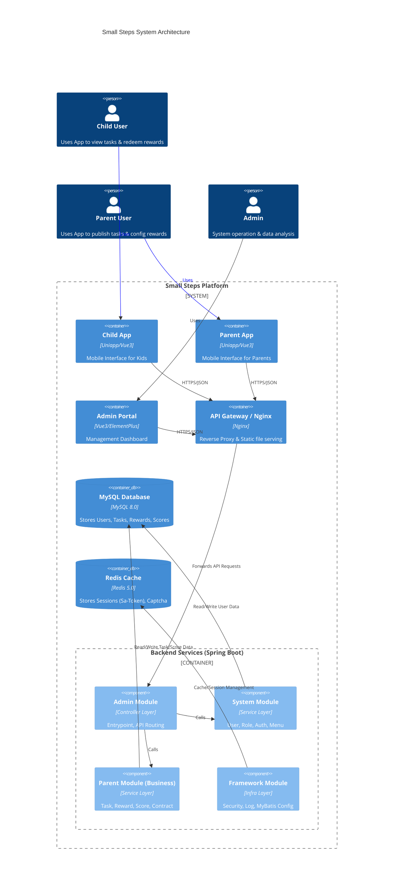

# Small Steps (小步) - Backend API

> 每一个小小的进步，都值得被看见。
> Every small step deserves to be seen.

**Small Steps (小步)** 是一款专为 ADHD 儿童及其家庭设计的行为辅助系统。本项目为其后端服务，基于 Spring Boot 3 + Vue 3 (前端) 的前后端分离架构，提供任务管理、奖励机制、积分系统与亲子互动核心能力。

- - -

## 🏗️ 模块结构

本项目采用多模块 Maven 架构：

- **smallsteps-admin**: 🟢 应用启动入口，包含 Controller 层与全局配置。
- **smallsteps-framework**: 🔧 核心框架层，封装 Web、Security、Log 等通用切面。
- **smallsteps-system**: 👤 系统基础模块，管理用户、角色、菜单与鉴权。
- **smallsteps-common**: 🧱 公共工具类与通用组件。
- **smallsteps-parent** (🌟 核心业务):
    - **Tasks**: 家长任务发布、儿童任务执行与状态流转。
    - **Rewards**: 奖励库管理、库存控制与兑换逻辑。
    - **Score**: 儿童积分系统 (余额管理 + 积分流水)。
    - **Contracts**: 亲子契约管理 (待完善)。

## 🏗️ 软件架构图 (Architecture)



## ✨ 核心功能

### 1. 任务体系 (Task System)
- **家长端**: 发布任务，设置难度与积分奖励，支持图文描述。
- **儿童端**: 查看今日任务清单，提交任务完成状态。
- **自动化**: 任务完成后后端自动记录流水并增加积分。

### 2. 奖励商店 (Reward Shop)
- **家长端**: 配置奖励商品（实物/活动/特权），设置积分价格与库存。
- **儿童端**: 浏览商店，使用积分兑换奖励。
- **逻辑闭环**: 兑换时自动扣除积分、扣减库存，并记录消费流水。

### 3. 积分银行 (Score Bank)
- **实时余额**: `ss_child_score` 表追踪每个儿童的当前可用积分。
- **透明流水**: `ss_score_history` 记录每一笔获取与消费的详细原因与时间。

## 🛠️ 技术栈

-   **核心框架**: Spring Boot 3.x
-   **持久层**: MyBatis Plus 3.5
-   **鉴权安全**: Sa-Token
-   **数据库**: MySQL 8.0
-   **缓存**: Redis
-   **工具**: Hutool, Lombok

## 🚀 快速开始

### 1. 环境准备
-   JDK 17+
-   MySQL 8.0+
-   Redis 5.0+
-   Maven 3.8+

### 2. 数据库初始化
请依次在 MySQL 中执行以下 SQL 脚本：
1.  `docs/sqls/ry_2024xxxx.sql` (基础框架表 - 若有)
2.  `docs/sqls/parent_schema.sql` (任务与奖励表)
3.  `docs/sqls/score_schema.sql` (积分与流水表 - **重要**)

### 3. 配置修改
修改 `smallsteps-admin/src/main/resources/application-dev.yml`：
```yaml
spring:
  datasource:
    url: jdbc:mysql://localhost:3306/smallsteps?useUnicode=true&characterEncoding=utf8&zeroDateTimeBehavior=convertToNull&useSSL=true&serverTimezone=GMT%2B8
    username: root
    password: your_password
  redis:
    host: localhost
    port: 6379
```

### 4. 启动项目
运行 `smallsteps-admin` 模块下的 `SmallStepsApplication.java`。

## 🐳 Docker 部署

请参考项目根目录下的 `docs/dockers` 文件夹：
- **Dockerfile**: 后端镜像构建脚本
- **docker-compose.yml**: 一键编排 (MySQL + Redis + API + Nginx)

## 📎 参考文档
[Human 3.0 中文原生协议](../../.agent/rules/human3.0-chinese-protocol-merged.md)
