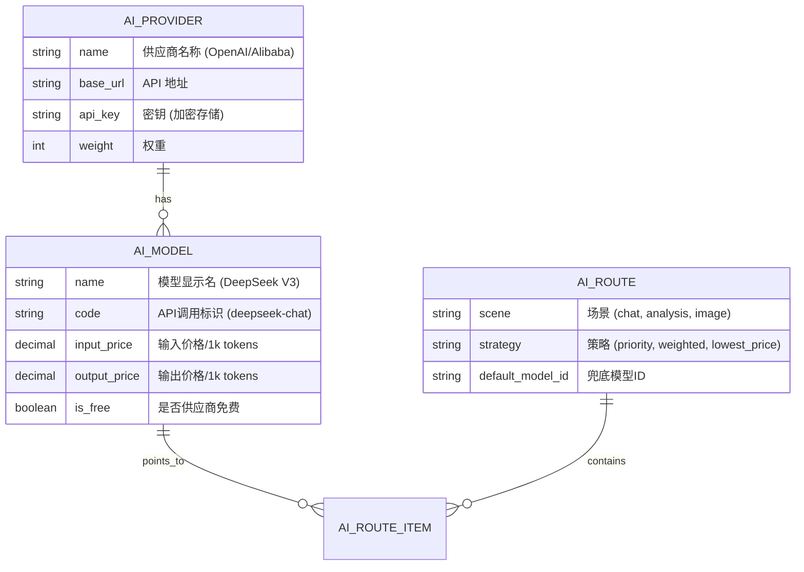

# SmallSteps AI 统一管理模块 (smallsteps-ai)

## 1. 模块概述
`smallsteps-ai` 是 SmallSteps 系统的 AI 中枢，负责统一管理所有 AI 模型的接入、鉴权、计费与智能路由。

**核心价值**:
*   **统一接入**: 屏蔽不同供应商 (OpenAI, DeepSeek, Zhipu, Azure) 的 API 差异。
*   **智能路由**: 根据用户权益、模型成本和可用性自动选择最佳通道。
*   **成本控制**: 通过精细化的路由策略最大化利用免费/低价资源。

## 2. 核心架构设计

### 2.1 实体关系 (ERD)



### 2.2 数据表设计 (`sys_ai_*`)

**1. 供应商表 (`sys_ai_provider`)**
| 字段 | 类型 | 说明 |
| :--- | :--- | :--- |
| id | bigint | 主键 |
| name | varchar | 供应商名称 (如: DeepSeek Official) |
| type | varchar | 类型 (openai_compatible, azure, sdk) |
| base_url | varchar | 接口地址 |
| api_key | varchar | 鉴权密钥 (AES加密) |
| status | char | 状态 (0正常 1停用) |

**2. 模型配置表 (`sys_ai_model`)**
| 字段 | 类型 | 说明 |
| :--- | :--- | :--- |
| id | bigint | 主键 |
| provider_id | bigint | 关联供应商 |
| model_code | varchar | API调用代码 (如 `gpt-4o`) |
| name | varchar | 前端显示名称 |
| cost_input | decimal | 输入单价 (元/1M tokens) |
| cost_output | decimal | 输出单价 (元/1M tokens) |
| context_window | int | 上下文窗口大小 |
| is_free_tier | boolean | 是否为免费/福利模型 |

**3. 路由策略表 (`sys_ai_route_config`)**
| 字段 | 类型 | 说明 |
| :--- | :--- | :--- |
| scene_key | varchar | 业务场景 (default, smart_analysis, quick_chat) |
| strategy | varchar | 路由策略 (PRIORITY_LEVEL, LOWEST_PRICE, LOAD_BALANCE) |
| config_json | json | 扩展配置 |

## 3. 智能路由逻辑 (The AI Router)

路由与分配旨在在保障用户体验的前提下，最小化系统成本。

### 3.1 路由分配流程

当收到一个 AI 请求 `ApplicationContext.getAI(userId, scene)` 时，系统执行以下决策链：

```mermaid
graph TD
    A[用户请求] --> B{Check 1: 会员权益?}
    B -- 是 (VIP) --> C[查询 VIP 专属路由池]
    B -- 否 (普通) --> D[查询默认路由池]
    
    C --> E{Check 2: 每日额度?}
    D --> E
    
    E -- 还有免费额度 --> F[分配: 免费/低成本通道 (Free Pool)]
    E -- 每日额度耗尽 --> G{Check 3: 余额/点数?}
    
    G -- 余额充足 --> H[分配: 高级/付费通道 (Pay-as-you-go Pool)]
    G -- 余额不足 --> I[分配: 降级模型 (Mini/Flash) 或 报错]
    
    F --> J[执行调用]
    H --> J
    I --> J
```

### 3.2 路由优先级定义

系统后台可配置 `RouteStrategy`，默认支持以下优先级：

1.  **Level 1: 免费资源 (Free Quota)**
    *   **定义**: 平台每日赠送的额度，或对接的免费 API (如有)。
    *   **依据**: `user_daily_usage < daily_limit`。
    *   **目标模型**: 成本最低或已预付费的模型 (如 DeepSeek V3, GPT-3.5)。

2.  **Level 2: 包月/订阅配额 (Subscription/Plan)**
    *   **定义**: 用户购买的月度套餐包含的算力。
    *   **目标模型**: 标准大模型 (如 GPT-4o-mini, Claude 3 Haiku)。

3.  **Level 3: 按量付费 (Pay-as-you-go)**
    *   **定义**: 超出额度后，消耗用户充值的余额（积分/Token）。
    *   **排序依据**: `单价` (Unit Price)。
    *   **逻辑**: 在满足能力需求的前提下，优先选择单价最低的供应商。例如用户请求 "Smart" 模型，系统对比 OpenAI GPT-4o 和 DeepSeek V3 的价格，若 DeepSeek 更便宜且在可用状态，则优先路由至 DeepSeek。

## 4. 后台配置功能

管理后台需提供以下配置能力：

1.  **模型上架/下架**: 随时开关某个供应商的模型（如某家 API 挂了，一键切断）。
2.  **默认路由设置**: 全局设定 "默认对话模型" 和 "默认绘图模型"。
3.  **价格倍率 (Rate Limit)**: 即使上游涨价，平台可通过调整兑换比例（如 100 积分/次 -> 150 积分/次）平滑过渡。
