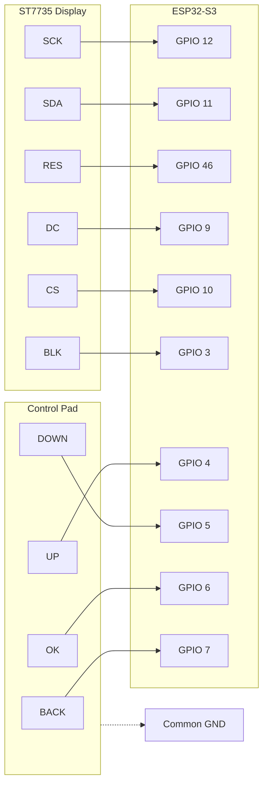

# Small Steps (小步) - ESP32 智能终端

> **"不是监控者，是陪伴者。"**  
> 专为 ADHD 儿童设计的行为习惯辅助终端 (The Anchor)。

## 1. 项目愿景 (Vision)
**Small Steps** 不仅仅是一个硬件，它是帮助 ADHD 儿童建立自信的“物理锚点”。
*   **核心理念**: 认知卸载 (Cognitive Offloading) —— 屏幕是辅助，灯光和声音才是主角。
*   **设计原则**: 容错、游戏化、无压力。
*   **硬件载体**: 基于 ESP32-S3 的 1.8寸非触摸屏终端，通过物理按键提供最确定的触觉反馈。

## 2. 硬件架构 (Hardware)

### 核心组件
*   **MCU**: ESP32-S3 (高性能，支持 Micropython)
*   **显示**: 1.8寸 ST7735 TFT LCD (128x160, RGB565)
*   **交互**: 4个微动按键 (UP, DOWN, OK, BACK)
*   **反馈**: WS2812B 幻彩灯环 + 扬声器/振动马达 (规划中)

### 🔌 接线指南 (Wiring Guide)
**注意**: 本项目针对 **ESP32-S3** 优化，使用硬件 **SPI2**。

#### A. 屏幕 (ST7735)
| 屏幕引脚 | ESP32-S3 GPIO | 变量名 | 备注 |
| :--- | :--- | :--- | :--- |
| **VCC** | 3.3V / 5V | - | 推荐 3.3V |
| **GND** | GND | - | 共地 |
| **CS** | **10** | `cs` | 片选 |
| **RES** | **46** | `rst` | 复位 |
| **DC** | **9** | `dc` | 数据/命令 |
| **SDA** | **11** | `mosi` | 数据 (MOSI) |
| **SCK** | **12** | `sck` | 时钟 (SCK) |
| **BLK** | **3** | `blk` | 背光 (高电平亮) |
| **CS** | **GPIO 10** | `cs` | 片选信号 |
| **RESET / RES** | **GPIO 46** | `rst` | 复位信号 |
| **A0 / DC** | **GPIO 9** | `dc` | 数据/命令选择 |
| **SDA / MOSI** | **GPIO 11** | `mosi` | SPI 数据传输 |
| **SCK / SCL** | **GPIO 12** | `sck` | SPI 时钟 |
| **LED / BLK** | **GPIO 3** | `blk` | 背光控制 (高电平亮) |
| **MISO** | **GPIO 13** | `miso` | *代码中定义了但通常屏幕不接* |

#### B. 物理按键 (Active Low)
采用**内部上拉 (PULL_UP)** 模式，按键一端接 GPIO，另一端接 **GND**。

| 按键 | GPIO | 功能定义 |
| :--- | :--- | :--- |
| **UP** | **4** | 向上 / 增加 |
| **DOWN** | **5** | 向下 / 减少 |
| **OK** | **6** | 确认 / 进入 / 暂停 |
| **BACK** | **7** | 返回 / 取消 (长按退出) |

#### C. 音频与扩展 (Advanced)
| 模块 | 引脚名称 | ESP32-S3 GPIO | 说明 |
| :--- | :--- | :--- | :--- |
| **Audio** | DF_TX/RX | **18 / 17** | 串口通信 |
| **Mic** | SCK/WS/SD | **41 / 42 / 2** | I2S 麦克风 |
| **LED** | DIN | **21** | WS2812B 灯珠控制 |
| **Haptic**| IN | **14** | 震动马达 |

### 📐 硬件拓扑图


## 3. 快速开始 (Quick Start)

### 环境准备
1.  **固件**: 刷入最新的 ESP32-S3 MicroPython 固件 (`Generic ESP32-S3`).
2.  **工具**: 推荐使用 [Thonny IDE](https://thonny.org/) 进行开发和文件传输。

### 部署步骤
1.  将项目根目录下的所有 `.py` 文件上传到设备：
    *   `boot.py`: 启动配置
    *   `main.py`: 主程序入口
    *   `device.py`: 硬件抽象层
    *   `st7735.py`: 屏幕驱动
    *   `config.py`: 全局配置
2.  上传 `lib/` 目录（如有）。
3.  **Hard Reset** 开发板，系统将自动启动。

## 4. 文件结构 (Structure)
```text
.
├── boot.py          # 系统启动脚本
├── main.py          # 应用程序入口 (App Loop)
├── device.py        # 硬件管理器 (Screen, Buttons, Audio 统一封装)
├── st7735.py        # ST7735 屏幕驱动 (Low-level)
├── config.py        # 配置文件 (Wifi, API, Colors)
└── README.md        # 本文档
```

## 5. 常见问题 (Troubleshooting)
*   **屏幕花屏/颜色反转**:
    *   检查 `st7735.py` 中的 `MADCTL` 寄存器。若红蓝颠倒，尝试修改 RGB/BGR 配置。
    *   ESP32-S3 必须使用硬件 SPI，确保未混用软件 SPI 定义。
*   **按键无反应**:
    *   检查是否共地 (GND)。
    *   代码逻辑为**低电平触发** (`value == 0`)。

---
**Human 3.0 Protocol** | Code is Liability, Clarity is Power.
