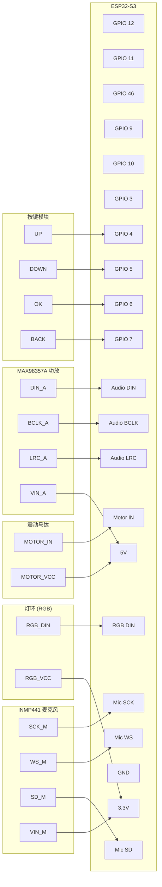

# 硬件接线指南 (最终稳定版 - 针对 Octal S3)

经过深度调试，我们确定了针对 **ESP32-S3 Octal (OPI)** 版本开发板的最佳布线方案，并修复了 I2S 冲突报错。

### ⚠️ 电源警告 (针对 5V 损坏用户)
* 如果您的开发板 **5V 针脚无输出**：请将下表中所有接 5V 的线全部改接到 **3.3V**。
* **效果影响**：音频音量会变小；某些马达模块可能因电压不足（低于 5V）而无法启动。

---

### 1. 模块接线清单 (Final)

| 模块名称 | 模块引脚 | **ESP32-S3 引脚** | 备注 |
| --- | --- | --- | --- |
| **ST7735 屏幕** | VCC | 3.3V | |
| | SCK/MOSI | **12 / 11** | SPI2 通道 |
| | CS/DC/RES | **10 / 9 / 46** | |
| | BLK | **GPIO 3** | |
| **RGB 灯环** | VCC | **3.3V** | **必须接 3.3V** 以匹配逻辑电平 |
| | DIN | **GPIO 15** | |
| **I2S 功放** | Vin | 5V / 3.3V | 5V 优先，若坏了接 3.3V |
| (MAX98357) | **DIN** | **GPIO 16** | 避开 Octal 冲突 (原 47) |
| | **BCLK** | **GPIO 8** | 避开 Octal 冲突 (原 48) |
| | **LRC** | **GPIO 21** | |
| **I2S 麦克风** | **SCK (BCLK)** | **GPIO 41** | |
| (INMP441) | **WS** | **GPIO 42** | |
| | **SD** | **GPIO 2** | |
| **震动马达** | VCC | 5V / 3.3V | **必须 5V** (若坏了接 3.3V 可能不转) |
| | IN | **GPIO 1** | 稳定数字 IO |
| **DFPlayer Mini** | VCC | **5V** | 音频播放模块 |
| | TX | **GPIO 18** | UART2 RX |
| | RX | **GPIO 17** | UART2 TX |
| | SPK_1/SPK_2 | 扬声器 | 音频输出 |
| **物理按键** | UP/DOWN | **4 / 5** | |
| | **OK / BACK** | **6 / 7** | |

---

### 2. 硬件连接示意图 (Mermaid)

### 3. I2S 重要配置说明
* 代码中已将音频强制切换至 **I2S 1 号实例**。
* 如果自行修改代码，请确保使用 `I2S(1, ...)` 而非 `I2S(0)`，以避免某些 S3 开发板上的内部资源冲突。

### 4. 5V 电源说明 (来自 Demo 检查)
* 根据 `demo` 資料夹中的电路图信息，您的 5V 针脚如果由 USB-C 供电：
    - 可能需要物理上的排针跳线或背面焊盘连接才能输出电压。
    - 请检查开发板背面是否有注明 "5V EN" 或类似的预留位置。
    - 在软件层面，目前的代码已经避开了所有已知的 GPIO 冲突引脚。