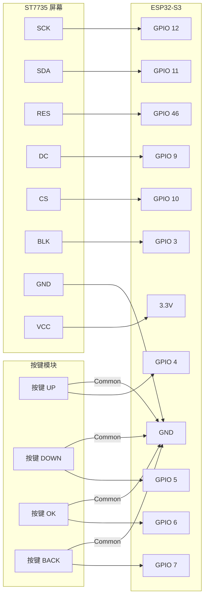

根据您上传的 `main.py` 代码文件，我已经提取出了具体的硬件引脚定义。这段代码是专门为 **ESP32-S3** 编写的（代码注释中提到了 `SPI(2)` 和 GPIO 46，这些通常是 S3 的特征）。

以下是基于您的代码生成的硬件排线配置指南：

### 1. ST7735 屏幕接线 (SPI 接口)

请注意，您的代码中使用了 **SPI2** 接口。屏幕通常有 8 个引脚，请按照下表连接：

| 屏幕引脚名称 (常见) | ESP32-S3 引脚 | 代码对应变量 | 说明 |
| --- | --- | --- | --- |
| **VCC** | 3.3V 或 5V | - | 看屏幕背面标记，通常接 3.3V 较稳妥 |
| **GND** | GND | - | 地线 |
| **CS** | **GPIO 10** | `cs` | 片选信号 |
| **RESET / RES** | **GPIO 46** | `rst` | 复位信号 |
| **A0 / DC** | **GPIO 9** | `dc` | 数据/命令选择 |
| **SDA / MOSI** | **GPIO 11** | `mosi` | SPI 数据传输 |
| **SCK / SCL** | **GPIO 12** | `sck` | SPI 时钟 |
| **LED / BLK** | **GPIO 3** | `blk` | 背光控制 (高电平亮) |
| **MISO** | **GPIO 13** | `miso` | *代码中定义了但通常屏幕不接* |

**注意：**

* 代码中 `miso=Pin(13)` 是为了满足 MicroPython SPI 驱动的参数要求而凑数的，屏幕端不需要接线到 GPIO 13。
* 如果屏幕不亮，请检查背光引脚 `BLK` 是否接好。

### 2. 按键接线 (GPIO 输入)

代码中使用了 `Pin.PULL_UP`（内部上拉模式），这意味着按键的一端接 GPIO，另一端必须接 **GND**。

| 按键功能 | ESP32-S3 引脚 | 接线方式 |
| --- | --- | --- |
| **UP (上)** | **GPIO 4** | 一端接 GPIO 4，另一端接 GND |
| **DOWN (下)** | **GPIO 5** | 一端接 GPIO 5，另一端接 GND |
| **OK (确认)** | **GPIO 6** | 一端接 GPIO 6，另一端接 GND |
| **BACK (返回)** | **GPIO 7** | 一端接 GPIO 7，另一端接 GND |

### 3. 硬件连接示意图 (Mermaid)

### 4. 调试建议

1. **屏幕花屏或颜色不对**：
* 请打开 `st7735.py`，找到 `init_display` 函数。
* 尝试修改 `self.write_data(0xC0)` 这一行。如果是 BGR/RGB 颜色反了，可以改为 `0x00` 或 `0x08`。
* 如果屏幕边缘有噪点（偏移），修改 `__init__` 函数中的 `self.xstart` 和 `self.ystart`。常见的偏移组合是 `(0,0)`, `(2,1)`, `(2,3)`。

2. **按键没反应**：
* 确保按键的公共端是接地的（GND），而不是接 VCC。因为代码逻辑是 `if btn.value() == 0:`（低电平触发）。

3. **运行报错 `Invalid Configuration**`：
* 这是 ESP32-S3 特有的 SPI 问题。代码中已经通过 `spi = SPI(2, ...)` 修复了这个问题，请确保不要改回 `SPI(1)`，因为 S3 的 SPI1 默认被内部 Flash 占用。